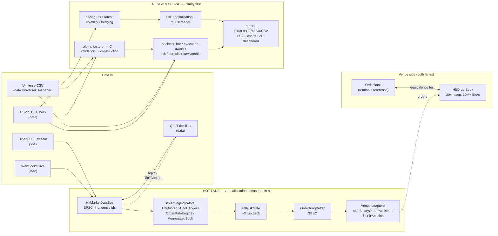
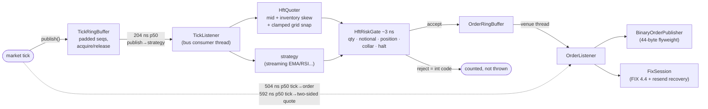
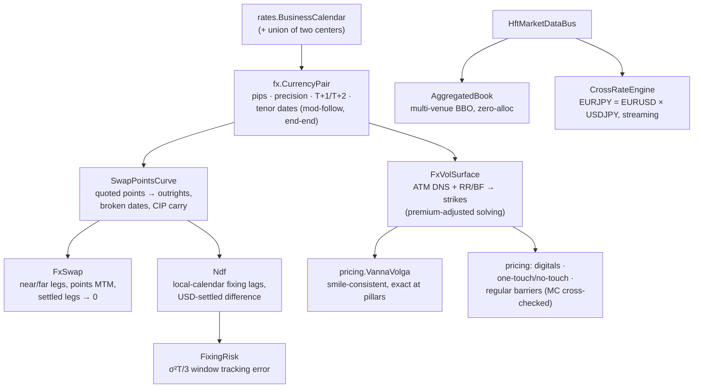

# Architecture & Flow Diagrams

Visual companions to [ARCHITECTURE.md](ARCHITECTURE.md). All diagrams are
Mermaid — GitHub renders them inline; measured numbers come from the
committed, re-runnable benchmarks.

---

## 1. The big picture — two lanes, one library

The design splits everything into a **hot lane** (zero-allocation,
single-producer/single-consumer, nanosecond-budgeted) and a **research lane**
(clarity first, allocation allowed). Knowing which lane a class is in tells
you what to expect from it.



---

## 2. The hot path, end to end — with measured latencies

Every arrow is on the measured path; the numbers are medians from the
benchmark family (`HftLatencyBenchmark`, `HftOrderBenchmark`,
`HftQuoterBenchmark`, `HftBookBenchmark`) on a stock Windows desktop.



Key disciplines, in one line each:

| Discipline | Where | Proof |
|---|---|---|
| Zero allocation steady-state | rings, gate, quoter, hedger, book, codecs | per-thread allocation-counter tests |
| No locks/CAS on the hot path | SPSC rings, acquire/release only | FIFO stress tests |
| No String/boxing on the hot path | dense int symbol ids everywhere | design + tests |
| Tails attributed, not guessed | `HiccupMonitor` in every benchmark | printed with every run |
| Zero GC, literally | whole sessions under Epsilon GC | benchmark runs committed |

---

## 3. The alpha research pipeline

Scores flow as `double[]` aligned to a frozen symbol panel; `NaN` = "not in
the cross-section" at every stage. Attaching a `PointInTimeUniverse` makes
the *whole* pipeline survivorship-honest.


---

## 4. Survivorship-aware backtest — per-bar event ordering

The order of operations inside each bar is a correctness contract (a
dividend on a delisting's ex-date still pays the holder of record; a
merger's shares flow into a same-bar-dying acquirer at *its* terms):

```mermaid
sequenceDiagram
    participant Bar as bar i (timestamp t)
    participant Div as 1. Dividends
    participant Mrg as 2. Mergers
    participant Del as 3. Delistings
    participant Drop as 4. Index drops
    participant Reb as 5. Rebalance

    Bar->>Div: ex-dates ≤ t: position × amount<br/>(holder of record at prior close; shorts pay)
    Bar->>Mrg: target → cash + acquirer shares<br/>(before delistings, so conversions land first)
    Bar->>Del: position × lastClose × (1 + delistingReturn)<br/>(−100% = wiped out; Shumway −30% default)
    Bar->>Drop: still listed but out of the index →<br/>forced sale at this bar's close (fee charged)
    Bar->>Reb: strategy weights (non-members capped at 0,<br/>dead names untradeable) via TradeCostModel
    Note over Div,Reb: symbols processed in sorted order —<br/>same inputs, same result, any JVM
```

---

## 5. Inside the venue-grade matching engine (`HftOrderBook`)

Everything is a primitive array; the diagram shows what happens to a
crossing buy limit.


Measured: **204 ns/op p50** (70/20/10 add/cancel/aggress), **10M+
fills/sec**, zero allocation, full sessions under Epsilon GC.

---

## 6. FX instruments — how the pieces compose

Conventions flow downward; everything date-related delegates to ONE joint
calendar.



---

## Where to go next

- [ARCHITECTURE.md](ARCHITECTURE.md) — the package → classes → tests map and design invariants
- [ULTRA_LOW_LATENCY.md](ULTRA_LOW_LATENCY.md) — the four-tier latency stack, honestly bounded
- `README.md` — capability tour with runnable examples and all measured numbers
