# Architecture & Flow Diagrams

Visual companions to [ARCHITECTURE.md](ARCHITECTURE.md). All diagrams are
Mermaid — GitHub renders them inline; measured numbers come from the
committed, re-runnable benchmarks.

---

## 1. The big picture — two lanes, one library

The design splits everything into a **hot lane** (zero-allocation,
single-producer/single-consumer, nanosecond-budgeted) and a **research lane**
(clarity first, allocation allowed). Knowing which lane a class is in tells
you what to expect from it.

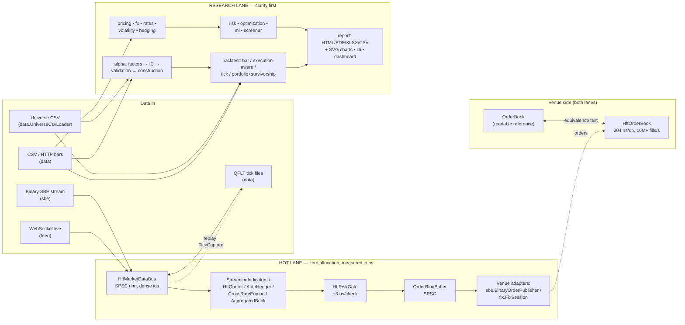

---

## 2. The hot path, end to end — with measured latencies

Every arrow is on the measured path; the numbers are medians from the
benchmark family (`HftLatencyBenchmark`, `HftOrderBenchmark`,
`HftQuoterBenchmark`, `HftBookBenchmark`) on a stock Windows desktop.


Key disciplines, in one line each:

| Discipline | Where | Proof |
|---|---|---|
| Zero allocation steady-state | rings, gate, quoter, hedger, book, codecs | per-thread allocation-counter tests |
| No locks/CAS on the hot path | SPSC rings, acquire/release only | FIFO stress tests |
| No String/boxing on the hot path | dense int symbol ids everywhere | design + tests |
| Tails attributed, not guessed | `HiccupMonitor` in every benchmark | printed with every run |
| Zero GC, literally | whole sessions under Epsilon GC | benchmark runs committed |

---

## 3. The alpha research pipeline

Scores flow as `double[]` aligned to a frozen symbol panel; `NaN` = "not in
the cross-section" at every stage. Attaching a `PointInTimeUniverse` makes
the *whole* pipeline survivorship-honest.


---

## 4. Survivorship-aware backtest — per-bar event ordering

The order of operations inside each bar is a correctness contract (a
dividend on a delisting's ex-date still pays the holder of record; a
merger's shares flow into a same-bar-dying acquirer at *its* terms):

```mermaid
sequenceDiagram
    participant Bar as bar i (timestamp t)
    participant Div as 1. Dividends
    participant Mrg as 2. Mergers
    participant Del as 3. Delistings
    participant Drop as 4. Index drops
    participant Reb as 5. Rebalance

    Bar->>Div: ex-dates ≤ t: position × amount<br/>(holder of record at prior close; shorts pay)
    Bar->>Mrg: target → cash + acquirer shares<br/>(before delistings, so conversions land first)
    Bar->>Del: position × lastClose × (1 + delistingReturn)<br/>(−100% = wiped out; Shumway −30% default)
    Bar->>Drop: still listed but out of the index →<br/>forced sale at this bar's close (fee charged)
    Bar->>Reb: strategy weights (non-members capped at 0,<br/>dead names untradeable) via TradeCostModel
    Note over Div,Reb: symbols processed in sorted order —<br/>same inputs, same result, any JVM
```

---

## 5. Inside the venue-grade matching engine (`HftOrderBook`)

Everything is a primitive array; the diagram shows what happens to a
crossing buy limit.

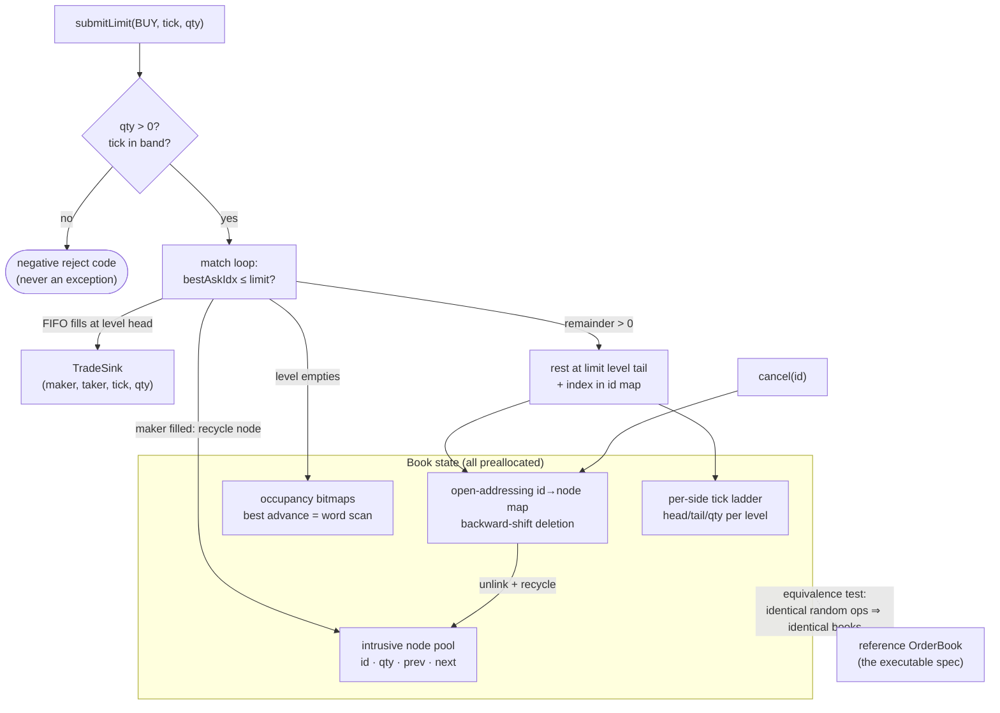

Measured: **204 ns/op p50** (70/20/10 add/cancel/aggress), **10M+
fills/sec**, zero allocation, full sessions under Epsilon GC.

---

## 6. FX instruments — how the pieces compose

Conventions flow downward; everything date-related delegates to ONE joint
calendar.

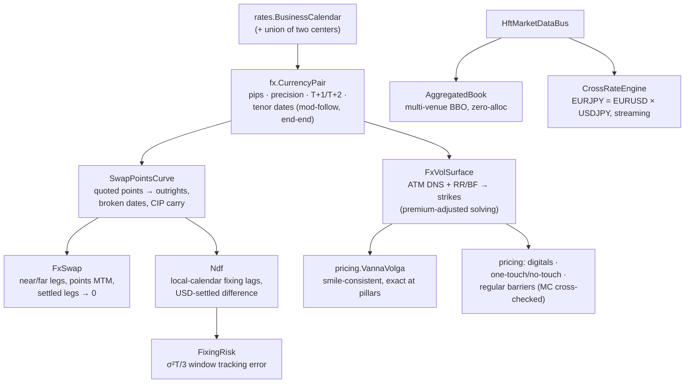

---

## 7. The equities participant stack — L3 feed in, routed orders out

The consumer's side of an exchange: rebuild the venue's book from its raw
event stream, know exactly where your own order queues, read the pressure,
route. Every stage is hot-lane (zero allocation, proven by test).

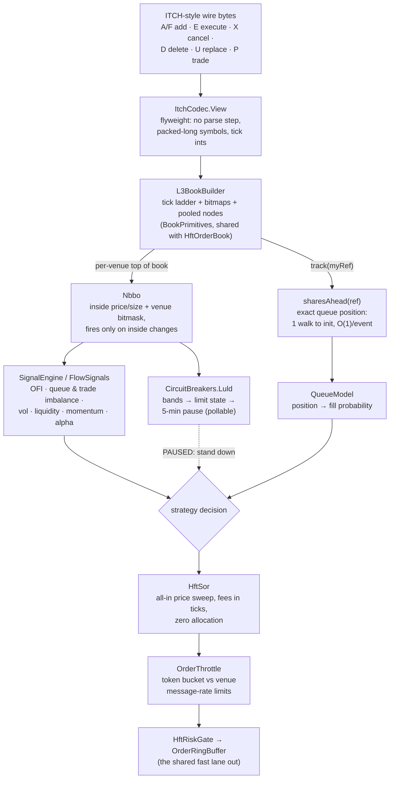

Own-order queue tracking rests on two price-time facts: executions always
consume the queue head, and a cancel is ahead of you iff it entered the
queue before you — which is what makes O(1) maintenance sound.

---

## 8. The FX participant stack — quotes, last look, and routing around it

FX is the mirror image: no tape, no central book. Liquidity is private
quotes subject to last look, so the stack measures LP *behavior* and routes
on expected all-in cost, not displayed price.

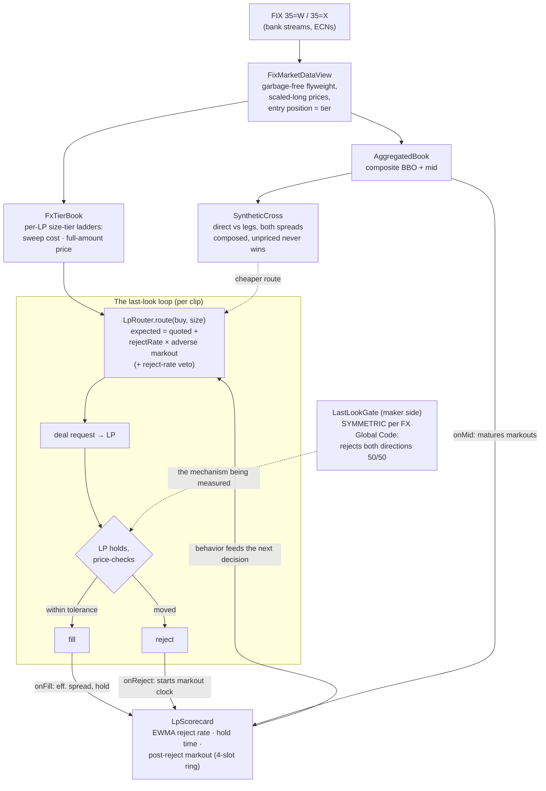

The feedback loop is the point: an LP's tight display means nothing if its
rejects cluster on the flow that was about to pay you — the scorecard
measures exactly that, and the router prices it in.

---

## 9. Scaling out — shared-nothing shards under one risk umbrella

Throughput scales by running independent engine stacks; safety stays global
through a slow observer that only ever asks the hot path to read one
boolean.

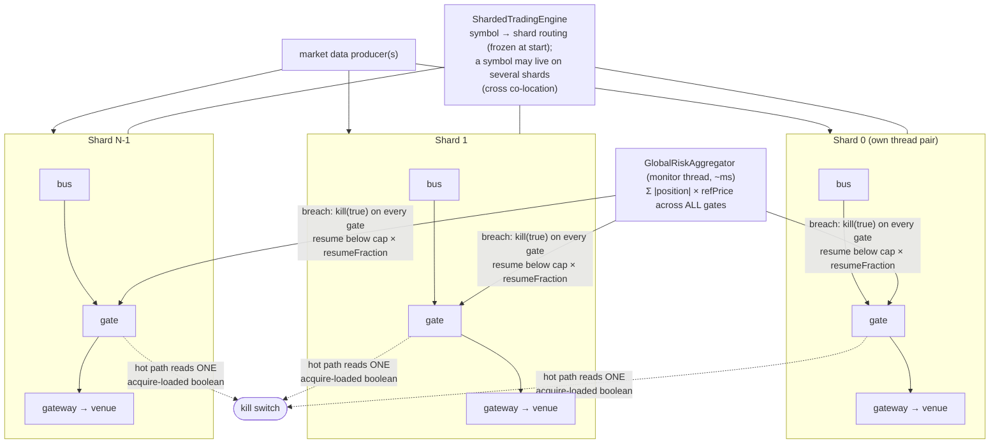

Measured on a 12-core desktop, 300 symbols quoted two-sided: 1 shard =
4.3M ticks/s → 2 shards = 6.2M (+46%) → 4 shards plateau at 6.7M (core
oversubscription + single producer, not contention). War story in
[ULTRA_LOW_LATENCY.md](ULTRA_LOW_LATENCY.md): one shared synchronized
counter across shards made sharding measure as a *slowdown*.

---

## 10. Choosing an execution algorithm — the decision map

The parent-order question is "what am I being measured against?" — the
benchmark picks the algorithm, and TCA closes the loop.


The two lanes coexist by design: **`BenchmarkExecutor`** when you re-decide
on live state (the usual case), the **static schedulers** when you want a
fixed slice list computed once up front.

---

## 11. Portfolio-level execution — one basket, one schedule

A two-sided transition run as N independent algos carries a risk none of
them can see: the filled legs drift apart and the basket holds an
unintended net market bet mid-flight. `PortfolioExecutor` layers the two
basket-level rules over untouched per-symbol executors — and both rules
only ever *reduce* a child's own due, so per-symbol benchmark integrity
holds by construction.

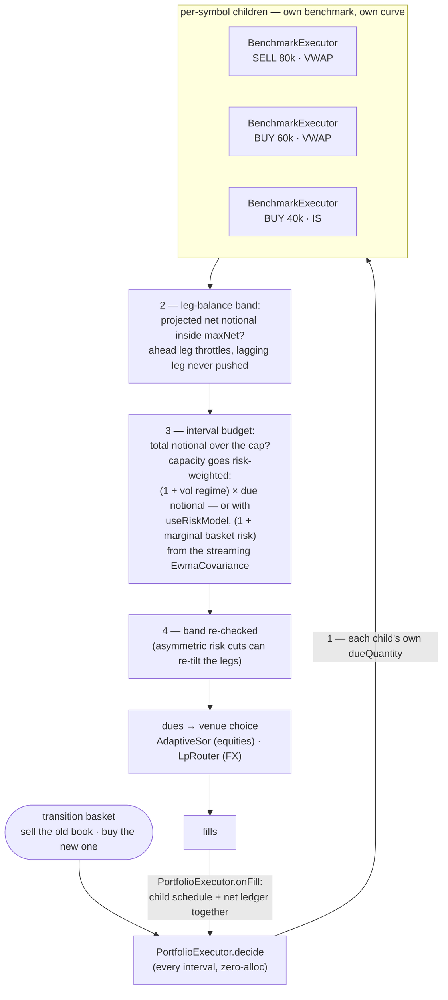

The fills edge is the one discipline to keep: report fills through
`PortfolioExecutor.onFill` only — going straight to a child advances its
schedule but blinds the net-exposure ledger the band reads.

---

## 12. Surviving the overnight — the checkpoint lifecycle

Everything the models learn lives in memory; `persist.Checkpoint` is how
it outlives the session. Two properties carry the design: the save is
atomic (a crash mid-save cannot corrupt yesterday's file), and the restore
is honest about time (learned state returns, intraday state deliberately
does not).

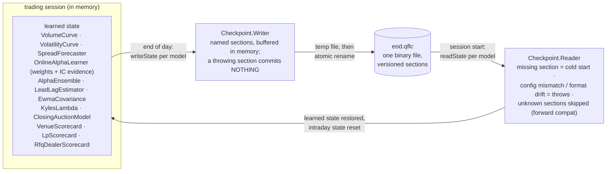

Deliberately NOT persisted: `HiddenLiquidityDetector` (its state is keyed
by price level, and overnight the ladder moves — restoring it would pin
yesterday's icebergs onto today's unrelated prices).

---

## 13. The central risk book — one netted view, four decisions

Every product decomposes into ONE factor space at booking (currency-level
FX legs, per-symbol equity deltas, gamma/vega per underlying), and every
downstream decision runs on the netted residual. The commercial loop:
capture spread by internalizing, spend as little of it as possible on
hedging, and answer one question at the close.

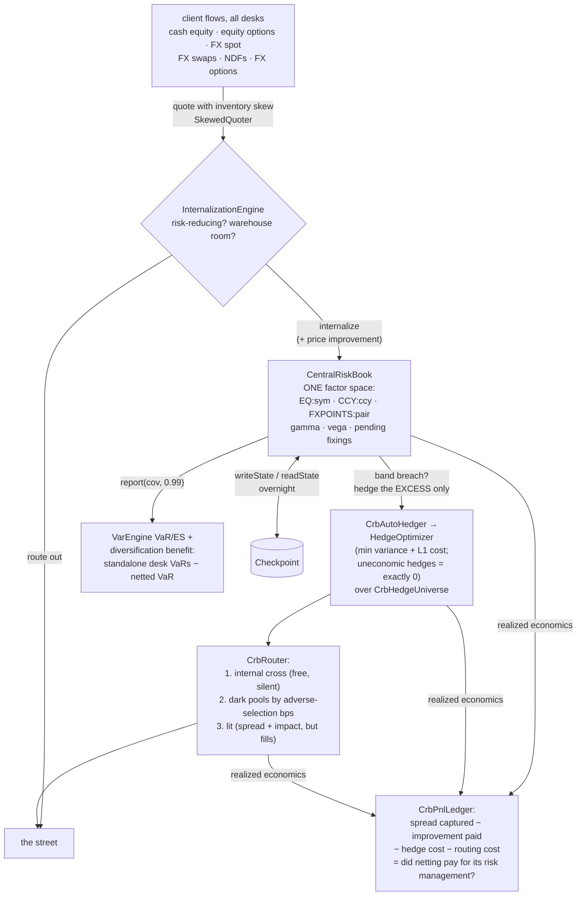

The whole loop at realistic sizes and costs is
`crb/CrbRealWorldScenarioTest` (quiet day, one-way institutional day,
COVID-template stress day, NDF fixing day); recipe 14 is the runnable
version and [CENTRAL_RISK_BOOK.md](CENTRAL_RISK_BOOK.md) the guided tour.

---

## 14. The market-risk workflow — data to Basel, fourteen steps

The map `docs/MARKET_RISK.md` maintains, as a pipeline. Every box is
implemented and tested; the regulatory boxes are styled after BCBS, not
certified — stated, not hidden.

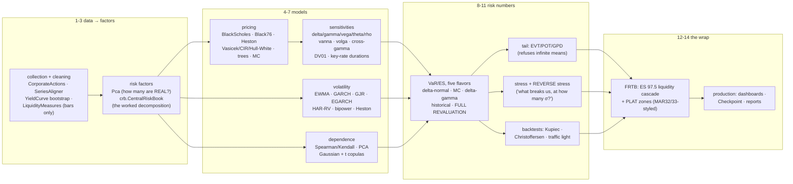

---

## 15. How an order reaches the exchange — and how the market comes back

Two lanes meet at the strategy: outbound, a decision survives the risk
gate, becomes a FIX message, and rides a sequenced session to the venue's
book; inbound, the venue's raw feed is rebuilt into signals that shape the
next decision. The `ExecutionReport` closes the loop through position and
P&L.

```mermaid
flowchart LR
    subgraph OUTLANE["outbound — the order's journey"]
        STRAT["strategy decision<br/>HftQuoter · BenchmarkExecutor ·<br/>your logic"]
        GATE15["HftRiskGate<br/>qty · notional · position ·<br/>collar · halt (~3 ns)"]
        ENC["FIX encode<br/>NewOrderSingle 35=D<br/>(FixSession.sendNewOrderSingle)"]
        SESS["FixSession<br/>seqnums · heartbeats · TestRequest ·<br/>ResendRequest recovery · session store"]
    end
    subgraph VENUE15["the venue"]
        VBOOK["venue book<br/>(HftOrderBook plays this<br/>role in the tests)"]
        ER["ExecutionReport 35=8<br/>ack · fill · cancel · reject"]
    end
    subgraph INLANE["inbound — the market's journey"]
        WIRE15["ITCH / SBE wire bytes<br/>(ItchCodec · sbe flyweights)"]
        L315["L3BookBuilder → Nbbo<br/>book rebuild + own-queue position"]
        SIGS15["SignalEngine / FlowSignals<br/>OFI · imbalance · vol · alpha"]
    end
    PNL["position & P&L update<br/>ledger · TCA markouts"]

    STRAT --> GATE15 --> ENC --> SESS
    SESS -->|"TCP, MsgSeqNum n"| VBOOK
    VBOOK --> ER
    ER -->|"onExecutionReport"| PNL
    ER -.->|"gap? ResendRequest(2),<br/>PossDup replay heals it"| SESS
    WIRE15 --> L315 --> SIGS15
    SIGS15 --> STRAT
    PNL -.->|"inventory feeds the<br/>next quote's skew"| STRAT
```

The sequenced session is the part people underestimate: the venue's book
only ever sees messages in order, so every gap is either healed by a
resend (application messages replayed with PossDup, admin runs coalesced
into GapFill) or the session refuses to continue. Recipe 21 is the
runnable version; diagram 2 shows the nanosecond budget of the left lane.

---

## 16. The rates stack — quotes to simulated curves

One curve object underneath everything: quotes bootstrap into zeros, the
zeros price cash flows, node bumps locate the risk, and the short-rate
models animate the same curve through time.

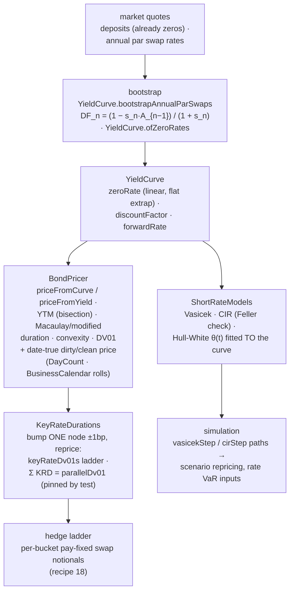

The stack splits statics from dynamics. Everything down the left column
is today's curve interrogated harder and harder — price, then slope
(DV01), then slope *per node* (the KRD ladder that recipe 18 turns into
hedge notionals). The right branch is the same curve given a stochastic
engine: Vasicek and CIR bring their own equilibrium, Hull-White is
calibrated so today's curve is reproduced exactly — which is why its
simulations are the ones you can use for curve-consistent scenario P&L.

---

## 17. Portfolio construction — one input set, three optimizers

All three consume the same expected returns and covariance; they disagree
about how much the return estimates deserve to be trusted, and the weight
vectors show it.

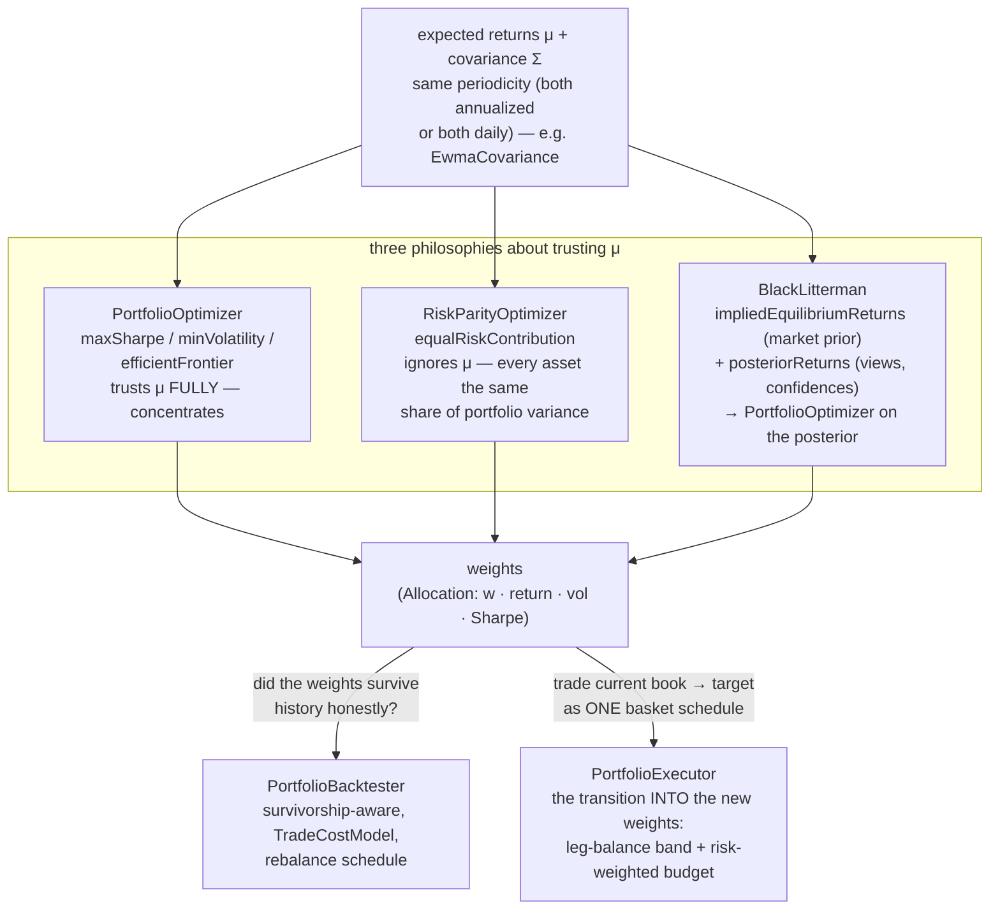

The fork at the bottom is the point of the diagram: a weight vector is a
research artifact until it survives a survivorship-honest backtest
(diagram 3's pipeline) *and* can be reached from the current book without
the transition itself destroying the alpha — which is what
`PortfolioExecutor` (diagram 11) exists to protect. Recipe 19 prints the
three weight vectors side by side.

---

## 18. The overfitting defense stack — from grid winner to deploy-or-reject

A parameter grid produces N backtests and reports the maximum — which is
a selection effect, not evidence. Four defenses interrogate the same
winner from different angles before any capital moves.

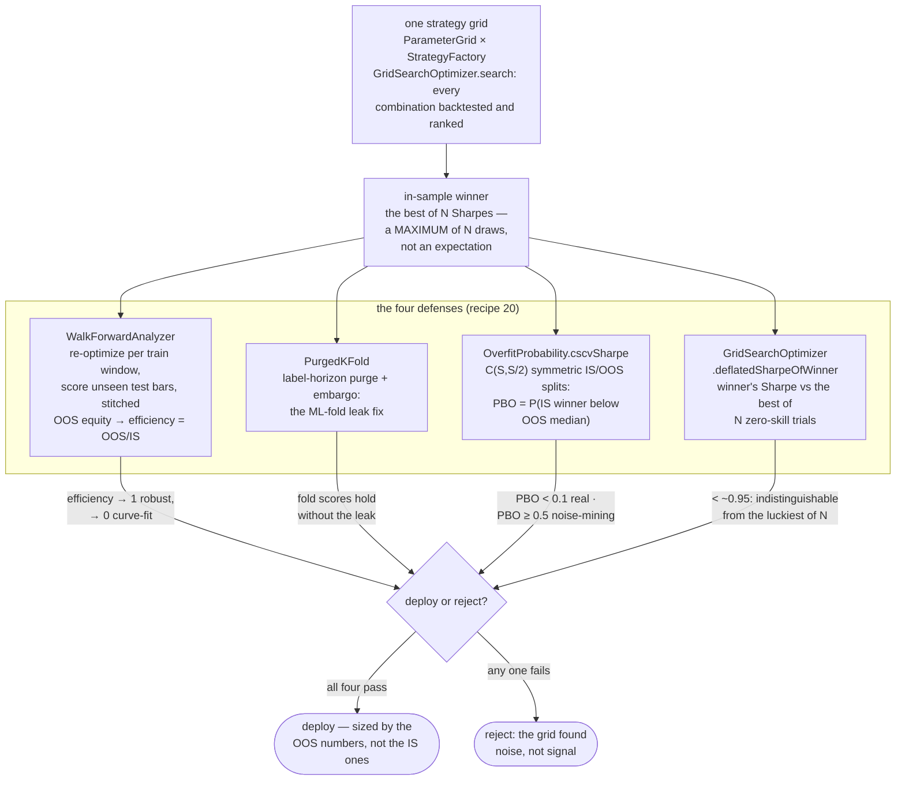

Each defense catches a different lie: walk-forward catches parameters
that only fit the past arrangement of regimes; the purged K-fold catches
label leakage that ordinary cross-validation invites; CSCV catches a
broken *selection process* (the winner keeps flipping under resampling);
the deflated Sharpe catches the multiple-testing haircut everyone forgets
to apply. Passing one is easy. Passing all four is what "not overfit"
means here — and PBO ≥ 0.5 is an unconditional stop.

---

## 19. The full trading pipeline in one line — alpha discovery to optimal execution

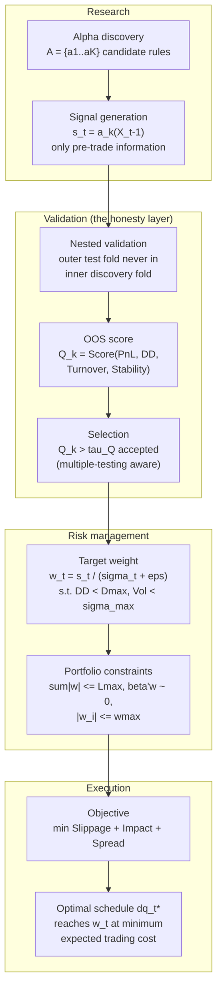

One line: **alpha discovery → signal generation → nested validation →
out-of-sample scoring → selection → risk-managed sizing → portfolio
constraints → optimal execution.** The class map, stage by stage:
`alpha.Factors`/`AlphaContext` (discover on a frozen panel) →
`PurgedKFold`/`WalkForwardAnalyzer`/`AlphaValidation` (leak-free folds) →
`SignalEvaluator`/`AlphaBacktester`/`DrawdownAnalytics` (the score
vector) → `SharpeValidation`/`OverfitProbability`/
`deflatedSharpeOfWinner` (a threshold that knows K rules were tried) →
`PortfolioConstruction`/`PositionSizing` (conviction over risk) →
`ConstrainedPortfolioOptimizer`/`ComponentVar` (book-level promises) →
`AlmgrenChriss`/`ImplementationShortfallScheduler`/`BenchmarkExecutor`/
`AdaptiveSor`/`PortfolioExecutor` (the schedule) →
`TransactionCostAnalyzer` (did reality match the objective?). When live
PnL disappoints, walk the arrows backwards — every post-mortem lands on
exactly one of them. The prose version is LEARN.md §8c.

---

## 20. The FIX session lifecycle -- a state machine with a heartbeat

One class (`fix.FixSession`) plays initiator and acceptor; the timings
below are the ones its heartbeat thread actually enforces (probe at 1.5x
the agreed interval of receive silence, disconnect at 2.5x), and the
sequence-number discipline is what makes a resumed session trustworthy.

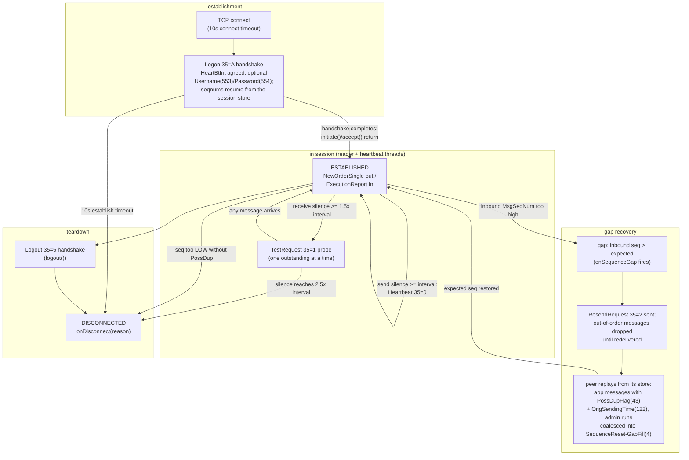

Duplicates (PossDup below the expected seqnum) are suppressed silently --
only a too-low seqnum WITHOUT the flag is unforgivable, because it means
the peer's story about the past changed. With a `FileSessionStore`, a
restart resumes yesterday's sequence numbers and can still service the
peer's ResendRequest for messages sent before the crash. Recipe 21 is the
runnable version; `FixSessionTest` drives every edge above over a real
TCP socket, forced gap included.

---

## 21. The variance-swap replication map -- from option chain to marked book

The Demeterfi-Derman-Kamal-Zou observation: a static 1/K^2 portfolio of
OTM options IS a variance payoff, so the fair strike is readable off the
chain with no model. Everything to the left of the fair strike is
model-free; the one box that is not (the vol swap) is marked as such.

```mermaid
flowchart TD
    subgraph REPL21["replication (model-free)"]
        CHAIN21["one expiry's option chain<br/>OTM mids: puts below F, calls above,<br/>put/call average at the pivot K0"]
        W21["1/K^2 weights<br/>sum of dK/K^2 x e^rT x Q(K)<br/>(VolatilityIndex.index)"]
        LOG21["the log contract<br/>constant-dollar-gamma payoff:<br/>its PnL IS realized variance"]
        FV21["fair variance K_var = index^2<br/>(VarianceSwap.fairVariance)<br/>a VIX of 20 IS a strike of 0.04"]
    end
    subgraph BOOK21["the desk's book"]
        VEGA21["vega quote to variance units<br/>varNotional = vegaNotional / (2 K_vol)<br/>(VarianceSwap.varianceNotional)"]
        MTM21["seasoned swap at time t:<br/>(t/T) x realized locked in +<br/>(1 - t/T) x K_remaining, discounted,<br/>vs the original K_0<br/>(VarianceSwap.markToMarket)"]
        VOL21["vol swap strike (NOT model-free)<br/>sqrt(K_var) - Var(V) / (8 K_var^1.5)<br/>(VarianceSwap.volSwapStrike)<br/>always BELOW sqrt(K_var)"]
    end

    CHAIN21 --> W21 --> LOG21 --> FV21
    FV21 -->|"the price tag"| VEGA21
    FV21 -->|"variance is additive in time"| MTM21
    FV21 -->|"convexity correction<br/>needs vol-of-vol"| VOL21
```

The MTM box is why desks love the product: the elapsed leg is locked
realized variance, the remaining leg is a fresh chain read, and no model
sits between them. The vol swap is the same payoff under a square root --
and that one concave function costs the trade its model-freeness, which
is what the convexity-correction box quantifies. Recipe 23 runs the whole
map end to end.

---

## 22. The risk allocation tree -- one VaR, three questions, one committee

Component, marginal, and incremental VaR all derive from the same
covariance and positions, but they answer different questions -- and the
book's hedge is where they visibly part ways.

```mermaid
flowchart TD
    COV22["factor covariance Sigma<br/>(EwmaCovariance, or a sample<br/>matrix STABILIZED by<br/>CovarianceShrinkage.ledoitWolf)"]
    POS22["signed position exposures w<br/>(hedges are negative)"]
    SIG22["portfolio sigma = sqrt(w' Sigma w)<br/>x z(confidence) = portfolio VaR<br/>(ComponentVar.allocate)"]
    subgraph SPLIT22["three numbers per desk (ComponentVar)"]
        COMP22["component VaR (Euler)<br/>w_i x z (Sigma w)_i / sigma --<br/>SUMS EXACTLY to portfolio VaR,<br/>no residual bucket; a hedge's<br/>component is NEGATIVE"]
        MARG22["marginal VaR<br/>z (Sigma w)_i / sigma --<br/>how fast VaR moves per unit:<br/>should the NEXT dollar go here?"]
        INCR22["incremental VaR<br/>VaR(book) - VaR(book without i) --<br/>what actually disappears if the<br/>desk is CLOSED (a re-computation,<br/>NOT the component)"]
    end
    ACT22["limits and committee actions:<br/>budget by component; grow where<br/>marginal is low; and never confuse<br/>the two for a hedge -- closing the<br/>negative-component desk RAISES VaR"]

    COV22 --> SIG22
    POS22 --> SIG22
    SIG22 --> COMP22
    SIG22 --> MARG22
    SIG22 --> INCR22
    COMP22 --> ACT22
    MARG22 --> ACT22
    INCR22 --> ACT22
```

The Euler split is exact only because delta-normal VaR is homogeneous of
degree one in the positions -- the allocations inherit the model's linear-
positions, normal-returns assumptions, stated. The shrinkage box matters
more than it looks: the raw sample matrix's smallest eigenvalues are too
small, and both the optimizer AND the allocation trust exactly those
directions. Recipe 25 prints the whole committee packet.

---

## 23. The NDF lifecycle -- two dates, one clamp, USD only

A non-deliverable forward never touches the restricted currency: the
trade fixes against an official reference rate and cash-settles the
difference in USD. The date arithmetic and the mark's behavior inside the
fixing window are where implementations quietly disagree; `fx.Ndf`'s
choices are drawn below.

```mermaid
flowchart LR
    subgraph DATES23["date arithmetic (calendars)"]
        TRADE23["trade date<br/>Ndf.of(pair, trade, tenor, ...)"]
        SETT23["settlement date<br/>pair.tenorDate: spot lag +<br/>tenor roll, joint calendar"]
        FIX23["fixing date: walk BACK from<br/>settlement in LOCAL (quote-calendar)<br/>business days -- 2 for INR/KRW/TWD/CNY,<br/>1 for BRL(PTAX)/PHP/CLP"]
    end
    subgraph MARK23["marking the trade (Ndf.markToMarket)"]
        PRE23["before the window:<br/>settlement formula at the curve<br/>outright to the FIXING date --<br/>the date the payoff references"]
        WIN23["inside the window<br/>(fixing date at or before curve spot):<br/>no forward left to read -- the mark<br/>CLAMPS to the SPOT outright and<br/>keeps marking, never throws"]
    end
    subgraph SETTLE23["fixing and settlement (USD)"]
        PUB23["official fixing publishes<br/>(RBI / KFTC18 / PTAX) -- from here<br/>the right number is settlementAmount<br/>with the ACTUAL print, not a curve"]
        CASH23["cash settlement in base ccy:<br/>notional x (fixing - K) / fixing<br/>pays on the SETTLEMENT date<br/>(discounting: base-ccy YieldCurve)"]
    end

    TRADE23 --> SETT23
    SETT23 -->|"fixing lag walk-back"| FIX23
    TRADE23 -->|"life of the trade"| PRE23
    PRE23 -->|"fixing date reaches<br/>the curve's spot"| WIN23
    WIN23 --> PUB23
    FIX23 -->|"fixing day arrives"| PUB23
    PUB23 --> CASH23
    SETT23 -->|"payment date"| CASH23
```

The division by the fixing in the settlement formula is the step people
forget: it converts the quote-currency difference back into deliverable
currency, which is why the buyer of USD in USDINR receives
`notional x (fixing - K) / fixing` USD, not the naive difference. The
fixing publishes on its LOCAL business days regardless of USD holidays --
hence the quote-calendar walk-back -- and the spot clamp inside the window
is the same keep-marking treatment an aged `FxSwap` leg gets: a curve
cannot know the print, but it should not throw mid-lifecycle either.
`FixingRisk` prices the window's remaining tracking error (diagram 6).

---

## 24. One order, five verbs -- time-in-force semantics in HftOrderBook

Five entry points share one matching core; what differs is only what
happens to the part that does not trade immediately.

```mermaid
flowchart TD
    IN24(["incoming order"]) --> Q24{"which entry point?"}

    subgraph VERBS24["order-entry verbs (all zero-alloc)"]
        LIM24["submitLimit<br/>match while crossing,<br/>rest the remainder"]
        MKT24["submitMarket<br/>match against the whole<br/>opposite book, never rest"]
        IOC24["submitIoc<br/>price-limited taker,<br/>remainder expires"]
        FOK24["submitFok<br/>all-or-nothing probe,<br/>then delegates to IOC"]
        PO24["submitPostOnly<br/>rest only, never take"]
    end

    Q24 --> LIM24
    Q24 --> MKT24
    Q24 --> IOC24
    Q24 --> FOK24
    Q24 --> PO24

    LIM24 -->|"crossing part"| FILL24["trades emitted<br/>(taker id = order id)"]
    LIM24 -->|"remainder"| REST24["rests at priceTick<br/>(FIFO at its level)"]
    LIM24 -->|"pool exhausted:<br/>matched part STANDS,<br/>remainder rejected"| RPF24["REJECT_POOL_FULL"]
    MKT24 --> FILL24
    MKT24 -->|"opposite side empty"| ZERO24["returns filled qty (0)"]
    IOC24 --> FILL24
    IOC24 -->|"unfilled remainder"| EXP24["expires -- nothing rests"]
    FOK24 -->|"fillableWithin walks the<br/>occupancy bitmaps: full qty<br/>available inside the limit?"| IOC24
    FOK24 -->|"probe fails: no trades,<br/>no id, no counters"| KILL24["killed (returns 0)"]
    PO24 -->|"would trade on arrival"| RWC24["REJECT_WOULD_CROSS<br/>(maker fee preserved)"]
    PO24 -->|"does not cross"| REST24
```

The subtleties are in the edges. A `submitLimit` that exhausts the order
pool keeps its executed portion -- trades were real -- and rejects only the
resting remainder, exactly how a venue sheds load without unwinding
executions. `submitIoc` clamps only the aggressive end of an off-band
limit (the subtraction is done in `long`, so `Integer.MIN/MAX_VALUE`
sentinels mean "pure market" and cannot wrap into the opposite meaning).
And a killed `submitFok` consumes no order id and emits no trades, like a
venue rejecting pre-match, while a `submitPostOnly` pool-full reject still
consumes an id -- so id sequences and `orderCount` reconcile identically
regardless of entry point. `LimitOrder` and the research-lane `OrderBook`
cover the same verbs in the readable lane.

---

## 25. Building L3 from ITCH -- seven message types, one book, your exact queue position

`ItchCodec` frames the wire; `L3BookBuilder.onMessage` applies it. The
payoff of tracking every order individually: `sharesAhead` is exact, not
estimated.

```mermaid
flowchart LR
    subgraph WIRE25["ITCH wire messages (ItchCodec)"]
        A25["A / F -- add order<br/>(F carries an MPID)"]
        E25["E -- order executed"]
        X25["X -- cancel (partial)"]
        D25["D -- delete"]
        U25["U -- replace<br/>(origRef to newRef)"]
        P25["P -- trade,<br/>non-displayed"]
    end

    subgraph BOOK25["L3BookBuilder (single-writer, zero-alloc)"]
        ADD25["onAdd: append to the<br/>level's FIFO"]
        EXE25["onExecute: consume<br/>from the queue HEAD"]
        CXL25["onCancel / onDelete:<br/>remove from mid-queue"]
        RPL25["onReplace: delete + add<br/>(priority lost by design)"]
        TRD25["onTrade: lastTradeTick only<br/>(hidden liquidity, no book change)"]
    end

    A25 --> ADD25
    E25 --> EXE25
    X25 --> CXL25
    D25 --> CXL25
    U25 --> RPL25
    P25 --> TRD25

    ADD25 --> STATE25["book state<br/>bestBid/AskTick, qtyAtTick,<br/>snapshot per side"]
    EXE25 --> STATE25
    CXL25 --> STATE25
    RPL25 --> STATE25

    EXE25 -->|"execution consumed the head:<br/>always ahead of you"| QP25["tracked orders<br/>track(ref) once, then O(1);<br/>sharesAhead(ref) exact"]
    CXL25 -->|"reduce ahead only if the<br/>removed qty WAS ahead"| QP25
    STATE25 -->|"unknown ref"| GAP25["unknownRefCount<br/>(feed gap symptom:<br/>resubscribe / snapshot)"]
```

`onMessage` returns the wire length consumed and 0 for another stock
locate or an unsupported type, so a feed handler skips by length without
branching per symbol. The queue-position update is where the L3 detail
pays: an `E` execution always consumed the front of the queue, so every
tracked order behind it decrements `sharesAhead`; an `X`/`D` in the middle
decrements only trackers the removed quantity was actually ahead of. When
you only have L2 aggregates, the honest fallback is the probabilistic
`microstructure.QueuePositionEstimator` -- this class is what it
approximates.

---

## 26. NBBO consolidation -- per-venue tops in, one inside out

`Nbbo` aggregates up to 64 venues' tops of book into a national best bid
and offer, and its listener fires only when that inside actually changes.

```mermaid
flowchart TD
    V1_26["venue 0 top<br/>onVenueQuote"] --> FAST26{"fast path:<br/>venue not at either inside<br/>and stays strictly outside?"}
    V2_26["venue k top<br/>onVenueQuote"] --> FAST26
    VD26["onVenueDown<br/>(feed loss / halt) --<br/>same clearing path as<br/>an empty quote"] --> FAST26

    FAST26 -->|"provably no change:<br/>no scan, return false"| DONE26["NBBO unchanged"]
    FAST26 -->|"might matter"| SCAN26["linear rescan over venues<br/>(at most 64 -- cache-resident)"]
    SCAN26 --> BEST26["national best bid / offer<br/>bidTick, askTick +<br/>TOTAL size at each inside<br/>+ bitmask of venues there"]
    BEST26 --> FLAGS26["locked(): NBB == NBO<br/>crossed(): NBB above NBO<br/>(the locked/crossed tape condition)"]
    BEST26 --> CHG26{"price or inside<br/>size changed?"}
    CHG26 -->|"yes: changeCount++"| CB26["Listener fires<br/>(primitive-only callback)"]
    CHG26 -->|no| DONE26
```

The single-venue-set bitmask (hence the hard `venueCount <= 64` limit) is
what makes the fast path provable: a venue that was not at either inside
and whose new quote stays strictly outside cannot have moved the NBBO, so
most quote traffic never triggers the rescan. Downstream, `locked()` and
`crossed()` are the flags an `AdaptiveSor` or `SmartOrderRouter` checks
before routing -- posting into a crossed market is how you buy yourself a
regulatory conversation. `NO_BID`/`NO_ASK` sentinels keep the empty-side
arithmetic branch-free.

---

## 27. Anatomy of a binary message -- the 48-byte quote vs tag=value FIX

Same fact -- "EURUSD is 1.0842 / 1.0844" -- in the two encodings the
library speaks. `QuoteFlyweight` is a fixed-offset window over a
`ByteBuffer`; `FixMessage` is a parsed bag of ASCII tags.

```mermaid
flowchart TB
    subgraph BIN27["QuoteFlyweight -- 48 bytes, little-endian, fixed offsets"]
        F0_27["offset 0: int32<br/>messageType = 3"]
        F4_27["offset 4: int32<br/>symbolId (dense id,<br/>shared by both ends)"]
        F8_27["offset 8: double<br/>bidPrice"]
        F16_27["offset 16: double<br/>bidSize"]
        F24_27["offset 24: double<br/>askPrice"]
        F32_27["offset 32: double<br/>askSize"]
        F40_27["offset 40: int64<br/>timestampNanos"]
    end

    subgraph FIX27["FIX tag=value -- variable length ASCII"]
        RAW27["8=FIX.4.4 | 35=W | 55=EURUSD |<br/>132=1.0842 | 133=1.0844 | ... | 10=checksum<br/>(every field: scan for SOH, parse digits)"]
    end

    F0_27 ~~~ F4_27 ~~~ F8_27 ~~~ F16_27 ~~~ F24_27 ~~~ F32_27 ~~~ F40_27

    BIN27 -->|"read = one getDouble at a<br/>compile-time-constant offset;<br/>wrap() repositions, no objects"| HOT27["hot lane<br/>BinaryOrderPublisher /<br/>BinaryMarketDataClient<br/>typeAt() dispatches by the<br/>first int32"]
    FIX27 -->|"parse = FixDecoder walks<br/>tags, allocates strings,<br/>validates checksum"| SESS27["counterparty lane<br/>FixSession -- interop is the<br/>point, not latency"]
```

Why fixed layout wins on the hot path: length is a constant
(`BLOCK_LENGTH = 48`), so framing is arithmetic, not scanning; every field
read is a single bounds-checked primitive load at an offset the JIT folds
into the instruction; and `wrap(buffer, offset)` re-points one reusable
flyweight, so a million quotes parse with zero allocation. The tag=value
message spends its budget on generality -- optional fields, repeating
groups, human-greppable logs -- which is exactly what you want at a
counterparty boundary and exactly what you do not want between your own
processes. `OrderFlyweight` and `TradeFlyweight` follow the same pattern
with their own type discriminators.

---

## 28. Tick capture and deterministic replay -- record once, relive exactly

The QFLT file is the seam between live and offline: everything upstream
is racy and real-time, everything downstream is a pure function of the
file.

```mermaid
flowchart LR
    FEED28["WebSocketFeed<br/>(BinanceTradeParser or<br/>any FeedParser)"] --> BUS28["HftMarketDataBus.publish<br/>lock-free ring, single<br/>consumer thread"]
    BUS28 --> STRAT28["live TickListener<br/>subscribers"]
    BUS28 --> CAP28["TickCapture.attach<br/>(inline) or AsyncTickCapture<br/>(own ring; droppedTicks<br/>counts overflow honestly)"]
    CAP28 --> FILE28[("QFLT file<br/>magic + version, then framed:<br/>symbol-def records +<br/>tick records (id, price,<br/>size, timestampNanos)")]
    FILE28 --> RD28["TickFileReader.replay<br/>(full speed) or replayPaced<br/>(wall-clock x multiplier)"]
    RD28 --> TB28["TickBacktester.run<br/>(strategy, tickFile, config)"]
    TB28 --> RES28["TickBacktestResult<br/>same file + same strategy<br/>= same fills, every run"]
    RES28 -.->|"bug reproduces on the<br/>Nth run exactly as the 1st"| TB28
```

What determinism buys debugging: a strategy that misbehaved at 14:31:07
on the live bus misbehaves at the same tick of the same file forever --
you can binary-search the tick stream, add asserts, and re-run in
milliseconds, none of which is possible against a live feed. The one
honest caveat sits at capture time: `AsyncTickCapture` prefers dropping
ticks (counted in `droppedTicks`) to stalling the market-data thread, so
a nonzero drop count means the file is an approximation and the
inline `TickCapture` on a slower symbol set is the fix. `TickFileWriter`
holds the format; recipe-grade replay needs nothing but the `Path`.

---

## 29. The four backtest engines -- what each models, what each ignores

One question picks the engine: what is the finest thing your edge
depends on?

```mermaid
flowchart TD
    Q29(["what does the<br/>edge depend on?"]) --> QP29{"queue position /<br/>tick-level fills?"}
    QP29 -->|yes| TB29["TickBacktester<br/>models: QFLT replay, market fills at<br/>last trade +/- half spread, limits earn<br/>fills through defaultQueueAhead as<br/>volume prints AT the price<br/>ignores: book depth, multi-asset"]
    QP29 -->|no| MA29{"multi-asset<br/>portfolio weights?"}
    MA29 -->|yes| PB29["PortfolioBacktester<br/>models: long/short rebalancing to target<br/>weights; survivorship-aware overload adds<br/>PointInTimeUniverse, delistings at true<br/>terminal value, mergers, dividends<br/>ignores: intrabar paths, execution detail"]
    MA29 -->|no| EX29{"does execution cost /<br/>TCA matter to the answer?"}
    EX29 -->|yes| EA29["ExecutionAwareBacktester<br/>models: parent orders worked over bars<br/>through an ExecutionModel (SorExecution,<br/>IcebergExecution, InstantExecution),<br/>per-parent TCA<br/>ignores: multi-asset (long-only, single name)"]
    EX29 -->|no| BT29["Backtester<br/>models: bar-close fills + slippage,<br/>intrabar stop/take-profit with gap-aware<br/>fills, warm-up overload for walk-forward<br/>ignores: fill realism, portfolio effects"]

    TB29 --> COST29["shared seam: TradeCostModel +<br/>PerformanceAnalytics -> PerformanceMetrics"]
    PB29 --> COST29
    EA29 --> COST29
    BT29 --> COST29
```

The engines are deliberately a ladder, not alternatives of equal rank:
`Backtester` answers "is there a signal at all" in microseconds per run
(which is what `GridSearchOptimizer` and `WalkForwardAnalyzer` need),
`ExecutionAwareBacktester` answers "does the signal survive being
executed", `PortfolioBacktester` answers "does it survive other positions
and dead companies", and `TickBacktester` answers "does the passive fill
I assumed actually happen". A strategy that only works on the engines
above the one matching its trading style is reporting model error as
alpha. `ExecutionAlgoBacktester` sits beside the ladder for benchmarking
the execution algos themselves.

---

## 30. Walk-forward windows -- rolling folds, warm indicators, honest capital

`WalkForwardAnalyzer` re-optimizes on each train window and trades the
parameters forward on the adjacent test window -- with two details naive
implementations miss.

```mermaid
flowchart LR
    subgraph F1_30["fold 1"]
        TR1_30["train<br/>GridSearchOptimizer picks<br/>best params in-sample"]
        TE1_30["test<br/>Backtester.run with the train<br/>bars as WARM-UP prefix --<br/>indicators enter warm,<br/>trades start at the boundary"]
    end
    subgraph F2_30["fold 2 (rolled forward)"]
        TR2_30["train"]
        TE2_30["test"]
    end
    subgraph F3_30["fold 3 ..."]
        TR3_30["train"]
        TE3_30["test"]
    end

    TR1_30 --> TE1_30
    TR2_30 --> TE2_30
    TR3_30 --> TE3_30
    TE1_30 -->|"carryCapital =<br/>finalEquity of fold 1"| TE2_30
    TE2_30 -->|"capital carries again"| TE3_30
    TE3_30 --> OUT30["stitched out-of-sample equity +<br/>per-fold Fold records +<br/>efficiency = OOS return sum /<br/>IS return sum"]
```

Detail one: evaluating a fold on a bare test slice would recompute every
indicator from scratch, silently forcing HOLD through the first
`lookback` bars of every fold -- so `Backtester` takes the preceding
train bars as a warm-up prefix (they are the past; no look-ahead) and
records equity only from `tradeFrom`. Detail two: each fold starts with
the previous fold's final equity, not a reset bankroll, so the stitched
curve compounds the way a live account would. The efficiency ratio
(out-of-sample performance as a fraction of in-sample) is the overfitting
thermometer -- near 1 means the edge generalizes, near 0 means the grid
search was fitting noise -- but as the class doc warns, it is only
meaningful when the in-sample objective is positive in the first place.

---

## 31. Purged K-fold -- the label-leak picture

A label computed over `[t, t + labelHorizon)` makes plain K-fold leak:
training samples adjacent to the test fold have already seen its data.
`PurgedKFold.splits(n, k, labelHorizon, embargo)` cuts the leak out.

```mermaid
flowchart LR
    TRL31["TRAIN (left)<br/>indices 0 .. t0-labelHorizon-1<br/>labels resolve BEFORE<br/>the test fold starts"] --> PGL31["PURGED (pre-test)<br/>t0-labelHorizon .. t0-1<br/>label windows OVERLAP the<br/>test fold -- they peeked"]
    PGL31 --> TEST31["TEST FOLD k<br/>t0 .. t1-1<br/>(contiguous block)"]
    TEST31 --> PGR31["PURGED (post-test)<br/>t1 .. t1+labelHorizon-1<br/>labels DRAW ON bars<br/>inside the test fold"]
    PGR31 --> EMB31["EMBARGO<br/>+embargo more bars dropped:<br/>serial correlation leaks<br/>even without label overlap"]
    EMB31 --> TRR31["TRAIN (right)<br/>t1+labelHorizon+embargo .. n-1<br/>clean again"]
```

Read it as the index line it is: each `Split` record carries the test
range and `trainIndices` that are exactly the left block ending at
`t0 - labelHorizon` and the right block starting at
`t1 + labelHorizon + embargo` -- hand-checkable, which is how the tests
verify it. The two purge zones have different causes: the pre-test zone
holds training samples whose label windows reach into the test fold, and
the post-test zone holds samples whose labels are computed from test-fold
bars. The embargo is the humbler admission that returns are serially
correlated, so a bar just outside the purge zone still carries test-fold
information. `OverfitProbability` and `SharpeValidation` sit downstream
in the same `backtest.validation` package -- diagram 18 shows the full
defense stack this feeds.

---

## 32. The CSCV split matrix -- every symmetric half, one probability

`OverfitProbability` implements combinatorially symmetric
cross-validation (Bailey, Borwein, Lopez de Prado and Zhu): not "is this
track record luck" but "is the selection process itself broken".

```mermaid
flowchart TD
    M32["returns matrix, T x N<br/>one column per strategy variant<br/>(the whole grid you searched)"] --> B32["slice time into S equal blocks<br/>S even, 4 to 16<br/>(cap: C(16,8) = 12,870 splits)"]
    B32 --> C32["enumerate ALL C(S, S/2) ways to<br/>pick half the blocks as in-sample;<br/>the other half is out-of-sample<br/>(symmetric: every split's mirror<br/>is also evaluated)"]
    C32 --> P32["per split:<br/>1. concatenate IS blocks,<br/>pick the variant with the<br/>best IS objective<br/>2. rank THAT variant among all<br/>N on the OOS blocks -> w"]
    P32 --> L32["logit lambda = ln(w / (1-w))<br/>positive: IS winner stays<br/>above OOS median"]
    L32 --> PBO32["PBO = fraction of the<br/>C(S, S/2) logits below 0<br/>Result(pbo, combinations, logits)"]
```

The trick that makes it honest: the selection rule inside each split is
the same rule you used in real life (pick the best in-sample variant), so
CSCV measures the propensity of *your process* to crown a variant that
then lands in the bottom half out-of-sample. A PBO near 0.5 says the grid
winner is indistinguishable from a coin flip; a low PBO says selection
carries real information. `cscvSharpe` bakes in the per-period Sharpe
objective; the general `cscv` takes any objective over a concatenated
return slice. Block structure (rather than per-bar shuffling) preserves
serial correlation inside each block, for the same reason
`BlockBootstrap` resamples blocks -- diagram 18 places PBO in the full
deploy-or-reject pipeline.

---

## 33. Cost model decomposition -- four components stack on every trade

`TradeCostModel.institutional` is the ONE definition of "what a trade
costs" shared by the engines; here is how the bps stack up on a single
buy.

```mermaid
flowchart TD
    T33(["trade: notional W<br/>at bar i of series"]) --> C1_33["+ commissionBps<br/>fixed, per side --<br/>the broker's cut"]
    C1_33 --> C2_33["+ halfSpreadBps<br/>you cross half the quoted<br/>spread on EVERY trade,<br/>buy or sell"]
    C2_33 --> C3_33["+ slippageBps<br/>fixed implementation noise:<br/>latency, odd lots, timing"]
    C3_33 --> C4_33["+ sqrt-impact term<br/>MarketImpactModel.estimate over the<br/>trailing impactWindow bars gives<br/>ADV and vol; impact grows with<br/>sqrt(W / ADV) -- the size-dependent<br/>component"]
    C4_33 --> SUM33["costBps(series, i, W)<br/>all-in one-way bps of notional"]

    C4_33 -.->|"bars before impactWindow,<br/>or no volume data:<br/>flat components only --<br/>documented degradation,<br/>never a crash"| SUM33
    SUM33 --> USE33["charged identically by the backtest<br/>engines and alpha.AlphaBacktester --<br/>execution-aware and survivorship-aware<br/>numbers from the SAME cost definition"]
```

The first three components are size-independent -- double the order,
same bps -- which is why a flat-cost backtest scales to any AUM on paper.
The square-root impact term is the one that does not: it grows with
traded notional against trailing ADV, so cost per dollar rises as the
book grows, and "capacity" stops being a vibe and becomes the AUM where
impact eats the alpha. `TradeCostModel.flat(bps)` remains available as
the classic commission-only assumption (and the exact equivalent of the
legacy `commissionRate` configs); the interface contract -- a pure
function of `(series, index, notional)` -- is what lets engines call it
at any bar in any order.

---

## 34. The GARCH family tree -- what each generation adds, and when it breaks

Each model in `volatility` fixes its parent's blind spot and inherits
its machinery; the HAR branch changes the input instead.

```mermaid
flowchart TD
    EWMA34["EwmaVolatility<br/>h(t) = lambda h(t-1) + (1-lambda) r^2<br/>riskMetrics(): lambda = 0.94<br/>adds: recency weighting, no fitting<br/>breaks: persistence pinned at 1 --<br/>shocks never decay toward a long-run level"]
    G34["Garch11<br/>h(t) = omega + alpha r^2 + beta h(t-1)<br/>adds: mean reversion to omega/(1-alpha-beta);<br/>variance-targeted MLE, deterministic grid<br/>breaks: symmetric -- a -3% day and a +3% day<br/>forecast identical vol"]
    GJR34["GjrGarch11<br/>negative returns load alpha + gamma,<br/>positive only alpha<br/>adds: the leverage effect<br/>(equities: gamma often > alpha)<br/>breaks: gamma near 0 (FX pairs) --<br/>extra parameter buys nothing"]
    EG34["Egarch11<br/>models LOG variance<br/>adds: asymmetry with no positivity<br/>constraints on parameters<br/>breaks: fit box excludes oscillating<br/>log-variance; runaway paths rejected<br/>as junk during fitting"]
    HAR34["HarRv (the realized branch)<br/>OLS on daily + weekly-avg + monthly-avg<br/>realized variance<br/>adds: uses INTRADAY information via RV<br/>breaks: needs >= 60 daily RV observations --<br/>no tick data, no model"]

    EWMA34 -->|"add mean reversion"| G34
    G34 -->|"add asymmetry<br/>(variance level)"| GJR34
    G34 -->|"add asymmetry<br/>(log variance)"| EG34
    G34 -.->|"different input, not<br/>different recursion"| HAR34
```

The progression is a lesson in paying for parameters: `EwmaVolatility`
has one knob and no likelihood; `Garch11` earns its three parameters via
variance targeting (omega is pinned to the sample variance, so the MLE
grid only searches alpha-beta -- derivative-free and deterministic);
`GjrGarch11` adds gamma only where the leverage effect exists to be
captured, and its own doc says so -- if fitted gamma is near zero, use
the simpler model. `Egarch11` moves the asymmetry into log-variance so no
positivity constraint binds the optimizer, at the price of a fit box that
must exclude empirically absurd oscillating solutions. `HarRv` is the
branch, not the trunk: same forecasting job, but fed by realized variance
from intraday data (e.g. `JumpRobustVolatility` output) rather than
daily returns.

---

## 35. Choosing a volatility estimator -- match the estimator to the data you have

The question is never "which model is best" -- it is "what input do you
actually possess".

```mermaid
flowchart TD
    Q35(["I need a volatility number"]) --> OPT35{"have a liquid<br/>option chain?"}
    OPT35 -->|yes| VIX35["VolatilityIndex.index<br/>model-free implied vol (VIX-style<br/>variance-swap replication) --<br/>the market's OWN forecast;<br/>mind truncation: sparse wings<br/>read LOW"]
    OPT35 -->|no| TICK35{"have tick /<br/>intraday data?"}
    TICK35 -->|yes| RV35["JumpRobustVolatility<br/>streaming realized vol with a bipower<br/>leg: volPerSqrtSecond is jump-robust,<br/>jumpShare = clamp(1 - bipower/raw)<br/>separates diffusion from jumps"]
    TICK35 -->|"yes, aggregated<br/>to daily RV"| HAR35["HarRv<br/>daily/weekly/monthly RV cascade,<br/>OLS forecast of tomorrow's RV"]
    TICK35 -->|"no, daily bars only"| GARCH35["the GARCH family<br/>EwmaVolatility (no fit),<br/>Garch11 (baseline),<br/>GjrGarch11 / Egarch11 (asymmetry)<br/>-- see the family tree"]
    Q35 --> DEC35{"need to know WHERE<br/>the vol comes from?"}
    DEC35 -->|yes| VD35["VolatilityDecomposition.decompose<br/>asset + market returns -> beta,<br/>systematicVol vs idiosyncraticVol<br/>(hedgeable vs not)"]
```

Two of these answer a different question than the others and it matters:
`VolatilityIndex` is forward-looking by construction (it reads the
market's 30-day expectation out of option prices), while the realized and
GARCH lanes are backward-looking estimates projected forward -- comparing
them IS the volatility risk premium. And `VolatilityDecomposition` does
not estimate the level at all; it splits an already-known total variance
into `beta^2 x market` and residual, which is the number that decides
whether hedging with index futures actually reduces your risk.
`indicators` and `microstructure.VolatilityCurve` cover the intraday
shape; this decision is about the level.

---

## 36. FX smile construction -- three broker quotes to five strikes to exact pillars

FX options are quoted in delta space (ATM, risk reversal, butterfly),
not strike space. `fx.FxVolSurface` does the translation;
`pricing.VannaVolga` makes the smile exact at the pillars.

```mermaid
flowchart LR
    QUOTES36["broker quotes per expiry<br/>ATM (delta-neutral straddle)<br/>RR25 = skew, BF25 = wings<br/>(optional RR10 / BF10)"] --> VOLS36["pillar vols<br/>v25c = atm + bf25 + rr25/2<br/>v25p = atm + bf25 - rr25/2<br/>(same shape at 10-delta)"]
    VOLS36 --> INV36["strike from delta, per pillar:<br/>invert forward delta N(d1) at the<br/>pillar's OWN vol; premiumAdjusted<br/>switches convention (deltas go<br/>non-monotone -- smallest-strike<br/>root taken, per market practice)"]
    INV36 --> PILLAR36["SmilePillar<br/>expiry, forward,<br/>strikes[] + vols[]<br/>(3 or 5 points)"]
    PILLAR36 --> VV36["VannaVolga.ofPillars<br/>takes the 25d put / ATM / 25d call<br/>triple (indices 1..3 of a<br/>five-pillar smile)"]
    VV36 --> PRICE36["price(K) = BS(K; atm) +<br/>sum of w_i(K) x pillar hedge cost;<br/>impliedVol(K) for the smile"]
    VV36 -.->|"exactness: pricing a pillar<br/>strike returns the pillar's<br/>own market vol"| PILLAR36
```

The two-step design matches how the market actually works: the broker
quote (`FxVolSurface.Builder.add(expiry, forward, atm, rr25, bf25)`)
is the tradable object, and each pillar's strike must be solved from its
delta *at its own vol* -- using the ATM vol for the wing strikes is the
classic implementation bug this class avoids. Downstream, `VannaVolga`
prices any strike as Black-Scholes at ATM vol plus the market cost of
the vega/vanna/volga hedge portfolio built from the three pillars -- the
log-strike weight form makes the construction exact at the pillars and
sensible between them. This surface is what `FxTierBook`-quoting desks
mark exotics against, and `SabrModel` (next diagram) is the parametric
alternative when you want a smile with four interpretable knobs.

---

## 37. SABR parameters at work -- backbone, tilt, and wings

`SabrModel.impliedVol(f, k, t, alpha, beta, rho, nu)` is the Hagan
expansion; each parameter owns one visible feature of the smile.

```mermaid
flowchart TD
    SABR37(["SABR smile<br/>sigma(K) around forward f"]) --> B37
    SABR37 --> R37
    SABR37 --> N37
    SABR37 --> A37["alpha -- the LEVEL<br/>ATM vol is approx alpha / f^(1-beta);<br/>calibrate() seeds alpha0 =<br/>atmVol x f^(1-beta) from the<br/>closest-to-ATM quote"]

    subgraph EFF37["one parameter, one feature"]
        B37["beta -- the BACKBONE<br/>how ATM vol moves when f moves:<br/>beta = 1: lognormal, ATM vol static<br/>beta = 0: normal, ATM vol approx alpha/f<br/>rises as rates fall<br/>(fixed by convention, NOT fitted)"]
        R37["rho -- the TILT<br/>spot-vol correlation:<br/>rho below 0 tilts the smile up on the<br/>low-strike side (equity/FX skew);<br/>searched in (-0.98, 0.98)"]
        N37["nu -- the WINGS<br/>vol-of-vol: nu near 0 flattens toward<br/>pure CEV; larger nu fattens BOTH<br/>wings symmetrically (curvature,<br/>the butterfly)"]
    end

    B37 --> CAL37["calibrate(f, t, beta, strikes, marketVols):<br/>beta held fixed, random restarts over<br/>(alpha, rho, nu), then coordinate descent;<br/>Params carries the fit rmse"]
    R37 --> CAL37
    N37 --> CAL37
    A37 --> CAL37
```

The reason `calibrate` takes beta as an *argument* rather than fitting
it: beta and rho produce nearly identical smile tilts on any single
expiry, so fitting both is chasing noise -- the market convention is to
fix beta by asset class (1 for FX, 0.5 or 0 flavors for rates) and let
rho carry the skew. That leaves a well-behaved three-parameter problem,
which the random-restart-plus-coordinate-descent search handles
deterministically enough for the `Params.rmse` field to be a meaningful
fit diagnostic. The practical division of labor with diagram 36:
`VannaVolga` reprices the three pillars exactly and interpolates;
`SabrModel` fits a four-knob functional form that extrapolates into the
wings and, via the backbone, says how the smile *moves* when the forward
does -- which is a delta-hedging statement, not just an interpolation
one.

---

## 38. The Greeks ladder -- what moves the option, and what moves the movers

One vanilla option has four inputs that move -- spot, vol, time, rate --
and the first-order Greeks price each of those moves. The second-order
Greeks answer the question a hedger actually lives with: how fast do my
first-order hedges go stale?

```mermaid
flowchart TD
    OPT38(["one vanilla option<br/>BlackScholes.greeks: price + all five<br/>first-order numbers in one call"])

    subgraph FIRST38["first order -- P&L per unit input move"]
        DELTA38["delta<br/>per 1.00 spot move --<br/>THE hedge ratio"]
        VEGA38["vega<br/>per 1.00 vol move --<br/>the smile exposure"]
        THETA38["theta<br/>per year of calendar --<br/>the rent on the position"]
        RHO38["rho<br/>per 1.00 rate move --<br/>smallest of the four, usually"]
    end

    subgraph SECOND38["second order -- how the hedges drift (HigherOrderGreeks)"]
        GAMMA38["gamma<br/>d delta / d spot --<br/>delta churn per spot move"]
        VANNA38["vanna<br/>d delta / d vol = d vega / d spot --<br/>THE skew-hedging Greek"]
        VOLGA38["volga (vomma)<br/>d vega / d vol --<br/>vega convexity"]
    end

    OPT38 --> DELTA38
    OPT38 --> VEGA38
    OPT38 --> THETA38
    OPT38 --> RHO38
    GAMMA38 -->|"spot moves:<br/>delta drifts, rehedge"| DELTA38
    VANNA38 -->|"vol moves:<br/>delta drifts too"| DELTA38
    VANNA38 -->|"spot moves:<br/>vega drifts"| VEGA38
    VOLGA38 -->|"vol moves:<br/>vega re-exposes itself"| VEGA38
    GAMMA38 <-->|"the theta-gamma trade:<br/>theta is the rent paid<br/>for owning gamma"| THETA38
```

`BlackScholes.greeks` returns the whole first-order set as one record
(`price, delta, gamma, vega, theta, rho`); `HigherOrderGreeks.vanna` and
`volga` supply the second order in closed form, pinned by tests as finite
differences of `BlackScholes.delta` and `vega`. Vanna is the one to
internalize: a delta-hedged book with vanna is not hedged through a
spot-vol move -- and down-spot-up-vol is how equity markets actually
move. Volga is its vol-side twin: a vega-hedged book with volga
re-exposes itself the moment vol moves. Both are identical for calls and
puts (put-call parity kills the sign difference at second order), and
both are exactly the Greeks the `VannaVolga` pricing method charges the
smile for.

The theta-gamma double arrow is the economics of the whole ladder: long
gamma means every spot move earns you rebalancing profit, and theta is
what you pay per day for that privilege. `HigherOrderGreeks.exchangeCrossGamma`
extends the ladder to the two-asset case, where per-asset gammas miss the
d2V/dS1 dS2 cross term.

---

## 39. The barrier option map -- up/down, in/out, and where the closed form refuses

Four barrier flavors, one parity, and an honest boundary: `BarrierOption`
prices the REGULAR configurations (barrier in the OTM region) by the
Reiner-Rubinstein reflection formula, and explicitly rejects the REVERSE
ones rather than pricing them subtly wrong.

```mermaid
flowchart TD
    VAN39["vanilla call / put<br/>BlackScholes.price"]

    subgraph REG39["regular barriers -- closed form (BarrierOption)"]
        DIC39["downAndInCall<br/>H <= min(S, K):<br/>alive only after the<br/>barrier trades"]
        DOC39["downAndOutCall<br/>H <= min(S, K):<br/>dies if the barrier trades"]
        UIP39["upAndInPut<br/>H >= max(S, K):<br/>the mirror case"]
        UOP39["upAndOutPut<br/>H >= max(S, K)"]
    end

    subgraph REV39["reverse barriers -- REJECTED here"]
        RB39["barrier in the ITM region<br/>(e.g. up-and-out call):<br/>knocks out exactly where the<br/>payoff is largest; risk dominated<br/>by barrier gamma; needs the full<br/>eight-case decomposition"]
    end

    MC39["simulation.MonteCarloSimulator<br/>path pricing, or a<br/>barrier-aware tree"]

    DIC39 -->|"reflection formula:<br/>vanilla priced on the<br/>barrier-reflected measure"| DOC39
    VAN39 -->|"in-out parity:<br/>KO = vanilla - KI<br/>(holding KI + KO<br/>replicates the vanilla)"| DOC39
    VAN39 -->|"same parity,<br/>put mirror"| UOP39
    UIP39 --> UOP39
    RB39 -->|"IllegalArgumentException,<br/>with directions"| MC39
```

The layout of the closed form is deliberately economical: only the
knock-INs are computed directly (`reflectionIn`, the Reiner-Rubinstein
value with `lambda = (r - q + sigma^2/2)/sigma^2`), and every knock-OUT
comes from in-out parity -- `downAndOutCall` is literally
`BlackScholes.price(...) - downAndInCall(...)` in the source. The parity
is not a shortcut, it is the product's economics: a knock-in plus the
matching knock-out IS the vanilla, so one formula and one subtraction
price the whole quadrant. Continuous monitoring, no rebates; `carry` is
the continuous yield, matching `BlackScholes` conventions.

The refusal is the diagram's second lesson. A reverse barrier (up-and-out
call with the barrier above the strike) dies exactly where it is worth
the most, its delta and gamma explode near the barrier, and pricing it
demands the full eight-case machinery -- so the class throws in
`validateDownCall`/`validateUpPut` instead, and the javadoc names the
alternatives. The knock-in edge case is also honest: at `timeYears <= 0`
an untouched knock-in returns 0, worthless by construction.

---

## 40. The autocallable lifecycle -- coupons, memory, and the knock-in cliff

The flagship equity structured product as `pricing.Autocallable` prices
it: a note that pays a fat coupon and redeems early the first observation
date the underlier closes at or above the autocall barrier -- economically
a bond plus a sold down-and-in put, funded by the coupons.

```mermaid
flowchart TD
    ISSUE40(["issue: notional, S0,<br/>observationYears[],<br/>barriers as fractions of S0<br/>(knockIn <= autocall,<br/>coupon <= autocall)"])
    OBS40{"observation date i:<br/>S vs the barriers"}
    CALL40["S >= autocallBarrier x S0:<br/>AUTOCALL -- redeem notional<br/>+ this period's coupon<br/>+ ALL missed coupons if<br/>memoryCoupons (Phoenix memory)"]
    CPN40["couponBarrier x S0 <= S<br/>< autocall: pay the coupon,<br/>note continues"]
    MISS40["S < couponBarrier x S0:<br/>no coupon -- banked for later<br/>if memoryCoupons, gone if not"]
    MAT40{"last observation reached<br/>without autocall:<br/>S_T vs knockInBarrier x S0"}
    SAFE40["S_T >= knockInBarrier x S0:<br/>principal protected --<br/>redeem full notional"]
    LOSS40["S_T < knockInBarrier x S0:<br/>the knock-in cliff --<br/>redeem notional x S_T/S0,<br/>the full equity loss"]

    ISSUE40 --> OBS40
    OBS40 --> CALL40
    OBS40 --> CPN40
    OBS40 --> MISS40
    CPN40 -->|"next observation"| OBS40
    MISS40 -->|"next observation"| OBS40
    OBS40 -->|"survived every<br/>autocall trigger"| MAT40
    MAT40 --> SAFE40
    MAT40 --> LOSS40
```

`Autocallable.price` runs this state machine down Monte Carlo GBM paths
-- antithetic variates halve the variance, a fixed seed makes every price
reproducible -- with each path terminating at the FIRST autocall (the
diagram's top exit) or walking through to the maturity branch. The
constructor enforces the geometry the diagram draws: the knock-in must
sit at or below the autocall (protection above the early-redemption
trigger is unreachable), while its relation to the coupon barrier is
deliberately free, because real structures place it on either side.

The model-honesty note in the class doc is part of the product, not fine
print: flat-vol GBM is the standard first pricer, NOT a desk-grade one --
the knock-in put is deeply smile-sensitive, so feed a vol from the
downside strike region (e.g. from `VolSurface`) as the first-order
correction. European knock-in observed at maturity only, observation-date
monitoring, no issuer credit spread: each simplification is stated, and
each moves the price in a direction the diagram lets you reason about
(the LOSS branch is where all the smile risk lives).

---

## 41. The delta-hedge rebalance loop -- band width as a dial between cost and error

Hedging continuously is bankruptcy by transaction costs; hedging never is
a naked option. The loop below is what every option desk runs instead,
and `WhalleyWilmott` is where the band width should come from rather than
be guessed.

```mermaid
flowchart LR
    MOVE41["price moves<br/>(one path step)"]
    DRIFT41["book delta drifts:<br/>target = BlackScholes.delta<br/>at the new spot, less time"]
    BAND41{"outside the no-trade band?<br/>half-width from<br/>WhalleyWilmott.bandHalfWidth =<br/>cbrt(1.5 k S Gamma^2 / lambda)"}
    HOLD41["inside: HOLD --<br/>zero trades, zero cost,<br/>carry the hedge error"]
    TRADE41["outside: trade to the<br/>NEAREST EDGE, not the center<br/>(WhalleyWilmott.rebalance) --<br/>pay transactionCostBps<br/>on the traded notional"]
    LEDGER41["cash ledger accrues interest;<br/>costs, turnover, rebalances<br/>accumulate (DeltaHedger)"]
    EXPIRY41["at expiry: finalPnl =<br/>hedge portfolio - payoff<br/>= the replication error<br/>(HedgeReport)"]
    DIST41["HedgingSimulator: the same loop<br/>over thousands of parallel GBM paths<br/>-> full error distribution,<br/>hedging VaR/CVaR, cost stats"]

    MOVE41 --> DRIFT41
    DRIFT41 --> BAND41
    BAND41 --> HOLD41
    BAND41 --> TRADE41
    HOLD41 --> MOVE41
    TRADE41 --> LEDGER41
    LEDGER41 --> MOVE41
    LEDGER41 --> EXPIRY41
    EXPIRY41 --> DIST41
```

`DeltaHedger.simulateShortOption` is one lap of the loop along one path:
sell the option, collect the premium into the cash account, rebalance
whenever `|target - held|` exceeds `Config.deltaBand`, and settle the
payoff at expiry -- `HedgeReport.finalPnl` is exactly the replication
error, zero in the Black-Scholes limit of continuous costless hedging at
the true vol. `HedgingSimulator.simulate` runs that lap across thousands
of paths in parallel (deterministic per seed regardless of thread
scheduling), with hedge vol and realized vol as SEPARATE inputs -- so
both classic questions fall out directly: discretization risk when they
are equal, and vol mispricing (selling rich shows up as positive mean
P&L) when they are not.

The Whalley-Wilmott cube root is why band width is so stable across
venues: costs must move 8x to move the band 2x. And the POLICY matters as
much as the width -- `WhalleyWilmott.rebalance` trades back to the
nearest edge, never to delta itself, because hedging to the center throws
away the band's whole point (you would pay the spread again on the next
tick's drift). Zero gamma degenerates honestly: zero band, always hedge
exactly to delta.

---

## 42. The pairs trading pipeline -- from candidate pair to entry z-score

The LEARN playbook's three questions, in library order: is the spread
actually tethered, how fast does it snap back, and how do you get in
without owning half a trade?

```mermaid
flowchart TD
    PAIR42(["candidate pair<br/>(dual listings, stock vs ADR,<br/>cash vs futures)"])
    VR42["pre-check: VarianceRatio --<br/>trending, mean-reverting,<br/>or a random walk?"]
    COINT42{"CointegrationTest.engleGranger:<br/>is the spread stationary?<br/>(ADF t-stat on the residual)"}
    DEAD42["NOT cointegrated: refuse.<br/>Two random walks can look<br/>correlated for years and<br/>then never come back"]
    SPREAD42["build the spread:<br/>A - beta x B from the<br/>cointegrating regression"]
    OU42{"OrnsteinUhlenbeck.fit:<br/>kappa, theta, sigma -- and the<br/>half-life = expected holding period"}
    NOREV42["no mean reversion in-sample:<br/>the fit THROWS rather than<br/>fitting a rubber-band model<br/>to a random walk"]
    SLOW42["half-life too long?<br/>a 200-day half-life is an<br/>index fund with extra steps"]
    KAL42["KalmanBeta.onObservation:<br/>track the DRIFTING hedge ratio --<br/>a beta fitted on last year<br/>is stale by spring"]
    SIG42["signal: Params.zScore --<br/>enter around |z| = 2 to 2.5<br/>(sell rich leg, buy cheap leg,<br/>ratio-locked), exit z under 0.5"]
    EXEC42["execution: SpreadExecutionAlgo --<br/>work the illiquid leg, chase with<br/>the liquid one, HARD legging cap;<br/>cointegration breaks = tether cut,<br/>exit everything"]

    PAIR42 --> VR42
    VR42 --> COINT42
    COINT42 -->|"fail"| DEAD42
    COINT42 -->|"pass"| SPREAD42
    SPREAD42 --> OU42
    OU42 -->|"refusal"| NOREV42
    OU42 -->|"kappa too small"| SLOW42
    OU42 -->|"tradable half-life"| KAL42
    KAL42 --> SIG42
    SIG42 --> EXEC42
```

Every box is a class and every refusal is deliberate.
`CointegrationTest.engleGranger` answers question 1 with an
`EngleGrangerResult` (the ADF t-statistic on the cointegrating
residual); `OrnsteinUhlenbeck.fit` answers question 2 with `Params` --
kappa, theta, sigma, and the derived `halfLife`, plus `zScore` against
the stationary standard deviation -- and literally throws when the series
shows no mean reversion in-sample, because fitting a rubber-band model to
a random walk is how pairs desks die. `KalmanBeta` replaces the static
hedge ratio with a time-varying one: the filter tracks the current beta
while a full-sample OLS averages the drift into a number that was never
true on any single day (its test demonstrates exactly that).

Question 3 is the one execution risk unique to spreads: the moment you
own one leg without the other you are not a pairs trader, just long (or
short) in disguise. The LEARN playbook's worked case -- 2.5 z-scores
apart, 8-day half-life, legging cap at 5% of the position, exit at z
under 0.5 or on a cointegration break -- runs the whole chain, and
cookbook recipe 15 prints it end to end.

---

## 43. Choosing a VaR flavor -- the book's shape picks the method

`VarEngine` implements all four classic flavors over one input shape
(factor exposures against a covariance or a return history) precisely
because the methods genuinely disagree -- and the disagreement is the
point.

```mermaid
flowchart TD
    START43(["what does the book hold,<br/>and what do the tails look like?"])
    Q1_43{"optionality<br/>in the book?"}
    DN43["linear book: DELTA-NORMAL<br/>VarEngine.deltaNormalVar --<br/>sigma_P = sqrt(d' Sigma d), VaR = z sigma_P.<br/>Instant, and exactly wrong<br/>for optionality"]
    Q2_43{"how much gamma?"}
    DG43["moderate gamma: DELTA-GAMMA<br/>VarEngine.deltaGammaVar --<br/>Cornish-Fisher quantile of<br/>d'dx + 0.5 dx'Gamma dx; short-gamma<br/>VaR is WORSE than delta-normal<br/>says, long-gamma better"]
    FR43["dominant gamma / exotics:<br/>FULL REVALUATION<br/>VarEngine.fullRevaluationVar --<br/>reprice every scenario;<br/>the expansion has degraded<br/>(skew beyond ~1)"]
    Q3_43{"trust the Gaussian<br/>factor model?"}
    HIST43["fat tails, no distribution:<br/>HISTORICAL<br/>VarEngine.historicalVar --<br/>replay actual factor rows;<br/>exactly as fat-tailed<br/>as the sample was"]
    EVT43["beyond-the-sample quantiles:<br/>ExtremeValueTheory.fitPot --<br/>GPD tail extrapolation<br/>(see diagram 44)"]
    Q4_43{"dependence structure<br/>the point?"}
    COP43["joint tail scenarios:<br/>GaussianCopula.sample / sampleT --<br/>Cholesky-correlated draws;<br/>the t variant adds the joint<br/>fat tails Gaussian copulas miss"]
    MC43["VarEngine.monteCarloVar --<br/>the copula draws through the book;<br/>converges to delta-normal for a<br/>linear book (tests pin that)"]

    START43 --> Q1_43
    Q1_43 -->|"no"| Q3_43
    Q1_43 -->|"yes"| Q2_43
    Q2_43 -->|"moderate"| DG43
    Q2_43 -->|"large"| FR43
    Q3_43 -->|"yes, Gaussian ok"| DN43
    Q3_43 -->|"no -- fat tails"| HIST43
    HIST43 -->|"need 99.9% from<br/>500 observations"| EVT43
    Q3_43 -->|"dependence matters"| Q4_43
    Q4_43 --> COP43
    COP43 --> MC43
```

The flowchart's edges are the honest limits stated in the source.
Delta-normal is "instant, and exactly wrong for optionality" -- the class
doc's own words. Delta-gamma's Cornish-Fisher expansion is accurate for
MODERATE gamma and degrades when the quadratic term dominates, which is
exactly when `fullRevaluationVar` earns its cost. Historical VaR needs no
covariance matrix at all, but reading a 99.9% quantile from 500
observations is reading the worst half-observation -- the handoff to
`ExtremeValueTheory` (diagram 44).

Two unifying details: every method returns expected shortfall alongside
VaR (`VarResult`), because post-FRTB the ES is the primary number and VaR
the diagnostic; and `monteCarloVar` builds its correlated draws from
`GaussianCopula.cholesky` -- the same machinery the copula exposes
directly via `sample` and `sampleT` when the joint tail, not the
portfolio quantile, is the object of study.

---

## 44. EVT peaks-over-threshold -- extrapolating the tail, and refusing the infinite one

Historical VaR at 99.9% from 500 observations is reading the worst
half-observation. `ExtremeValueTheory` instead fits the Generalized
Pareto Distribution to the exceedances over a high threshold and
extrapolates along the fitted tail.

```mermaid
flowchart LR
    LOSS44["loss sample<br/>(positive losses,<br/>>= 50 required)"]
    THR44["threshold u at a<br/>quantile of the losses --<br/>0.90 to 0.95 is the usual start;<br/>the classic diagnostic is fitting<br/>at several thresholds and<br/>checking xi stability"]
    EXC44["exceedances y = loss - u,<br/>STRICTLY above u<br/>(ties at u would deflate the<br/>moments on tick-snapped P&L);<br/>>= 10 required"]
    FIT44["GPD fit via probability-<br/>weighted moments (Hosking-Wallis):<br/>closed form, no optimizer,<br/>well-behaved for xi < 0.5<br/>-> GpdFit(threshold, shape xi,<br/>scale beta, counts)"]
    XI44{"the shape xi --<br/>the number to stare at"}
    THIN44["xi ~ 0: exponential tail<br/>(Gaussian-ish)"]
    FAT44["xi > 0: power-law tail --<br/>equity returns typically<br/>fit xi = 0.2 to 0.4"]
    INF44["xi >= 1: the tail mean<br/>does not exist"]
    VAR44["GpdFit.var(p):<br/>VaR_p = u + (beta/xi) x<br/>[((n/N_u)(1-p))^(-xi) - 1] --<br/>p must lie IN the fitted tail,<br/>below that use plain historical"]
    ES44["GpdFit.expectedShortfall(p):<br/>(VaR_p + beta - xi u)/(1 - xi)"]
    REFUSE44["REFUSES (throws) at xi >= 1:<br/>a finite number here would be<br/>the exact lie EVT exists<br/>to prevent"]

    LOSS44 --> THR44
    THR44 --> EXC44
    EXC44 --> FIT44
    FIT44 --> XI44
    XI44 --> THIN44
    XI44 --> FAT44
    XI44 --> INF44
    FIT44 --> VAR44
    VAR44 --> ES44
    INF44 --> REFUSE44
```

`ExtremeValueTheory.fitPot` is the whole pipeline in one static call --
sort, threshold at the requested quantile, collect strict exceedances,
fit by probability-weighted moments -- and its refusals are pipeline
stages, not afterthoughts: fewer than 50 losses is no tail sample, fewer
than 10 exceedances means lower the threshold or bring more data, and
non-finite losses are caught before they sort into the tail and poison
the moments. The theoretical license for all of this is
Pickands-Balkema-de Haan: the tail of ANY well-behaved distribution
converges to a GPD, so the extrapolation is principled rather than a
curve extended by hope.

The two refusals on the result object are the diagram's right edge.
`var(p)` rejects a p outside the fitted tail (the error message even
catches the classic units slip: "99.9% is 0.999, not 99.9"), because
below the threshold plain historical VaR is simply better.
`expectedShortfall(p)` throws outright at xi >= 1 -- the fitted tail has
no finite mean, and this is the one place in the risk stack where
returning any number at all would be the lie.

---

## 45. The stress testing map -- three ways to ask "what breaks the book?"

`StressTester` answers the question in all three canonical directions:
replay history, walk a ladder, or run the question backwards -- find the
scenario that loses a target amount, then judge its plausibility.

```mermaid
flowchart TD
    BOOK45(["the book: factor exposures<br/>(+ optional gamma matrix<br/>for the convexity term)"])

    subgraph HIST45["historical -- what DID happen"]
        SC45["stylized single-day templates<br/>(starting points, not certified<br/>replays), factor order:<br/>equity, rates, FX, commodity, vol"]
        BM45["blackMonday1987:<br/>equities -20%, vol +20pts"]
        LE45["lehman2008: -9% equities,<br/>-40bp, USD bid, vol +16pts"]
        CV45["covidMarch2020: -12%,<br/>oil -15%, vol +25pts"]
    end

    subgraph LADDER45["hypothetical -- what COULD happen"]
        LAD45["sensitivityLadder:<br/>sweep ONE factor across<br/>[-range, +range] in steps,<br/>linear or with the<br/>0.5 gamma shock^2 term"]
    end

    subgraph REV45["reverse -- what WOULD it take"]
        RS45["reverseStress(exposures,<br/>covariance, targetLoss):<br/>closed form, no search --<br/>the MOST PROBABLE Gaussian<br/>shock vector losing exactly<br/>the target"]
        MAH45["ReverseStress.mahalanobisSigmas<br/>= targetLoss / sigma_P:<br/>how many JOINT sigmas away<br/>the breaking scenario sits --<br/>the plausibility verdict"]
    end

    PNL45["scenarioPnl:<br/>exposures . shocks<br/>(+ 0.5 shocks' Gamma shocks)"]

    BOOK45 --> SC45
    BOOK45 --> LAD45
    BOOK45 --> RS45
    SC45 --> BM45
    SC45 --> LE45
    SC45 --> CV45
    BM45 --> PNL45
    LE45 --> PNL45
    CV45 --> PNL45
    LAD45 --> PNL45
    RS45 --> MAH45
```

The three lanes answer different committee questions. Historical
scenarios (`StressTester.blackMonday1987`, `lehman2008`,
`covidMarch2020` -- each documented as a stylized starting point from the
public record, not a certified replay) answer "would we have survived?";
`sensitivityLadder` answers "where does the P&L curve bend?" -- the
gamma-aware overload adds the `0.5 * gamma * shock^2` term so a short-vol
book's asymmetry shows up in the ladder instead of hiding in the
linearization.

Reverse stress is the lane regulators added after 2008, and the
closed-form here is the elegant part: under Gaussian factors the
most-probable shock losing exactly `targetLoss` is proportional to
`Sigma delta` -- no optimizer, no search -- and the returned Mahalanobis
distance prices its plausibility in joint sigmas. A book that breaks at 3
sigmas has a risk problem; one that breaks at 15 has a stress-test
theater problem. The guard is honest too: a book with no factor risk
throws ("no finite move loses that amount") rather than returning an
infinite shock.

---

## 46. The FRTB ES cascade -- liquidity horizons, stressed calibration, and the traffic light

The capital measure that replaced 10-day VaR: ES at 97.5%, scaled across
liquidity horizons, anchored to a stressed period -- with the Basel
traffic light watching the model's exceptions from the side.

```mermaid
flowchart TD
    LOSSES46["desk loss samples,<br/>10-day base horizon"]
    ES46["FrtbEs.es975 per factor subset:<br/>ES at 97.5% -- the FRTB tail<br/>measure (VarEngine.tail under it)"]
    LH46["liquidity horizons LH_10 ... LH_120:<br/>how long each factor class takes<br/>to exit under stress -- 10d major<br/>FX/rates, up to 120d exotic credit;<br/>esByHorizon[j] = ES with only<br/>factors of LH >= horizons[j] shocked"]
    CASC46["FrtbEs.liquidityHorizonEs (MAR33.5):<br/>ES = sqrt( sum_j [ ES_j x<br/>sqrt((LH_j - LH_j-1)/10) ]^2 )"]
    STRESS46["FrtbEs.stressCalibratedEs (MAR33.6):<br/>IMCC = ES_current,full x<br/>(ES_stressed,reduced / ES_current,reduced);<br/>ratio FLOORED at 1 -- a calmer-than-today<br/>stressed period must not discount capital"]
    CAP46(["the capital number<br/>(desk approvals, PnlAttribution,<br/>NMRF and the SA floor are the<br/>named out-of-scope remainder)"])

    BT46["VarBacktest: Kupiec POF +<br/>Christoffersen independence +<br/>conditional coverage, with p-values"]
    TL46["FrtbEs.TrafficLight over 250 days<br/>of 99% VaR exceptions:<br/>GREEN <= 4 -- model fine<br/>AMBER 5-9 -- multiplier rises<br/>RED >= 10 -- model presumed wrong"]

    LOSSES46 --> ES46
    ES46 --> LH46
    LH46 --> CASC46
    CASC46 --> STRESS46
    STRESS46 --> CAP46
    LOSSES46 --> BT46
    BT46 --> TL46
    TL46 -->|"AMBER/RED: the capital<br/>multiplier punishes the<br/>same number the cascade built"| CAP46
```

The cascade is the subtle part and `liquidityHorizonEs` implements it
exactly as MAR33.5 writes it: `esByHorizon[0]` is the FULL factor set at
LH 10, each later entry re-computes ES with only the slower factors still
shocked, and the square-root-of-time weights apply to the DIFFERENCES
between consecutive horizons. The stressed calibration then transports
the worst historical period onto today's book through the reduced factor
set (stressed-period data rarely covers every factor), with the ratio
floored at 1 -- the one-line regulatory floor that stops a calm stressed
window from discounting capital.

The bottom lane is the model's report card. `VarBacktest` supplies the
statistician's answer -- Kupiec's proportion-of-failures test,
Christoffersen's independence test (a model right on average but wrong in
crises fails here), and their joint conditional-coverage p-value -- while
`TrafficLight.of` is the one-page summary supervisors actually use:
count the 250-day exceptions and read the color. The class doc's honesty
stance carries the whole diagram: styled after BCBS MAR33, formulas
pinned by tests, NOT certified -- desk approvals, P&L attribution, NMRF
capital and the standardized floor are deliberately out of scope and
named in `docs/MARKET_RISK.md`.

---

## 47. The internalization decision tree -- keep the flow or route it out

The economics that justify a central risk book's existence: every
internalized unit of flow saves the street's spread and market impact
twice over -- once on the client's execution, once on the hedge the book
no longer needs.

```mermaid
flowchart TD
    FLOW47(["client flow arrives<br/>(signed exposure the book<br/>absorbs if it internalizes)"])
    SIGN47{"InternalizationEngine.decide:<br/>flow sign vs the book's<br/>net on that factor?"}
    RED47["RISK-REDUCING (opposite sign):<br/>cross against inventory up to<br/>min(|flow|, |bookNet|) -- and give<br/>the client back improvementShare<br/>x halfSpreadBps as price<br/>improvement: the book was going<br/>to pay to shed that risk anyway"]
    EXC47["the excess beyond the offset<br/>FLIPS the book's sign -- that part<br/>is risk-ADDING and faces the<br/>warehouse test; the improvement<br/>is blended down (only the<br/>reducing portion earned it)"]
    ADD47{"RISK-ADDING (same sign):<br/>post-trade inventory inside<br/>warehouseLimit?"}
    WH47["headroom = warehouseLimit<br/>- |bookNet|: warehouse up to it,<br/>no improvement -- a limit that<br/>yields to one more trade<br/>is not a limit"]
    ROUTE47["the remainder ROUTES OUT:<br/>Decision(internalized, routed,<br/>improvementBps); counters feed<br/>internalizationRate()"]
    CRB47["CrbRouter.route for the routed leg:<br/>internal cross first (0 bps -- the CRB<br/>is the firm's best dark pool), dark<br/>midpoint next (charged its measured<br/>adverseSelectionBps, discounted by fill<br/>probability), lit last (half spread +<br/>KylesLambda impact) -- greedy by<br/>expected cost"]

    FLOW47 --> SIGN47
    SIGN47 --> RED47
    SIGN47 --> ADD47
    RED47 --> EXC47
    EXC47 --> ADD47
    ADD47 -->|"inside"| WH47
    ADD47 -->|"beyond"| ROUTE47
    WH47 --> ROUTE47
    ROUTE47 --> CRB47
```

`InternalizationEngine.decide` is the whole tree in one method, and its
two asymmetries are the design. Risk-reducing flow earns price
improvement because internalizing it is a favor to BOTH sides -- the
formula in the source blends the improvement down when part of the flow
flips the book past flat, since only the reducing portion earned it.
Risk-adding flow is warehoused silently inside the limit and refused
beyond it; the counters accumulate into `internalizationRate()`, the
number the desk actually reports. The engine also persists across the
overnight (`writeState`/`readState` as a `persist.Checkpoint` section)
and throws on a configuration mismatch -- an internalization rate earned
under one warehouse limit says nothing about a different one.

The routed remainder falls to `CrbRouter.route`, whose venue ordering is
priced rather than assumed: internal crossing is free and leaks nothing,
each dark pool carries the adverse-selection charge a `VenueScorecard`
measures from post-fill markouts and is used only while that charge
undercuts the lit cost, and whatever the dark legs are not EXPECTED to
fill routes lit -- because hedges that might fill are not hedges.

---

## 48. The last-look timeline -- one hold window, three vantage points

The same few hundred milliseconds seen from the maker's side
(`trading.LastLookGate`, the Code-compliant mechanism), the taker's side
(`fx.LpScorecard`, the measurement), and the backtester's side
(`backtest.LastLookExecution`, the worst-case budget).

```mermaid
flowchart LR
    QUOTE48["LP shows a quote"]
    ORDER48["taker sends the<br/>deal request"]
    HOLD48["the HOLD WINDOW --<br/>the LP watches the<br/>market move (the timer<br/>belongs to the caller's<br/>session machinery)"]
    CHECK48{"LastLookGate.accept:<br/>|currentFair - quotedPrice|<br/><= tolerance?<br/>SYMMETRIC -- the direction<br/>never changes the outcome<br/>(FX Global Code, Principle 17)"}
    FILL48["ACCEPT: fill at the quote"]
    REJ48["REJECT -- classified for<br/>disclosure: makerProtectiveRejects<br/>(fair moved against the maker)<br/>vs takerProtectiveRejects (the<br/>taker would have overpaid)"]
    CHASE48["requote-and-chase: the parent<br/>quantity carries to the next bar --<br/>backtest.LastLookExecution models<br/>exactly this, rejecting ONLY moves<br/>in the taker's favor: the taker's<br/>worst-case (Code-prohibited)<br/>asymmetric LP"]
    SCORE48["LpScorecard, the taker's ledger<br/>per LP: rejectRate, avgHoldNanos,<br/>effectiveSpread, and postRejectMarkout --<br/>where the market went AFTER the<br/>reject, the signature of<br/>asymmetric last look"]

    QUOTE48 --> ORDER48
    ORDER48 --> HOLD48
    HOLD48 --> CHECK48
    CHECK48 --> FILL48
    CHECK48 --> REJ48
    REJ48 --> CHASE48
    FILL48 -->|"onFill"| SCORE48
    REJ48 -->|"onReject"| SCORE48
    HOLD48 -->|"hold length measured"| SCORE48
```

The maker-side gate is deliberately minimal: one tolerance, one
comparison at the end of the hold, and the decision is symmetric --
rejection happens on a move beyond tolerance in EITHER direction, which
is exactly what separates the Code-compliant mechanism from the
free-option abuse. The classification counters (`makerProtectiveRejects`
vs `takerProtectiveRejects`) do not change any decision; they exist
because those are the disclosure statistics an LP publishes and a taker
audits.

The other two classes are the taker's response. `LpScorecard` measures
each LP from the outside -- reject rate, average hold time, effective
spread, and the post-reject markout, the one metric that catches
asymmetry directly (if the market systematically ran in your favor after
rejects, the LP was picking which rejects to take). `LastLookExecution`
budgets for the worst case in backtests: it rejects only taker-favorable
moves, holds on the parent's signal bar (no intrabar time travel), and
carries rejected quantity forward like a real requote chase -- and its
javadoc warns about calibrating its one-sided threshold from an LP's
two-sided disclosures.

---

## 49. The alpha factor zoo -- nine built-ins, three families, one sign convention

Everything in `alpha.Factors` obeys one contract: higher score = more
attractive long, computed from bars at or before the evaluation index
(the no-look-ahead contract), stateless and exactly recomputable at any
date.

```mermaid
flowchart TD
    subgraph TREND49["trend -- positive when the trend is up"]
        MA49["movingAverageCrossover(fast, slow)<br/>(SMA_fast - SMA_slow)/SMA_slow<br/>warm-up: slow bars"]
        MACD49["macd(fast, slow, signal)<br/>histogram / close --<br/>price-normalized momentum<br/>acceleration; warm-up: slow+signal"]
        MOM49["momentum(lookback, skip)<br/>close[i-skip]/close[i-lookback] - 1<br/>the academic 12-1 as<br/>momentum(252, 21) -- the skip<br/>sidesteps short-term reversal"]
    end

    subgraph REV49["mean reversion -- contrarian sign: depressed prices score HIGH"]
        RSI49["rsi(period)<br/>(50 - RSI)/50, Cutler's form<br/>(stateless, NOT the Wilder-smoothed<br/>indicators.Indicators#rsi --<br/>the name says so)"]
        BOLL49["bollinger(period, stdDevs)<br/>negative band position:<br/>+1 at the lower band,<br/>-1 at the upper"]
        MR49["meanReversion(lookback)<br/>-(close/SMA - 1):<br/>how far below its own average"]
    end

    subgraph DEF49["fundamental / defensive -- the Fama-French/AQR orientation"]
        VAL49["value()<br/>mean of 1/PE and 1/PB --<br/>YIELDS, not ratios, so negative<br/>earnings hurt instead of ranking<br/>as a meaningless negative PE"]
        QUAL49["quality()<br/>ROE - 0.1 x debt/equity --<br/>profitable AND conservatively<br/>financed, quality-minus-junk shape"]
        LV49["lowVolatility(lookback)<br/>-sigma(returns): calm names<br/>score high -- the low-vol anomaly"]
    end

    XS49["cross-sectional scores per symbol<br/>(NaN below warm-up, NaN outside the<br/>point-in-time universe gate) -><br/>AlphaEnsemble / rank-and-trade"]

    MA49 --> XS49
    MACD49 --> XS49
    MOM49 --> XS49
    RSI49 --> XS49
    BOLL49 --> XS49
    MR49 --> XS49
    VAL49 --> XS49
    QUAL49 --> XS49
    LV49 --> XS49
```

The sign conventions are the class's whole reason to exist as one file:
trend factors score positively when the trend is up, mean-reversion
factors score positively when the price is DEPRESSED (they bet on the
snap-back), and the defensive trio scores cheap, profitable, calm names
positively -- so every factor is usable long/short as-is and any subset
can feed one ensemble without per-factor sign flips. Each factor also
carries its warm-up in its construction (a `slow`-bar SMA needs `slow`
bars; `lowVolatility` needs `lookback + 1` for returns) and returns NaN
before it -- downstream ranking simply skips those symbols, as it does
for names outside the point-in-time universe gate.

Two definitional honesty notes from the source are worth keeping visible:
the RSI here is Cutler's arithmetic form -- chosen because it is
stateless and exactly recomputable at any bar -- and can disagree with
the Wilder-smoothed streaming RSI near the 30/70 thresholds, which is why
the factor NAMES itself `RSI_CUTLER_REV`; and the two fundamental factors
(`value`, `quality`) read `screener.Fundamentals` snapshots and return
NaN without one, rather than inventing a neutral score.

---

## 50. The learning loop -- five days, four overnights, nothing relearned from zero

Everything the models learn lives in memory; `persist.Checkpoint` is how
it outlives the session. The integration test
`OvernightLearningLoopTest.fiveDaysOfLearningSurviveFourOvernights` is
the one test that proves the LOOP, not just the pieces.

```mermaid
flowchart LR
    DAY50["live trading day:<br/>quotes and fills flow through<br/>models -> executor -> router"]
    LEARN50["models learn as a side effect:<br/>VolumeCurve / VolatilityCurve /<br/>SpreadForecaster baselines,<br/>KylesLambda impact, OnlineAlphaLearner<br/>weights + IC evidence,<br/>VenueScorecard fill/markout stats"]
    WRITE50["end of day: Checkpoint.writer --<br/>one section per model<br/>('volume', 'alpha', 'venues', ...),<br/>buffered in memory; a throwing<br/>section commits NOTHING"]
    FILE50[("eod.qflc -- temp file,<br/>then ATOMIC RENAME: a crash<br/>mid-save leaves yesterday's<br/>file intact, never a torn one")]
    READ50["session start: Checkpoint.reader<br/>into FRESH instances --<br/>missing section = cold start;<br/>config mismatch or unconsumed<br/>bytes = throws; unknown sections<br/>skipped (forward compat)"]
    MORNING50["next morning: learned state<br/>restored, INTRADAY state reset --<br/>you restore at session start,<br/>not mid-stream"]
    BETTER50["the fresh day trades better:<br/>curves converge to the planted<br/>shapes, the alpha learner's IC gate<br/>opens only because the signal is<br/>real, the toxic venue is found --<br/>the integration test's assertions"]
    NOT50["deliberately NOT persisted:<br/>HiddenLiquidityDetector -- its state<br/>is keyed by price level, and<br/>overnight the ladder moves;<br/>restoring it would pin yesterday's<br/>icebergs onto today's prices"]

    DAY50 --> LEARN50
    LEARN50 --> WRITE50
    WRITE50 --> FILE50
    FILE50 --> READ50
    READ50 --> MORNING50
    MORNING50 --> DAY50
    MORNING50 --> BETTER50
    LEARN50 -.-> NOT50
```

The test drives exactly this circle: five synthetic days, and every
morning after the first it constructs BRAND-NEW `VolumeCurve`,
`VolatilityCurve`, `SpreadForecaster`, `OnlineAlphaLearner`,
`KylesLambda` and `VenueScorecard` instances -- so state can only arrive
through the file -- then asserts `volume.daysLearned()` equals the day
count ("learning is continuous"). What each model persists is its
LEARNED, cross-day state only; intraday accumulators reset by contract,
because a restored 10 a.m. volume bucket is meaningless at 9:30.

The durability details carry the design. The writer buffers all sections
in memory and commits in `close()` -- temp file, then atomic rename --
so the failure mode is always "yesterday's checkpoint, intact", never a
torn file; if any section writer threw, nothing commits at all. The
reader is equally opinionated: a section the model did not fully consume
is rejected as the loudest possible signal of writer/reader format drift,
and a configuration mismatch (bucket count, venue count) throws rather
than silently misaligning arrays. The one deliberate absence --
`HiddenLiquidityDetector` -- is the same honesty about time as the
intraday reset, stated in diagram 12's narration and enforced here.

---

## Where to go next

- [LEARN.md](LEARN.md) — the from-zero tutorial: every concept in these diagrams, explained for beginners
- [ARCHITECTURE.md](ARCHITECTURE.md) — the package → classes → tests map and design invariants
- [ULTRA_LOW_LATENCY.md](ULTRA_LOW_LATENCY.md) — the four-tier latency stack, honestly bounded
- [COOKBOOK.md](COOKBOOK.md) — one hundred runnable recipes across these flows
- `README.md` — capability tour with runnable examples and all measured numbers
