# Architecture & Flow Diagrams

Visual companions to [ARCHITECTURE.md](ARCHITECTURE.md). All diagrams are
Mermaid — GitHub renders them inline; measured numbers come from the
committed, re-runnable benchmarks.

---

## 1. The big picture — two lanes, one library

The design splits everything into a **hot lane** (zero-allocation,
single-producer/single-consumer, nanosecond-budgeted) and a **research lane**
(clarity first, allocation allowed). Knowing which lane a class is in tells
you what to expect from it.

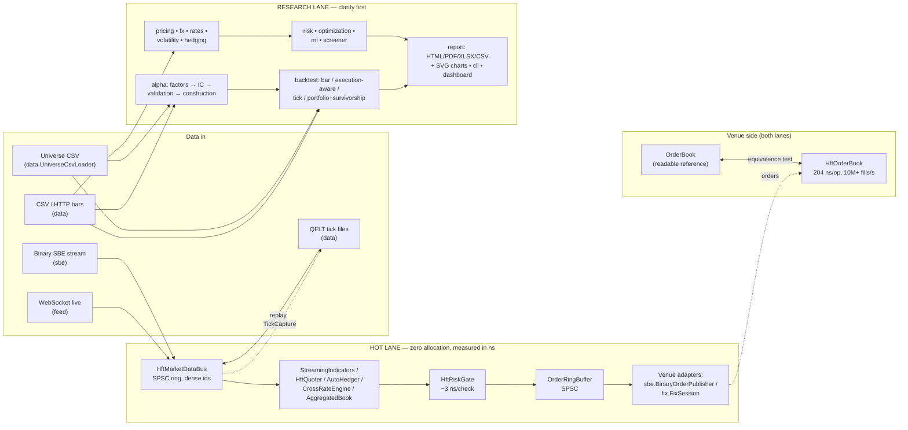

---

## 2. The hot path, end to end — with measured latencies

Every arrow is on the measured path; the numbers are medians from the
benchmark family (`HftLatencyBenchmark`, `HftOrderBenchmark`,
`HftQuoterBenchmark`, `HftBookBenchmark`) on a stock Windows desktop.


Key disciplines, in one line each:

| Discipline | Where | Proof |
|---|---|---|
| Zero allocation steady-state | rings, gate, quoter, hedger, book, codecs | per-thread allocation-counter tests |
| No locks/CAS on the hot path | SPSC rings, acquire/release only | FIFO stress tests |
| No String/boxing on the hot path | dense int symbol ids everywhere | design + tests |
| Tails attributed, not guessed | `HiccupMonitor` in every benchmark | printed with every run |
| Zero GC, literally | whole sessions under Epsilon GC | benchmark runs committed |

---

## 3. The alpha research pipeline

Scores flow as `double[]` aligned to a frozen symbol panel; `NaN` = "not in
the cross-section" at every stage. Attaching a `PointInTimeUniverse` makes
the *whole* pipeline survivorship-honest.


---

## 4. Survivorship-aware backtest — per-bar event ordering

The order of operations inside each bar is a correctness contract (a
dividend on a delisting's ex-date still pays the holder of record; a
merger's shares flow into a same-bar-dying acquirer at *its* terms):

```mermaid
sequenceDiagram
    participant Bar as bar i (timestamp t)
    participant Div as 1. Dividends
    participant Mrg as 2. Mergers
    participant Del as 3. Delistings
    participant Drop as 4. Index drops
    participant Reb as 5. Rebalance

    Bar->>Div: ex-dates ≤ t: position × amount<br/>(holder of record at prior close; shorts pay)
    Bar->>Mrg: target → cash + acquirer shares<br/>(before delistings, so conversions land first)
    Bar->>Del: position × lastClose × (1 + delistingReturn)<br/>(−100% = wiped out; Shumway −30% default)
    Bar->>Drop: still listed but out of the index →<br/>forced sale at this bar's close (fee charged)
    Bar->>Reb: strategy weights (non-members capped at 0,<br/>dead names untradeable) via TradeCostModel
    Note over Div,Reb: symbols processed in sorted order —<br/>same inputs, same result, any JVM
```

---

## 5. Inside the venue-grade matching engine (`HftOrderBook`)

Everything is a primitive array; the diagram shows what happens to a
crossing buy limit.


Measured: **204 ns/op p50** (70/20/10 add/cancel/aggress), **10M+
fills/sec**, zero allocation, full sessions under Epsilon GC.

---

## 6. FX instruments — how the pieces compose

Conventions flow downward; everything date-related delegates to ONE joint
calendar.

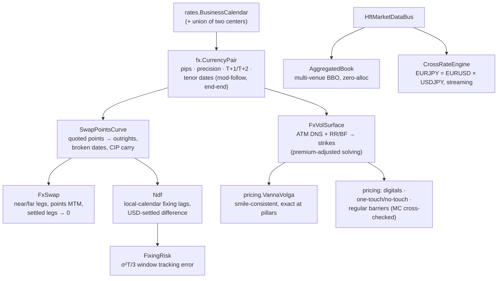

---

## 7. The equities participant stack — L3 feed in, routed orders out

The consumer's side of an exchange: rebuild the venue's book from its raw
event stream, know exactly where your own order queues, read the pressure,
route. Every stage is hot-lane (zero allocation, proven by test).

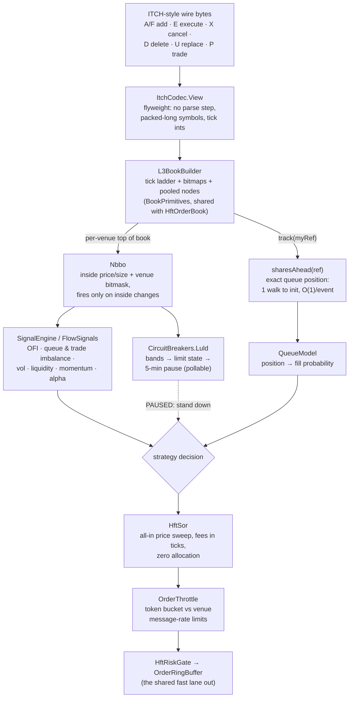

Own-order queue tracking rests on two price-time facts: executions always
consume the queue head, and a cancel is ahead of you iff it entered the
queue before you — which is what makes O(1) maintenance sound.

---

## 8. The FX participant stack — quotes, last look, and routing around it

FX is the mirror image: no tape, no central book. Liquidity is private
quotes subject to last look, so the stack measures LP *behavior* and routes
on expected all-in cost, not displayed price.

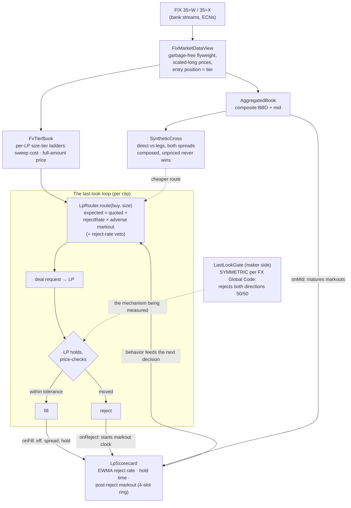

The feedback loop is the point: an LP's tight display means nothing if its
rejects cluster on the flow that was about to pay you — the scorecard
measures exactly that, and the router prices it in.

---

## 9. Scaling out — shared-nothing shards under one risk umbrella

Throughput scales by running independent engine stacks; safety stays global
through a slow observer that only ever asks the hot path to read one
boolean.


Measured on a 12-core desktop, 300 symbols quoted two-sided: 1 shard =
4.3M ticks/s → 2 shards = 6.2M (+46%) → 4 shards plateau at 6.7M (core
oversubscription + single producer, not contention). War story in
[ULTRA_LOW_LATENCY.md](ULTRA_LOW_LATENCY.md): one shared synchronized
counter across shards made sharding measure as a *slowdown*.

---

## 10. Choosing an execution algorithm — the decision map

The parent-order question is "what am I being measured against?" — the
benchmark picks the algorithm, and TCA closes the loop.

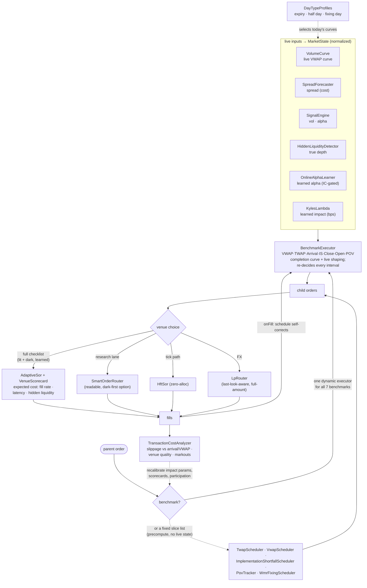

The two lanes coexist by design: **`BenchmarkExecutor`** when you re-decide
on live state (the usual case), the **static schedulers** when you want a
fixed slice list computed once up front.

---

## 11. Portfolio-level execution — one basket, one schedule

A two-sided transition run as N independent algos carries a risk none of
them can see: the filled legs drift apart and the basket holds an
unintended net market bet mid-flight. `PortfolioExecutor` layers the two
basket-level rules over untouched per-symbol executors — and both rules
only ever *reduce* a child's own due, so per-symbol benchmark integrity
holds by construction.


The fills edge is the one discipline to keep: report fills through
`PortfolioExecutor.onFill` only — going straight to a child advances its
schedule but blinds the net-exposure ledger the band reads.

---

## 12. Surviving the overnight — the checkpoint lifecycle

Everything the models learn lives in memory; `persist.Checkpoint` is how
it outlives the session. Two properties carry the design: the save is
atomic (a crash mid-save cannot corrupt yesterday's file), and the restore
is honest about time (learned state returns, intraday state deliberately
does not).

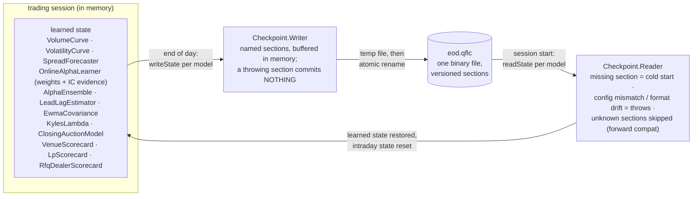

Deliberately NOT persisted: `HiddenLiquidityDetector` (its state is keyed
by price level, and overnight the ladder moves — restoring it would pin
yesterday's icebergs onto today's unrelated prices).

---

## 13. The central risk book — one netted view, four decisions

Every product decomposes into ONE factor space at booking (currency-level
FX legs, per-symbol equity deltas, gamma/vega per underlying), and every
downstream decision runs on the netted residual. The commercial loop:
capture spread by internalizing, spend as little of it as possible on
hedging, and answer one question at the close.

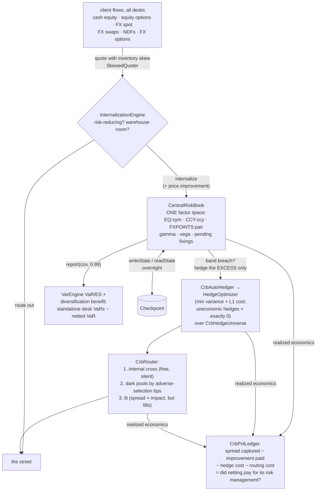

The whole loop at realistic sizes and costs is
`crb/CrbRealWorldScenarioTest` (quiet day, one-way institutional day,
COVID-template stress day, NDF fixing day); recipe 14 is the runnable
version and [CENTRAL_RISK_BOOK.md](CENTRAL_RISK_BOOK.md) the guided tour.

---

## 14. The market-risk workflow — data to Basel, fourteen steps

The map `docs/MARKET_RISK.md` maintains, as a pipeline. Every box is
implemented and tested; the regulatory boxes are styled after BCBS, not
certified — stated, not hidden.

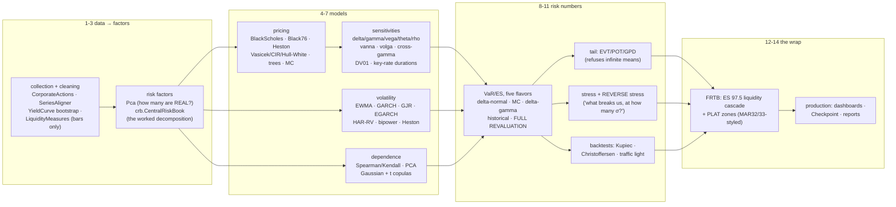

---

## 15. How an order reaches the exchange — and how the market comes back

Two lanes meet at the strategy: outbound, a decision survives the risk
gate, becomes a FIX message, and rides a sequenced session to the venue's
book; inbound, the venue's raw feed is rebuilt into signals that shape the
next decision. The `ExecutionReport` closes the loop through position and
P&L.

```mermaid
flowchart LR
    subgraph OUTLANE["outbound — the order's journey"]
        STRAT["strategy decision<br/>HftQuoter · BenchmarkExecutor ·<br/>your logic"]
        GATE15["HftRiskGate<br/>qty · notional · position ·<br/>collar · halt (~3 ns)"]
        ENC["FIX encode<br/>NewOrderSingle 35=D<br/>(FixSession.sendNewOrderSingle)"]
        SESS["FixSession<br/>seqnums · heartbeats · TestRequest ·<br/>ResendRequest recovery · session store"]
    end
    subgraph VENUE15["the venue"]
        VBOOK["venue book<br/>(HftOrderBook plays this<br/>role in the tests)"]
        ER["ExecutionReport 35=8<br/>ack · fill · cancel · reject"]
    end
    subgraph INLANE["inbound — the market's journey"]
        WIRE15["ITCH / SBE wire bytes<br/>(ItchCodec · sbe flyweights)"]
        L315["L3BookBuilder → Nbbo<br/>book rebuild + own-queue position"]
        SIGS15["SignalEngine / FlowSignals<br/>OFI · imbalance · vol · alpha"]
    end
    PNL["position & P&L update<br/>ledger · TCA markouts"]

    STRAT --> GATE15 --> ENC --> SESS
    SESS -->|"TCP, MsgSeqNum n"| VBOOK
    VBOOK --> ER
    ER -->|"onExecutionReport"| PNL
    ER -.->|"gap? ResendRequest(2),<br/>PossDup replay heals it"| SESS
    WIRE15 --> L315 --> SIGS15
    SIGS15 --> STRAT
    PNL -.->|"inventory feeds the<br/>next quote's skew"| STRAT
```

The sequenced session is the part people underestimate: the venue's book
only ever sees messages in order, so every gap is either healed by a
resend (application messages replayed with PossDup, admin runs coalesced
into GapFill) or the session refuses to continue. Recipe 21 is the
runnable version; diagram 2 shows the nanosecond budget of the left lane.

---

## 16. The rates stack — quotes to simulated curves

One curve object underneath everything: quotes bootstrap into zeros, the
zeros price cash flows, node bumps locate the risk, and the short-rate
models animate the same curve through time.

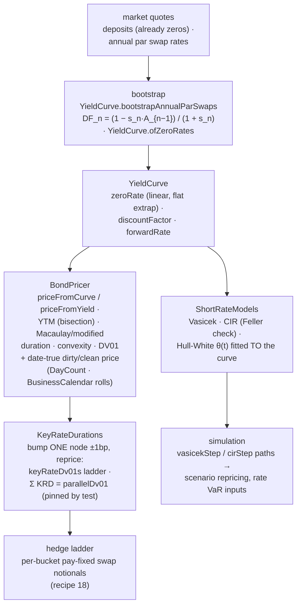

The stack splits statics from dynamics. Everything down the left column
is today's curve interrogated harder and harder — price, then slope
(DV01), then slope *per node* (the KRD ladder that recipe 18 turns into
hedge notionals). The right branch is the same curve given a stochastic
engine: Vasicek and CIR bring their own equilibrium, Hull-White is
calibrated so today's curve is reproduced exactly — which is why its
simulations are the ones you can use for curve-consistent scenario P&L.

---

## 17. Portfolio construction — one input set, three optimizers

All three consume the same expected returns and covariance; they disagree
about how much the return estimates deserve to be trusted, and the weight
vectors show it.

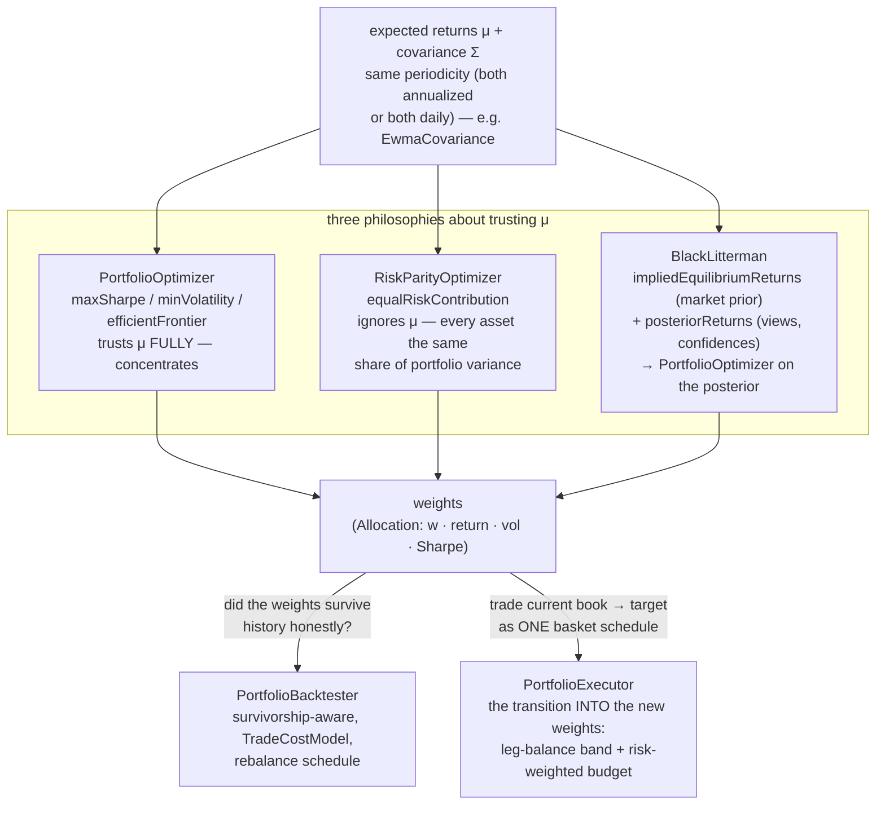

The fork at the bottom is the point of the diagram: a weight vector is a
research artifact until it survives a survivorship-honest backtest
(diagram 3's pipeline) *and* can be reached from the current book without
the transition itself destroying the alpha — which is what
`PortfolioExecutor` (diagram 11) exists to protect. Recipe 19 prints the
three weight vectors side by side.

---

## 18. The overfitting defense stack — from grid winner to deploy-or-reject

A parameter grid produces N backtests and reports the maximum — which is
a selection effect, not evidence. Four defenses interrogate the same
winner from different angles before any capital moves.


Each defense catches a different lie: walk-forward catches parameters
that only fit the past arrangement of regimes; the purged K-fold catches
label leakage that ordinary cross-validation invites; CSCV catches a
broken *selection process* (the winner keeps flipping under resampling);
the deflated Sharpe catches the multiple-testing haircut everyone forgets
to apply. Passing one is easy. Passing all four is what "not overfit"
means here — and PBO ≥ 0.5 is an unconditional stop.

---

## 19. The full trading pipeline in one line — alpha discovery to optimal execution

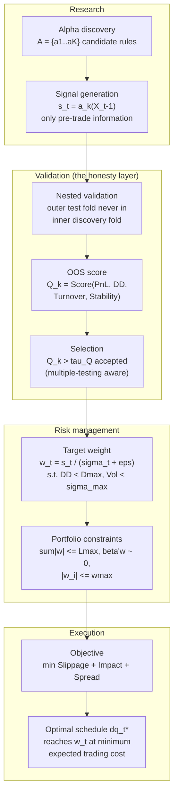

One line: **alpha discovery → signal generation → nested validation →
out-of-sample scoring → selection → risk-managed sizing → portfolio
constraints → optimal execution.** The class map, stage by stage:
`alpha.Factors`/`AlphaContext` (discover on a frozen panel) →
`PurgedKFold`/`WalkForwardAnalyzer`/`AlphaValidation` (leak-free folds) →
`SignalEvaluator`/`AlphaBacktester`/`DrawdownAnalytics` (the score
vector) → `SharpeValidation`/`OverfitProbability`/
`deflatedSharpeOfWinner` (a threshold that knows K rules were tried) →
`PortfolioConstruction`/`PositionSizing` (conviction over risk) →
`ConstrainedPortfolioOptimizer`/`ComponentVar` (book-level promises) →
`AlmgrenChriss`/`ImplementationShortfallScheduler`/`BenchmarkExecutor`/
`AdaptiveSor`/`PortfolioExecutor` (the schedule) →
`TransactionCostAnalyzer` (did reality match the objective?). When live
PnL disappoints, walk the arrows backwards — every post-mortem lands on
exactly one of them. The prose version is LEARN.md §8c.

---

## 20. The FIX session lifecycle -- a state machine with a heartbeat

One class (`fix.FixSession`) plays initiator and acceptor; the timings
below are the ones its heartbeat thread actually enforces (probe at 1.5x
the agreed interval of receive silence, disconnect at 2.5x), and the
sequence-number discipline is what makes a resumed session trustworthy.

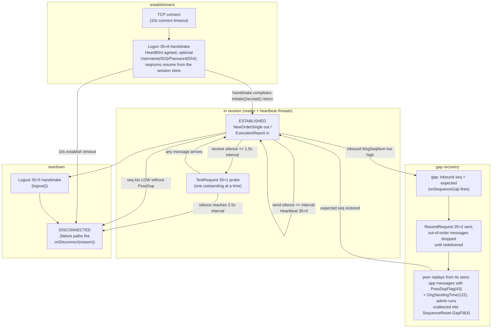

Duplicates (PossDup below the expected seqnum) are suppressed silently --
only a too-low seqnum WITHOUT the flag is unforgivable, because it means
the peer's story about the past changed. With a `FileSessionStore`, a
restart resumes yesterday's sequence numbers and can still service the
peer's ResendRequest for messages sent before the crash. Recipe 21 is the
runnable version; `FixSessionTest` drives every edge above over a real
TCP socket, forced gap included.

---

## 21. The variance-swap replication map -- from option chain to marked book

The Demeterfi-Derman-Kamal-Zou observation: a static 1/K^2 portfolio of
OTM options IS a variance payoff, so the fair strike is readable off the
chain with no model. Everything to the left of the fair strike is
model-free; the one box that is not (the vol swap) is marked as such.

```mermaid
flowchart TD
    subgraph REPL21["replication (model-free)"]
        CHAIN21["one expiry's option chain<br/>OTM mids: puts below F, calls above,<br/>put/call average at the pivot K0"]
        W21["1/K^2 weights<br/>sum of dK/K^2 x e^rT x Q(K)<br/>(VolatilityIndex.index)"]
        LOG21["the log contract<br/>constant-dollar-gamma payoff:<br/>its PnL IS realized variance"]
        FV21["fair variance K_var = index^2<br/>(VarianceSwap.fairVariance)<br/>a VIX of 20 IS a strike of 0.04"]
    end
    subgraph BOOK21["the desk's book"]
        VEGA21["vega quote to variance units<br/>varNotional = vegaNotional / (2 K_vol)<br/>(VarianceSwap.varianceNotional)"]
        MTM21["seasoned swap at time t:<br/>(t/T) x realized locked in +<br/>(1 - t/T) x K_remaining, discounted,<br/>vs the original K_0<br/>(VarianceSwap.markToMarket)"]
        VOL21["vol swap strike (NOT model-free)<br/>sqrt(K_var) - Var(V) / (8 K_var^1.5)<br/>(VarianceSwap.volSwapStrike)<br/>always BELOW sqrt(K_var)"]
    end

    CHAIN21 --> W21 --> LOG21 --> FV21
    FV21 -->|"the price tag"| VEGA21
    FV21 -->|"variance is additive in time"| MTM21
    FV21 -->|"convexity correction<br/>needs vol-of-vol"| VOL21
```

The MTM box is why desks love the product: the elapsed leg is locked
realized variance, the remaining leg is a fresh chain read, and no model
sits between them. The vol swap is the same payoff under a square root --
and that one concave function costs the trade its model-freeness, which
is what the convexity-correction box quantifies. Recipe 23 runs the whole
map end to end.

---

## 22. The risk allocation tree -- one VaR, three questions, one committee

Component, marginal, and incremental VaR all derive from the same
covariance and positions, but they answer different questions -- and the
book's hedge is where they visibly part ways.

```mermaid
flowchart TD
    COV22["factor covariance Sigma<br/>(EwmaCovariance, or a sample<br/>matrix STABILIZED by<br/>CovarianceShrinkage.ledoitWolf)"]
    POS22["signed position exposures w<br/>(hedges are negative)"]
    SIG22["portfolio sigma = sqrt(w' Sigma w)<br/>x z(confidence) = portfolio VaR<br/>(ComponentVar.allocate)"]
    subgraph SPLIT22["three numbers per desk (ComponentVar)"]
        COMP22["component VaR (Euler)<br/>w_i x z (Sigma w)_i / sigma --<br/>SUMS EXACTLY to portfolio VaR,<br/>no residual bucket; a hedge's<br/>component is NEGATIVE"]
        MARG22["marginal VaR<br/>z (Sigma w)_i / sigma --<br/>how fast VaR moves per unit:<br/>should the NEXT dollar go here?"]
        INCR22["incremental VaR<br/>VaR(book) - VaR(book without i) --<br/>what actually disappears if the<br/>desk is CLOSED (a re-computation,<br/>NOT the component)"]
    end
    ACT22["limits and committee actions:<br/>budget by component; grow where<br/>marginal is low; and never confuse<br/>the two for a hedge -- closing the<br/>negative-component desk RAISES VaR"]

    COV22 --> SIG22
    POS22 --> SIG22
    SIG22 --> COMP22
    SIG22 --> MARG22
    SIG22 --> INCR22
    COMP22 --> ACT22
    MARG22 --> ACT22
    INCR22 --> ACT22
```

The Euler split is exact only because delta-normal VaR is homogeneous of
degree one in the positions -- the allocations inherit the model's linear-
positions, normal-returns assumptions, stated. The shrinkage box matters
more than it looks: the raw sample matrix's smallest eigenvalues are too
small, and both the optimizer AND the allocation trust exactly those
directions. Recipe 25 prints the whole committee packet.

---

## 23. The NDF lifecycle -- two dates, one clamp, USD only

A non-deliverable forward never touches the restricted currency: the
trade fixes against an official reference rate and cash-settles the
difference in USD. The date arithmetic and the mark's behavior inside the
fixing window are where implementations quietly disagree; `fx.Ndf`'s
choices are drawn below.

```mermaid
flowchart LR
    subgraph DATES23["date arithmetic (calendars)"]
        TRADE23["trade date<br/>Ndf.of(pair, trade, tenor, ...)"]
        SETT23["settlement date<br/>pair.tenorDate: spot lag +<br/>tenor roll, joint calendar"]
        FIX23["fixing date: walk BACK from<br/>settlement in LOCAL (quote-calendar)<br/>business days -- 2 for INR/KRW/TWD/CNY,<br/>1 for BRL(PTAX)/PHP/CLP"]
    end
    subgraph MARK23["marking the trade (Ndf.markToMarket)"]
        PRE23["before the window:<br/>settlement formula at the curve<br/>outright to the FIXING date --<br/>the date the payoff references"]
        WIN23["inside the window<br/>(fixing date at or before curve spot):<br/>no forward left to read -- the mark<br/>CLAMPS to the SPOT outright and<br/>keeps marking, never throws"]
    end
    subgraph SETTLE23["fixing and settlement (USD)"]
        PUB23["official fixing publishes<br/>(RBI / KFTC18 / PTAX) -- from here<br/>the right number is settlementAmount<br/>with the ACTUAL print, not a curve"]
        CASH23["cash settlement in base ccy:<br/>notional x (fixing - K) / fixing<br/>pays on the SETTLEMENT date<br/>(discounting: base-ccy YieldCurve)"]
    end

    TRADE23 --> SETT23
    SETT23 -->|"fixing lag walk-back"| FIX23
    TRADE23 -->|"life of the trade"| PRE23
    PRE23 -->|"fixing date reaches<br/>the curve's spot"| WIN23
    WIN23 --> PUB23
    FIX23 -->|"fixing day arrives"| PUB23
    PUB23 --> CASH23
    SETT23 -->|"payment date"| CASH23
```

The division by the fixing in the settlement formula is the step people
forget: it converts the quote-currency difference back into deliverable
currency, which is why the buyer of USD in USDINR receives
`notional x (fixing - K) / fixing` USD, not the naive difference. The
fixing publishes on its LOCAL business days regardless of USD holidays --
hence the quote-calendar walk-back -- and the spot clamp inside the window
is the same keep-marking treatment an aged `FxSwap` leg gets: a curve
cannot know the print, but it should not throw mid-lifecycle either.
`FixingRisk` prices the window's remaining tracking error (diagram 6).

---

## 24. One order, five verbs -- time-in-force semantics in HftOrderBook

Five entry points share one matching core; what differs is only what
happens to the part that does not trade immediately.

```mermaid
flowchart TD
    IN24(["incoming order"]) --> Q24{"which entry point?"}

    subgraph VERBS24["order-entry verbs (all zero-alloc)"]
        LIM24["submitLimit<br/>match while crossing,<br/>rest the remainder"]
        MKT24["submitMarket<br/>match against the whole<br/>opposite book, never rest"]
        IOC24["submitIoc<br/>price-limited taker,<br/>remainder expires"]
        FOK24["submitFok<br/>all-or-nothing probe,<br/>then delegates to IOC"]
        PO24["submitPostOnly<br/>rest only, never take"]
    end

    Q24 --> LIM24
    Q24 --> MKT24
    Q24 --> IOC24
    Q24 --> FOK24
    Q24 --> PO24

    LIM24 -->|"crossing part"| FILL24["trades emitted<br/>(taker id = order id)"]
    LIM24 -->|"remainder"| REST24["rests at priceTick<br/>(FIFO at its level)"]
    LIM24 -->|"pool exhausted:<br/>matched part STANDS,<br/>remainder rejected"| RPF24["REJECT_POOL_FULL"]
    MKT24 --> FILL24
    MKT24 -->|"opposite side empty"| ZERO24["returns filled qty (0)"]
    IOC24 --> FILL24
    IOC24 -->|"unfilled remainder"| EXP24["expires -- nothing rests"]
    FOK24 -->|"fillableWithin walks the<br/>occupancy bitmaps: full qty<br/>available inside the limit?"| IOC24
    FOK24 -->|"probe fails: no trades,<br/>no id, no counters"| KILL24["killed (returns 0)"]
    PO24 -->|"would trade on arrival"| RWC24["REJECT_WOULD_CROSS<br/>(maker fee preserved)"]
    PO24 -->|"does not cross"| REST24
```

The subtleties are in the edges. A `submitLimit` that exhausts the order
pool keeps its executed portion -- trades were real -- and rejects only the
resting remainder, exactly how a venue sheds load without unwinding
executions. `submitIoc` clamps only the aggressive end of an off-band
limit (the subtraction is done in `long`, so `Integer.MIN/MAX_VALUE`
sentinels mean "pure market" and cannot wrap into the opposite meaning).
And a killed `submitFok` consumes no order id and emits no trades, like a
venue rejecting pre-match, while a `submitPostOnly` pool-full reject still
consumes an id -- so id sequences and `orderCount` reconcile identically
regardless of entry point. The research-lane `OrderBook` covers the limit
and market verbs in the readable lane; IOC, FOK and post-only exist only
on the venue-grade book.

---

## 25. Building L3 from ITCH -- seven message types, one book, your exact queue position

`ItchCodec` frames the wire; `L3BookBuilder.onMessage` applies it. The
payoff of tracking every order individually: `sharesAhead` is exact, not
estimated.

```mermaid
flowchart LR
    subgraph WIRE25["ITCH wire messages (ItchCodec)"]
        A25["A / F -- add order<br/>(F carries an MPID)"]
        E25["E -- order executed"]
        X25["X -- cancel (partial)"]
        D25["D -- delete"]
        U25["U -- replace<br/>(origRef to newRef)"]
        P25["P -- trade,<br/>non-displayed"]
    end

    subgraph BOOK25["L3BookBuilder (single-writer, zero-alloc)"]
        ADD25["onAdd: append to the<br/>level's FIFO"]
        EXE25["onExecute: consume<br/>from the queue HEAD"]
        CXL25["onCancel / onDelete:<br/>remove from mid-queue"]
        RPL25["onReplace: delete + add<br/>(priority lost by design)"]
        TRD25["onTrade: lastTradeTick only<br/>(hidden liquidity, no book change)"]
    end

    A25 --> ADD25
    E25 --> EXE25
    X25 --> CXL25
    D25 --> CXL25
    U25 --> RPL25
    P25 --> TRD25

    ADD25 --> STATE25["book state<br/>bestBid/AskTick, qtyAtTick,<br/>snapshot per side"]
    EXE25 --> STATE25
    CXL25 --> STATE25
    RPL25 --> STATE25

    EXE25 -->|"execution consumed the head:<br/>always ahead of you"| QP25["tracked orders<br/>track(ref) once, then O(1);<br/>sharesAhead(ref) exact"]
    CXL25 -->|"reduce ahead only if the<br/>removed qty WAS ahead"| QP25
    STATE25 -->|"unknown ref"| GAP25["unknownRefCount<br/>(feed gap symptom:<br/>resubscribe / snapshot)"]
```

`onMessage` returns the wire length consumed and 0 for another stock
locate or an unsupported type, so a feed handler skips by length without
branching per symbol. The queue-position update is where the L3 detail
pays: an `E` execution always consumed the front of the queue, so every
tracked order behind it decrements `sharesAhead`; an `X`/`D` in the middle
decrements only trackers the removed quantity was actually ahead of. When
you only have L2 aggregates, the honest fallback is the probabilistic
`microstructure.QueuePositionEstimator` -- this class is what it
approximates.

---

## 26. NBBO consolidation -- per-venue tops in, one inside out

`Nbbo` aggregates up to 64 venues' tops of book into a national best bid
and offer, and its listener fires only when that inside actually changes.

```mermaid
flowchart TD
    V1_26["venue 0 top<br/>onVenueQuote"] --> FAST26{"fast path:<br/>venue not at either inside<br/>and stays strictly outside?"}
    V2_26["venue k top<br/>onVenueQuote"] --> FAST26
    VD26["onVenueDown<br/>(feed loss / halt) --<br/>same clearing path as<br/>an empty quote"] --> FAST26

    FAST26 -->|"provably no change:<br/>no scan, return false"| DONE26["NBBO unchanged"]
    FAST26 -->|"might matter"| SCAN26["linear rescan over venues<br/>(at most 64 -- cache-resident)"]
    SCAN26 --> BEST26["national best bid / offer<br/>bidTick, askTick +<br/>TOTAL size at each inside<br/>+ bitmask of venues there"]
    BEST26 --> FLAGS26["locked(): NBB == NBO<br/>crossed(): NBB above NBO<br/>(the locked/crossed tape condition)"]
    BEST26 --> CHG26{"price or inside<br/>size changed?"}
    CHG26 -->|"yes: changeCount++"| CB26["Listener fires<br/>(primitive-only callback)"]
    CHG26 -->|no| DONE26
```

The single-venue-set bitmask (hence the hard `venueCount <= 64` limit) is
what makes the fast path provable: a venue that was not at either inside
and whose new quote stays strictly outside cannot have moved the NBBO, so
most quote traffic never triggers the rescan. Downstream, `locked()` and
`crossed()` are the flags an `AdaptiveSor` or `SmartOrderRouter` checks
before routing -- posting into a crossed market is how you buy yourself a
regulatory conversation. `NO_BID`/`NO_ASK` sentinels keep the empty-side
arithmetic branch-free.

---

## 27. Anatomy of a binary message -- the 48-byte quote vs tag=value FIX

Same fact -- "EURUSD is 1.0842 / 1.0844" -- in the two encodings the
library speaks. `QuoteFlyweight` is a fixed-offset window over a
`ByteBuffer`; `FixMessage` is a parsed bag of ASCII tags.

```mermaid
flowchart TB
    subgraph BIN27["QuoteFlyweight -- 48 bytes, little-endian, fixed offsets"]
        F0_27["offset 0: int32<br/>messageType = 3"]
        F4_27["offset 4: int32<br/>symbolId (dense id,<br/>shared by both ends)"]
        F8_27["offset 8: double<br/>bidPrice"]
        F16_27["offset 16: double<br/>bidSize"]
        F24_27["offset 24: double<br/>askPrice"]
        F32_27["offset 32: double<br/>askSize"]
        F40_27["offset 40: int64<br/>timestampNanos"]
    end

    subgraph FIX27["FIX tag=value -- variable length ASCII"]
        RAW27["8=FIX.4.4 | 35=W | 55=EURUSD |<br/>132=1.0842 | 133=1.0844 | ... | 10=checksum<br/>(every field: scan for SOH, parse digits)"]
    end

    F0_27 ~~~ F4_27 ~~~ F8_27 ~~~ F16_27 ~~~ F24_27 ~~~ F32_27 ~~~ F40_27

    BIN27 -->|"read = one getDouble at a<br/>compile-time-constant offset;<br/>wrap() repositions, no objects"| HOT27["hot lane<br/>BinaryOrderPublisher /<br/>BinaryMarketDataClient<br/>typeAt() dispatches by the<br/>first int32"]
    FIX27 -->|"parse = FixDecoder walks<br/>tags, allocates strings,<br/>validates checksum"| SESS27["counterparty lane<br/>FixSession -- interop is the<br/>point, not latency"]
```

Why fixed layout wins on the hot path: length is a constant
(`BLOCK_LENGTH = 48`), so framing is arithmetic, not scanning; every field
read is a single bounds-checked primitive load at an offset the JIT folds
into the instruction; and `wrap(buffer, offset)` re-points one reusable
flyweight, so a million quotes parse with zero allocation. The tag=value
message spends its budget on generality -- optional fields, repeating
groups, human-greppable logs -- which is exactly what you want at a
counterparty boundary and exactly what you do not want between your own
processes. `OrderFlyweight` and `TradeFlyweight` follow the same pattern
with their own type discriminators.

---

## 28. Tick capture and deterministic replay -- record once, relive exactly

The QFLT file is the seam between live and offline: everything upstream
is racy and real-time, everything downstream is a pure function of the
file.

```mermaid
flowchart LR
    FEED28["WebSocketFeed<br/>(BinanceTradeParser or<br/>any FeedParser)"] --> BUS28["HftMarketDataBus.publish<br/>lock-free ring, single<br/>consumer thread"]
    BUS28 --> STRAT28["live TickListener<br/>subscribers"]
    BUS28 --> CAP28["TickCapture.attach<br/>(inline) or AsyncTickCapture<br/>(own ring; droppedTicks<br/>counts overflow honestly)"]
    CAP28 --> FILE28[("QFLT file<br/>magic + version, then framed:<br/>symbol-def records +<br/>tick records (id, price,<br/>size, timestampNanos)")]
    FILE28 --> RD28["TickFileReader.replay<br/>(full speed) or replayPaced<br/>(wall-clock x multiplier)"]
    RD28 --> TB28["TickBacktester.run<br/>(strategy, tickFile, config)"]
    TB28 --> RES28["TickBacktestResult<br/>same file + same strategy<br/>= same fills, every run"]
    RES28 -.->|"bug reproduces on the<br/>Nth run exactly as the 1st"| TB28
```

What determinism buys debugging: a strategy that misbehaved at 14:31:07
on the live bus misbehaves at the same tick of the same file forever --
you can binary-search the tick stream, add asserts, and re-run in
milliseconds, none of which is possible against a live feed. The one
honest caveat sits at capture time: `AsyncTickCapture` prefers dropping
ticks (counted in `droppedTicks`) to stalling the market-data thread, so
a nonzero drop count means the file is an approximation and the
inline `TickCapture` on a slower symbol set is the fix. `TickFileWriter`
holds the format; recipe-grade replay needs nothing but the `Path`.

---

## 29. The four backtest engines -- what each models, what each ignores

One question picks the engine: what is the finest thing your edge
depends on?

```mermaid
flowchart TD
    Q29(["what does the<br/>edge depend on?"]) --> QP29{"queue position /<br/>tick-level fills?"}
    QP29 -->|yes| TB29["TickBacktester<br/>models: QFLT replay, market fills at<br/>last trade +/- half spread, limits earn<br/>fills through defaultQueueAhead as<br/>volume prints AT the price<br/>ignores: book depth, target-weight<br/>rebalancing"]
    QP29 -->|no| MA29{"multi-asset<br/>portfolio weights?"}
    MA29 -->|yes| PB29["PortfolioBacktester<br/>models: long/short rebalancing to target<br/>weights; survivorship-aware overload adds<br/>PointInTimeUniverse, delistings at true<br/>terminal value, mergers, dividends<br/>ignores: intrabar paths, execution detail"]
    MA29 -->|no| EX29{"does execution cost /<br/>TCA matter to the answer?"}
    EX29 -->|yes| EA29["ExecutionAwareBacktester<br/>models: parent orders worked over bars<br/>through an ExecutionModel (SorExecution,<br/>IcebergExecution, InstantExecution),<br/>per-parent TCA<br/>ignores: multi-asset (long-only, single name)"]
    EX29 -->|no| BT29["Backtester<br/>models: bar-close fills + slippage,<br/>intrabar stop/take-profit with gap-aware<br/>fills, warm-up overload for walk-forward<br/>ignores: fill realism, portfolio effects"]

    TB29 --> COST29["shared seam: PerformanceAnalytics -><br/>PerformanceMetrics (TradeCostModel plugs<br/>into the portfolio and execution-algo<br/>engines and alpha.AlphaBacktester)"]
    PB29 --> COST29
    EA29 --> COST29
    BT29 --> COST29
```

The engines are deliberately a ladder, not alternatives of equal rank:
`Backtester` answers "is there a signal at all" in microseconds per run
(which is what `GridSearchOptimizer` and `WalkForwardAnalyzer` need),
`ExecutionAwareBacktester` answers "does the signal survive being
executed", `PortfolioBacktester` answers "does it survive other positions
and dead companies", and `TickBacktester` answers "does the passive fill
I assumed actually happen". A strategy that only works on the engines
above the one matching its trading style is reporting model error as
alpha. `ExecutionAlgoBacktester` sits beside the ladder for benchmarking
the execution algos themselves.

---

## 30. Walk-forward windows -- rolling folds, warm indicators, honest capital

`WalkForwardAnalyzer` re-optimizes on each train window and trades the
parameters forward on the adjacent test window -- with two details naive
implementations miss.

```mermaid
flowchart LR
    subgraph F1_30["fold 1"]
        TR1_30["train<br/>GridSearchOptimizer picks<br/>best params in-sample"]
        TE1_30["test<br/>Backtester.run with the train<br/>bars as WARM-UP prefix --<br/>indicators enter warm,<br/>trades start at the boundary"]
    end
    subgraph F2_30["fold 2 (rolled forward)"]
        TR2_30["train"]
        TE2_30["test"]
    end
    subgraph F3_30["fold 3 ..."]
        TR3_30["train"]
        TE3_30["test"]
    end

    TR1_30 --> TE1_30
    TR2_30 --> TE2_30
    TR3_30 --> TE3_30
    TE1_30 -->|"carryCapital =<br/>finalEquity of fold 1"| TE2_30
    TE2_30 -->|"capital carries again"| TE3_30
    TE3_30 --> OUT30["stitched out-of-sample equity +<br/>per-fold Fold records +<br/>efficiency = OOS objective sum /<br/>IS objective sum"]
```

Detail one: evaluating a fold on a bare test slice would recompute every
indicator from scratch, silently forcing HOLD through the first
`lookback` bars of every fold -- so `Backtester` takes the preceding
train bars as a warm-up prefix (they are the past; no look-ahead) and
records equity only from `tradeFrom`. Detail two: each fold starts with
the previous fold's final equity, not a reset bankroll, so the stitched
curve compounds the way a live account would. The efficiency ratio
(out-of-sample performance as a fraction of in-sample) is the overfitting
thermometer -- near 1 means the edge generalizes, near 0 means the grid
search was fitting noise -- but as the class doc warns, it is only
meaningful when the in-sample objective is positive in the first place.

---

## 31. Purged K-fold -- the label-leak picture

A label computed over `[t, t + labelHorizon)` makes plain K-fold leak:
training samples adjacent to the test fold have already seen its data.
`PurgedKFold.splits(n, k, labelHorizon, embargo)` cuts the leak out.

```mermaid
flowchart LR
    TRL31["TRAIN (left)<br/>indices 0 .. t0-labelHorizon-1<br/>labels resolve BEFORE<br/>the test fold starts"] --> PGL31["PURGED (pre-test)<br/>t0-labelHorizon .. t0-1<br/>label windows OVERLAP the<br/>test fold -- they peeked"]
    PGL31 --> TEST31["TEST FOLD k<br/>t0 .. t1-1<br/>(contiguous block)"]
    TEST31 --> PGR31["PURGED (post-test)<br/>t1 .. t1+labelHorizon-1<br/>the TEST fold's labels are<br/>computed from these bars"]
    PGR31 --> EMB31["EMBARGO<br/>+embargo more bars dropped:<br/>serial correlation leaks<br/>even without label overlap"]
    EMB31 --> TRR31["TRAIN (right)<br/>t1+labelHorizon+embargo .. n-1<br/>clean again"]
```

Read it as the index line it is: each `Split` record carries the test
range and `trainIndices` that are exactly the left block ending at
`t0 - labelHorizon` and the right block starting at
`t1 + labelHorizon + embargo` -- hand-checkable, which is how the tests
verify it. The two purge zones have different causes: the pre-test zone
holds training samples whose label windows reach into the test fold, and
the post-test zone holds the bars the test fold's own labels are computed
from. The embargo is the humbler admission that returns are serially
correlated, so a bar just outside the purge zone still carries test-fold
information. `OverfitProbability` and `SharpeValidation` sit downstream
in the same `backtest.validation` package -- diagram 18 shows the full
defense stack this feeds.

---

## 32. The CSCV split matrix -- every symmetric half, one probability

`OverfitProbability` implements combinatorially symmetric
cross-validation (Bailey, Borwein, Lopez de Prado and Zhu): not "is this
track record luck" but "is the selection process itself broken".

```mermaid
flowchart TD
    M32["returns matrix, T x N<br/>one column per strategy variant<br/>(the whole grid you searched)"] --> B32["slice time into S equal blocks<br/>S even, 4 to 16<br/>(cap: C(16,8) = 12,870 splits)"]
    B32 --> C32["enumerate ALL C(S, S/2) ways to<br/>pick half the blocks as in-sample;<br/>the other half is out-of-sample<br/>(symmetric: every split's mirror<br/>is also evaluated)"]
    C32 --> P32["per split:<br/>1. concatenate IS blocks,<br/>pick the variant with the<br/>best IS objective<br/>2. rank THAT variant among all<br/>N on the OOS blocks -> w"]
    P32 --> L32["logit lambda = ln(w / (1-w))<br/>positive: IS winner stays<br/>above OOS median"]
    L32 --> PBO32["PBO = fraction of the<br/>C(S, S/2) logits at or below 0<br/>Result(pbo, combinations, logits)"]
```

The trick that makes it honest: the selection rule inside each split is
the same rule you used in real life (pick the best in-sample variant), so
CSCV measures the propensity of *your process* to crown a variant that
then lands in the bottom half out-of-sample. A PBO near 0.5 says the grid
winner is indistinguishable from a coin flip; a low PBO says selection
carries real information. `cscvSharpe` bakes in the per-period Sharpe
objective; the general `cscv` takes any objective over a concatenated
return slice. Block structure (rather than per-bar shuffling) preserves
serial correlation inside each block, for the same reason
`BlockBootstrap` resamples blocks -- diagram 18 places PBO in the full
deploy-or-reject pipeline.

---

## 33. Cost model decomposition -- four components stack on every trade

`TradeCostModel.institutional` is the ONE definition of "what a trade
costs" shared by the engines; here is how the bps stack up on a single
buy.

```mermaid
flowchart TD
    T33(["trade: notional W<br/>at bar i of series"]) --> C1_33["+ commissionBps<br/>fixed, per side --<br/>the broker's cut"]
    C1_33 --> C2_33["+ halfSpreadBps<br/>you cross half the quoted<br/>spread on EVERY trade,<br/>buy or sell"]
    C2_33 --> C3_33["+ slippageBps<br/>fixed implementation noise:<br/>latency, odd lots, timing"]
    C3_33 --> C4_33["+ sqrt-impact term<br/>MarketImpactModel.estimate over the<br/>trailing impactWindow bars gives<br/>ADV and vol; impact grows with<br/>sqrt(W / ADV) -- the size-dependent<br/>component"]
    C4_33 --> SUM33["costBps(series, i, W)<br/>all-in one-way bps of notional"]

    C4_33 -.->|"bars before impactWindow,<br/>or no volume data:<br/>flat components only --<br/>documented degradation,<br/>never a crash"| SUM33
    SUM33 --> USE33["charged identically by PortfolioBacktester,<br/>ExecutionAlgoBacktester and alpha.AlphaBacktester --<br/>execution-aware and survivorship-aware<br/>numbers from the SAME cost definition"]
```

The first three components are size-independent -- double the order,
same bps -- which is why a flat-cost backtest scales to any AUM on paper.
The square-root impact term is the one that does not: it grows with
traded notional against trailing ADV, so cost per dollar rises as the
book grows, and "capacity" stops being a vibe and becomes the AUM where
impact eats the alpha. `TradeCostModel.flat(bps)` remains available as
the classic commission-only assumption (and the exact equivalent of the
legacy `commissionRate` configs); the interface contract -- a pure
function of `(series, index, notional)` -- is what lets engines call it
at any bar in any order.

---

## 34. The GARCH family tree -- what each generation adds, and when it breaks

Each model in `volatility` fixes its parent's blind spot and inherits
its machinery; the HAR branch changes the input instead.

```mermaid
flowchart TD
    EWMA34["EwmaVolatility<br/>h(t) = lambda h(t-1) + (1-lambda) r^2<br/>riskMetrics(): lambda = 0.94<br/>adds: recency weighting, no fitting<br/>breaks: persistence pinned at 1 --<br/>shocks never decay toward a long-run level"]
    G34["Garch11<br/>h(t) = omega + alpha r^2 + beta h(t-1)<br/>adds: mean reversion to omega/(1-alpha-beta);<br/>variance-targeted MLE, deterministic grid<br/>breaks: symmetric -- a -3% day and a +3% day<br/>forecast identical vol"]
    GJR34["GjrGarch11<br/>negative returns load alpha + gamma,<br/>positive only alpha<br/>adds: the leverage effect<br/>(equities: gamma often > alpha)<br/>breaks: gamma near 0 (FX pairs) --<br/>extra parameter buys nothing"]
    EG34["Egarch11<br/>models LOG variance<br/>adds: asymmetry with no positivity<br/>constraints on parameters<br/>breaks: fit box excludes oscillating<br/>log-variance; runaway paths rejected<br/>as junk during fitting"]
    HAR34["HarRv (the realized branch)<br/>OLS on daily + weekly-avg + monthly-avg<br/>realized variance<br/>adds: uses INTRADAY information via RV<br/>breaks: needs >= 60 daily RV observations --<br/>no tick data, no model"]

    EWMA34 -->|"add mean reversion"| G34
    G34 -->|"add asymmetry<br/>(variance level)"| GJR34
    G34 -->|"add asymmetry<br/>(log variance)"| EG34
    G34 -.->|"different input, not<br/>different recursion"| HAR34
```

The progression is a lesson in paying for parameters: `EwmaVolatility`
has one knob and no likelihood; `Garch11` earns its three parameters via
variance targeting (omega is pinned so the long-run variance equals the
sample variance, and the MLE grid only searches alpha-beta --
derivative-free and deterministic);
`GjrGarch11` adds gamma only where the leverage effect exists to be
captured, and its own doc says so -- if fitted gamma is near zero, use
the simpler model. `Egarch11` moves the asymmetry into log-variance so no
positivity constraint binds the optimizer, at the price of a fit box that
must exclude empirically absurd oscillating solutions. `HarRv` is the
branch, not the trunk: same forecasting job, but fed by realized variance
from intraday data (e.g. `JumpRobustVolatility` output) rather than
daily returns.

---

## 35. Choosing a volatility estimator -- match the estimator to the data you have

The question is never "which model is best" -- it is "what input do you
actually possess".

```mermaid
flowchart TD
    Q35(["I need a volatility number"]) --> OPT35{"have a liquid<br/>option chain?"}
    OPT35 -->|yes| VIX35["VolatilityIndex.index<br/>model-free implied vol (VIX-style<br/>variance-swap replication) --<br/>the market's OWN forecast;<br/>mind truncation: sparse wings<br/>read LOW"]
    OPT35 -->|no| TICK35{"have tick /<br/>intraday data?"}
    TICK35 -->|yes| RV35["JumpRobustVolatility<br/>streaming realized vol with a bipower<br/>leg: volPerSqrtSecond is jump-robust,<br/>jumpShare = clamp(1 - bipower/raw)<br/>separates diffusion from jumps"]
    TICK35 -->|"yes, aggregated<br/>to daily RV"| HAR35["HarRv<br/>daily/weekly/monthly RV cascade,<br/>OLS forecast of tomorrow's RV"]
    TICK35 -->|"no, daily bars only"| GARCH35["the GARCH family<br/>EwmaVolatility (no fit),<br/>Garch11 (baseline),<br/>GjrGarch11 / Egarch11 (asymmetry)<br/>-- see the family tree"]
    Q35 --> DEC35{"need to know WHERE<br/>the vol comes from?"}
    DEC35 -->|yes| VD35["VolatilityDecomposition.decompose<br/>asset + market returns -> beta,<br/>systematicVol vs idiosyncraticVol<br/>(hedgeable vs not)"]
```

Two of these answer a different question than the others and it matters:
`VolatilityIndex` is forward-looking by construction (it reads the
market's 30-day expectation out of option prices), while the realized and
GARCH lanes are backward-looking estimates projected forward -- comparing
them IS the volatility risk premium. And `VolatilityDecomposition` does
not estimate the level at all; it splits an already-known total variance
into `beta^2 x market` and residual, which is the number that decides
whether hedging with index futures actually reduces your risk.
`indicators` and `microstructure.VolatilityCurve` cover the intraday
shape; this decision is about the level.

---

## 36. FX smile construction -- three broker quotes to five strikes to exact pillars

FX options are quoted in delta space (ATM, risk reversal, butterfly),
not strike space. `fx.FxVolSurface` does the translation;
`pricing.VannaVolga` makes the smile exact at the pillars.

```mermaid
flowchart LR
    QUOTES36["broker quotes per expiry<br/>ATM (delta-neutral straddle)<br/>RR25 = skew, BF25 = wings<br/>(optional RR10 / BF10)"] --> VOLS36["pillar vols<br/>v25c = atm + bf25 + rr25/2<br/>v25p = atm + bf25 - rr25/2<br/>(same shape at 10-delta)"]
    VOLS36 --> INV36["strike from delta, per pillar:<br/>invert forward delta N(d1) at the<br/>pillar's OWN vol; premiumAdjusted<br/>switches convention (deltas go<br/>non-monotone -- smallest-strike<br/>root taken, per market practice)"]
    INV36 --> PILLAR36["SmilePillar<br/>expiry, forward,<br/>strikes[] + vols[]<br/>(3 or 5 points)"]
    PILLAR36 --> VV36["VannaVolga.ofPillars<br/>takes the 25d put / ATM / 25d call<br/>triple (indices 1..3 of a<br/>five-pillar smile)"]
    VV36 --> PRICE36["price(K) = BS(K; atm) +<br/>sum of w_i(K) x pillar hedge cost;<br/>impliedVol(K) for the smile"]
    VV36 -.->|"exactness: pricing a pillar<br/>strike returns the pillar's<br/>own market vol"| PILLAR36
```

The two-step design matches how the market actually works: the broker
quote (`FxVolSurface.Builder.add(expiry, forward, atm, rr25, bf25)`)
is the tradable object, and each pillar's strike must be solved from its
delta *at its own vol* -- using the ATM vol for the wing strikes is the
classic implementation bug this class avoids. Downstream, `VannaVolga`
prices any strike as Black-Scholes at ATM vol plus the market cost of
the vega/vanna/volga hedge portfolio built from the three pillars -- the
log-strike weight form makes the construction exact at the pillars and
sensible between them. This surface is what `FxTierBook`-quoting desks
mark exotics against, and `SabrModel` (next diagram) is the parametric
alternative when you want a smile with four interpretable knobs.

---

## 37. SABR parameters at work -- backbone, tilt, and wings

`SabrModel.impliedVol(f, k, t, alpha, beta, rho, nu)` is the Hagan
expansion; each parameter owns one visible feature of the smile.

```mermaid
flowchart TD
    SABR37(["SABR smile<br/>sigma(K) around forward f"]) --> B37
    SABR37 --> R37
    SABR37 --> N37
    SABR37 --> A37["alpha -- the LEVEL<br/>ATM vol is approx alpha / f^(1-beta);<br/>calibrate() seeds alpha0 =<br/>atmVol x f^(1-beta) from the<br/>closest-to-ATM quote"]

    subgraph EFF37["one parameter, one feature"]
        B37["beta -- the BACKBONE<br/>how ATM vol moves when f moves:<br/>beta = 1: lognormal, ATM vol static<br/>beta = 0: normal, ATM vol approx alpha/f<br/>rises as rates fall<br/>(fixed by convention, NOT fitted)"]
        R37["rho -- the TILT<br/>spot-vol correlation:<br/>rho below 0 tilts the smile up on the<br/>low-strike side (equity/FX skew);<br/>searched in (-0.98, 0.98)"]
        N37["nu -- the WINGS<br/>vol-of-vol: nu near 0 flattens toward<br/>pure CEV; larger nu fattens BOTH<br/>wings symmetrically (curvature,<br/>the butterfly)"]
    end

    B37 --> CAL37["calibrate(f, t, beta, strikes, marketVols):<br/>beta held fixed, random restarts over<br/>(alpha, rho, nu), then coordinate descent;<br/>Params carries the fit rmse"]
    R37 --> CAL37
    N37 --> CAL37
    A37 --> CAL37
```

The reason `calibrate` takes beta as an *argument* rather than fitting
it: beta and rho produce nearly identical smile tilts on any single
expiry, so fitting both is chasing noise -- the market convention is to
fix beta by asset class (1 for FX, 0.5 or 0 flavors for rates) and let
rho carry the skew. That leaves a well-behaved three-parameter problem,
which the random-restart-plus-coordinate-descent search handles
deterministically enough for the `Params.rmse` field to be a meaningful
fit diagnostic. The practical division of labor with diagram 36:
`VannaVolga` reprices the three pillars exactly and interpolates;
`SabrModel` fits a four-knob functional form that extrapolates into the
wings and, via the backbone, says how the smile *moves* when the forward
does -- which is a delta-hedging statement, not just an interpolation
one.

---

## 38. The Greeks ladder -- what moves the option, and what moves the movers

One vanilla option has four inputs that move -- spot, vol, time, rate --
and the first-order Greeks price each of those moves. The second-order
Greeks answer the question a hedger actually lives with: how fast do my
first-order hedges go stale?

```mermaid
flowchart TD
    OPT38(["one vanilla option<br/>BlackScholes.greeks: price + all five<br/>first-order numbers in one call"])

    subgraph FIRST38["first order -- P&L per unit input move"]
        DELTA38["delta<br/>per 1.00 spot move --<br/>THE hedge ratio"]
        VEGA38["vega<br/>per 1.00 vol move --<br/>the smile exposure"]
        THETA38["theta<br/>per year of calendar --<br/>the rent on the position"]
        RHO38["rho<br/>per 1.00 rate move --<br/>smallest of the four, usually"]
    end

    subgraph SECOND38["second order -- how the hedges drift (HigherOrderGreeks)"]
        GAMMA38["gamma<br/>d delta / d spot --<br/>delta churn per spot move"]
        VANNA38["vanna<br/>d delta / d vol = d vega / d spot --<br/>THE skew-hedging Greek"]
        VOLGA38["volga (vomma)<br/>d vega / d vol --<br/>vega convexity"]
    end

    OPT38 --> DELTA38
    OPT38 --> VEGA38
    OPT38 --> THETA38
    OPT38 --> RHO38
    GAMMA38 -->|"spot moves:<br/>delta drifts, rehedge"| DELTA38
    VANNA38 -->|"vol moves:<br/>delta drifts too"| DELTA38
    VANNA38 -->|"spot moves:<br/>vega drifts"| VEGA38
    VOLGA38 -->|"vol moves:<br/>vega re-exposes itself"| VEGA38
    GAMMA38 <-->|"the theta-gamma trade:<br/>theta is the rent paid<br/>for owning gamma"| THETA38
```

`BlackScholes.greeks` returns the whole first-order set as one record
(`price, delta, gamma, vega, theta, rho`); `HigherOrderGreeks.vanna` and
`volga` supply the second order in closed form, pinned by tests as finite
differences of `BlackScholes.delta` and `vega`. Vanna is the one to
internalize: a delta-hedged book with vanna is not hedged through a
spot-vol move -- and down-spot-up-vol is how equity markets actually
move. Volga is its vol-side twin: a vega-hedged book with volga
re-exposes itself the moment vol moves. Both are identical for calls and
puts (put-call parity kills the sign difference at second order), and
both are exactly the Greeks the `VannaVolga` pricing method charges the
smile for.

The theta-gamma double arrow is the economics of the whole ladder: long
gamma means every spot move earns you rebalancing profit, and theta is
what you pay per day for that privilege. `HigherOrderGreeks.exchangeCrossGamma`
extends the ladder to the two-asset case, where per-asset gammas miss the
d2V/dS1 dS2 cross term.

---

## 39. The barrier option map -- up/down, in/out, and where the closed form refuses

Four barrier flavors, one parity, and an honest boundary: `BarrierOption`
prices the REGULAR configurations (barrier in the OTM region) by the
Reiner-Rubinstein reflection formula, and explicitly rejects the REVERSE
ones rather than pricing them subtly wrong.

```mermaid
flowchart TD
    VAN39["vanilla call / put<br/>BlackScholes.price"]

    subgraph REG39["regular barriers -- closed form (BarrierOption)"]
        DIC39["downAndInCall<br/>H <= min(S, K):<br/>alive only after the<br/>barrier trades"]
        DOC39["downAndOutCall<br/>H <= min(S, K):<br/>dies if the barrier trades"]
        UIP39["upAndInPut<br/>H >= max(S, K):<br/>the mirror case"]
        UOP39["upAndOutPut<br/>H >= max(S, K)"]
    end

    subgraph REV39["reverse barriers -- REJECTED here"]
        RB39["barrier in the ITM region<br/>(e.g. up-and-out call):<br/>knocks out exactly where the<br/>payoff is largest; risk dominated<br/>by barrier gamma; needs the full<br/>eight-case decomposition"]
    end

    MC39["simulation.MonteCarloSimulator<br/>path pricing, or a<br/>barrier-aware tree"]

    DIC39 -->|"reflection formula:<br/>vanilla priced on the<br/>barrier-reflected measure"| DOC39
    VAN39 -->|"in-out parity:<br/>KO = vanilla - KI<br/>(holding KI + KO<br/>replicates the vanilla)"| DOC39
    VAN39 -->|"same parity,<br/>put mirror"| UOP39
    UIP39 --> UOP39
    RB39 -->|"IllegalArgumentException,<br/>with directions"| MC39
```

The layout of the closed form is deliberately economical: only the
knock-INs are computed directly (`reflectionIn`, the Reiner-Rubinstein
value with `lambda = (r - q + sigma^2/2)/sigma^2`), and every knock-OUT
comes from in-out parity -- `downAndOutCall` is literally
`BlackScholes.price(...) - downAndInCall(...)` in the source. The parity
is not a shortcut, it is the product's economics: a knock-in plus the
matching knock-out IS the vanilla, so one formula and one subtraction
price the whole quadrant. Continuous monitoring, no rebates; `carry` is
the continuous yield, matching `BlackScholes` conventions.

The refusal is the diagram's second lesson. A reverse barrier (up-and-out
call with the barrier above the strike) dies exactly where it is worth
the most, its delta and gamma explode near the barrier, and pricing it
demands the full eight-case machinery -- so the class throws in
`validateDownCall`/`validateUpPut` instead, and the javadoc names the
alternatives. The knock-in edge case is also honest: at `timeYears <= 0`
an untouched knock-in returns 0, worthless by construction.

---

## 40. The autocallable lifecycle -- coupons, memory, and the knock-in cliff

The flagship equity structured product as `pricing.Autocallable` prices
it: a note that pays a fat coupon and redeems early the first observation
date the underlier closes at or above the autocall barrier -- economically
a bond plus a sold down-and-in put, funded by the coupons.

```mermaid
flowchart TD
    ISSUE40(["issue: notional, S0,<br/>observationYears[],<br/>barriers as fractions of S0<br/>(knockIn <= autocall,<br/>coupon <= autocall)"])
    OBS40{"observation date i:<br/>S vs the barriers"}
    CALL40["S >= autocallBarrier x S0:<br/>AUTOCALL -- redeem notional<br/>+ this period's coupon<br/>+ ALL missed coupons if<br/>memoryCoupons (Phoenix memory)"]
    CPN40["couponBarrier x S0 <= S<br/>< autocall: pay the coupon,<br/>note continues"]
    MISS40["S < couponBarrier x S0:<br/>no coupon -- banked for later<br/>if memoryCoupons, gone if not"]
    MAT40{"last observation reached<br/>without autocall:<br/>S_T vs knockInBarrier x S0"}
    SAFE40["S_T >= knockInBarrier x S0:<br/>principal protected --<br/>redeem full notional"]
    LOSS40["S_T < knockInBarrier x S0:<br/>the knock-in cliff --<br/>redeem notional x S_T/S0,<br/>the full equity loss"]

    ISSUE40 --> OBS40
    OBS40 --> CALL40
    OBS40 --> CPN40
    OBS40 --> MISS40
    CPN40 -->|"next observation"| OBS40
    MISS40 -->|"next observation"| OBS40
    OBS40 -->|"survived every<br/>autocall trigger"| MAT40
    MAT40 --> SAFE40
    MAT40 --> LOSS40
```

`Autocallable.price` runs this state machine down Monte Carlo GBM paths
-- antithetic variates halve the variance, a fixed seed makes every price
reproducible -- with each path terminating at the FIRST autocall (the
diagram's top exit) or walking through to the maturity branch. The
constructor enforces the geometry the diagram draws: the knock-in must
sit at or below the autocall (protection above the early-redemption
trigger is unreachable), while its relation to the coupon barrier is
deliberately free, because real structures place it on either side.

The model-honesty note in the class doc is part of the product, not fine
print: flat-vol GBM is the standard first pricer, NOT a desk-grade one --
the knock-in put is deeply smile-sensitive, so feed a vol from the
downside strike region (e.g. from `VolSurface`) as the first-order
correction. European knock-in observed at maturity only, observation-date
monitoring, no issuer credit spread: each simplification is stated, and
each moves the price in a direction the diagram lets you reason about
(the LOSS branch is where all the smile risk lives).

---

## 41. The delta-hedge rebalance loop -- band width as a dial between cost and error

Hedging continuously is bankruptcy by transaction costs; hedging never is
a naked option. The loop below is what every option desk runs instead,
and `WhalleyWilmott` is where the band width should come from rather than
be guessed.

```mermaid
flowchart LR
    MOVE41["price moves<br/>(one path step)"]
    DRIFT41["book delta drifts:<br/>target = BlackScholes.delta<br/>at the new spot, less time"]
    BAND41{"outside the no-trade band?<br/>half-width from<br/>WhalleyWilmott.bandHalfWidth =<br/>cbrt(1.5 k S Gamma^2 / lambda)"}
    HOLD41["inside: HOLD --<br/>zero trades, zero cost,<br/>carry the hedge error"]
    TRADE41["outside: trade to the<br/>NEAREST EDGE, not the center<br/>(WhalleyWilmott.rebalance) --<br/>pay transactionCostBps<br/>on the traded notional"]
    LEDGER41["cash ledger accrues interest;<br/>costs, turnover, rebalances<br/>accumulate (DeltaHedger)"]
    EXPIRY41["at expiry: finalPnl =<br/>hedge portfolio - payoff<br/>= the replication error<br/>(HedgeReport)"]
    DIST41["HedgingSimulator: the same loop<br/>over thousands of parallel GBM paths<br/>-> full error distribution,<br/>hedging VaR/CVaR, cost stats"]

    MOVE41 --> DRIFT41
    DRIFT41 --> BAND41
    BAND41 --> HOLD41
    BAND41 --> TRADE41
    HOLD41 --> MOVE41
    TRADE41 --> LEDGER41
    LEDGER41 --> MOVE41
    LEDGER41 --> EXPIRY41
    EXPIRY41 --> DIST41
```

`DeltaHedger.simulateShortOption` is one lap of the loop along one path:
sell the option, collect the premium into the cash account, rebalance
whenever `|target - held|` exceeds `Config.deltaBand`, and settle the
payoff at expiry -- `HedgeReport.finalPnl` is exactly the replication
error, zero in the Black-Scholes limit of continuous costless hedging at
the true vol. `HedgingSimulator.simulate` runs that lap across thousands
of paths in parallel (deterministic per seed regardless of thread
scheduling), with hedge vol and realized vol as SEPARATE inputs -- so
both classic questions fall out directly: discretization risk when they
are equal, and vol mispricing (selling rich shows up as positive mean
P&L) when they are not.

The Whalley-Wilmott cube root is why band width is so stable across
venues: costs must move 8x to move the band 2x. And the POLICY matters as
much as the width -- `WhalleyWilmott.rebalance` trades back to the
nearest edge, never to delta itself, because hedging to the center throws
away the band's whole point (you would pay the spread again on the next
tick's drift). Zero gamma degenerates honestly: zero band, always hedge
exactly to delta.

---

## 42. The pairs trading pipeline -- from candidate pair to entry z-score

The LEARN playbook's three questions, in library order: is the spread
actually tethered, how fast does it snap back, and how do you get in
without owning half a trade?

```mermaid
flowchart TD
    PAIR42(["candidate pair<br/>(dual listings, stock vs ADR,<br/>cash vs futures)"])
    VR42["pre-check: VarianceRatio --<br/>trending, mean-reverting,<br/>or a random walk?"]
    COINT42{"CointegrationTest.engleGranger:<br/>is the spread stationary?<br/>(ADF t-stat on the residual)"}
    DEAD42["NOT cointegrated: refuse.<br/>Two random walks can look<br/>correlated for years and<br/>then never come back"]
    SPREAD42["build the spread:<br/>A - beta x B from the<br/>cointegrating regression"]
    OU42{"OrnsteinUhlenbeck.fit:<br/>kappa, theta, sigma -- and the<br/>half-life = expected holding period"}
    NOREV42["no mean reversion in-sample:<br/>the fit THROWS rather than<br/>fitting a rubber-band model<br/>to a random walk"]
    SLOW42["half-life too long?<br/>a 200-day half-life is an<br/>index fund with extra steps"]
    KAL42["KalmanBeta.onObservation:<br/>track the DRIFTING hedge ratio --<br/>a beta fitted on last year<br/>is stale by spring"]
    SIG42["signal: Params.zScore --<br/>enter around |z| = 2 to 2.5<br/>(sell rich leg, buy cheap leg,<br/>ratio-locked), exit z under 0.5"]
    EXEC42["execution: SpreadExecutionAlgo --<br/>work the illiquid leg, chase with<br/>the liquid one, HARD legging cap;<br/>cointegration breaks = tether cut,<br/>exit everything"]

    PAIR42 --> VR42
    VR42 --> COINT42
    COINT42 -->|"fail"| DEAD42
    COINT42 -->|"pass"| SPREAD42
    SPREAD42 --> OU42
    OU42 -->|"refusal"| NOREV42
    OU42 -->|"kappa too small"| SLOW42
    OU42 -->|"tradable half-life"| KAL42
    KAL42 --> SIG42
    SIG42 --> EXEC42
```

Every box is a class and every refusal is deliberate.
`CointegrationTest.engleGranger` answers question 1 with an
`EngleGrangerResult` (the ADF t-statistic on the cointegrating
residual); `OrnsteinUhlenbeck.fit` answers question 2 with `Params` --
kappa, theta, sigma, and the derived `halfLife`, plus `zScore` against
the stationary standard deviation -- and literally throws when the series
shows no mean reversion in-sample, because fitting a rubber-band model to
a random walk is how pairs desks die. `KalmanBeta` replaces the static
hedge ratio with a time-varying one: the filter tracks the current beta
while a full-sample OLS averages the drift into a number that was never
true on any single day (its test demonstrates exactly that).

Question 3 is the one execution risk unique to spreads: the moment you
own one leg without the other you are not a pairs trader, just long (or
short) in disguise. The LEARN playbook's worked case -- 2.5 z-scores
apart, 8-day half-life, legging cap at 5% of the position, exit at z
under 0.5 or on a cointegration break -- runs the whole chain, and
cookbook recipe 15 prints it end to end.

---

## 43. Choosing a VaR flavor -- the book's shape picks the method

`VarEngine` implements all four classic flavors over one input shape
(factor exposures against a covariance or a return history) precisely
because the methods genuinely disagree -- and the disagreement is the
point.

```mermaid
flowchart TD
    START43(["what does the book hold,<br/>and what do the tails look like?"])
    Q1_43{"optionality<br/>in the book?"}
    DN43["linear book: DELTA-NORMAL<br/>VarEngine.deltaNormalVar --<br/>sigma_P = sqrt(d' Sigma d), VaR = z sigma_P.<br/>Instant, and exactly wrong<br/>for optionality"]
    Q2_43{"how much gamma?"}
    DG43["moderate gamma: DELTA-GAMMA<br/>VarEngine.deltaGammaVar --<br/>Cornish-Fisher quantile of<br/>d'dx + 0.5 dx'Gamma dx; short-gamma<br/>VaR is WORSE than delta-normal<br/>says, long-gamma better"]
    FR43["dominant gamma / exotics:<br/>FULL REVALUATION<br/>VarEngine.fullRevaluationVar --<br/>reprice every scenario;<br/>the expansion has degraded<br/>(skew beyond ~1)"]
    Q3_43{"trust the Gaussian<br/>factor model?"}
    HIST43["fat tails, no distribution:<br/>HISTORICAL<br/>VarEngine.historicalVar --<br/>replay actual factor rows;<br/>exactly as fat-tailed<br/>as the sample was"]
    EVT43["beyond-the-sample quantiles:<br/>ExtremeValueTheory.fitPot --<br/>GPD tail extrapolation<br/>(see diagram 44)"]
    Q4_43{"dependence structure<br/>the point?"}
    COP43["joint tail scenarios:<br/>GaussianCopula.sample / sampleT --<br/>Cholesky-correlated draws;<br/>the t variant adds the joint<br/>fat tails Gaussian copulas miss"]
    MC43["VarEngine.monteCarloVar --<br/>the copula draws through the book;<br/>converges to delta-normal for a<br/>linear book (tests pin that)"]

    START43 --> Q1_43
    Q1_43 -->|"no"| Q3_43
    Q1_43 -->|"yes"| Q2_43
    Q2_43 -->|"moderate"| DG43
    Q2_43 -->|"large"| FR43
    Q3_43 -->|"yes, Gaussian ok"| DN43
    Q3_43 -->|"no -- fat tails"| HIST43
    HIST43 -->|"need 99.9% from<br/>500 observations"| EVT43
    Q3_43 -->|"dependence matters"| Q4_43
    Q4_43 --> COP43
    COP43 --> MC43
```

The flowchart's edges are the honest limits stated in the source.
Delta-normal is "instant, and exactly wrong for optionality" -- the class
doc's own words. Delta-gamma's Cornish-Fisher expansion is accurate for
MODERATE gamma and degrades when the quadratic term dominates, which is
exactly when `fullRevaluationVar` earns its cost. Historical VaR needs no
covariance matrix at all, but reading a 99.9% quantile from 500
observations is reading the worst half-observation -- the handoff to
`ExtremeValueTheory` (diagram 44).

Two unifying details: every flavor reports expected shortfall alongside
VaR (the scenario methods return `VarResult`; delta-normal and
delta-gamma pair with `deltaNormalEs`/`deltaGammaEs`), because post-FRTB
the ES is the primary number and VaR the diagnostic; and `monteCarloVar` builds its correlated draws from
`GaussianCopula.cholesky` -- the same machinery the copula exposes
directly via `sample` and `sampleT` when the joint tail, not the
portfolio quantile, is the object of study.

---

## 44. EVT peaks-over-threshold -- extrapolating the tail, and refusing the infinite one

Historical VaR at 99.9% from 500 observations is reading the worst
half-observation. `ExtremeValueTheory` instead fits the Generalized
Pareto Distribution to the exceedances over a high threshold and
extrapolates along the fitted tail.

```mermaid
flowchart LR
    LOSS44["loss sample<br/>(positive losses,<br/>>= 50 required)"]
    THR44["threshold u at a<br/>quantile of the losses --<br/>0.90 to 0.95 is the usual start;<br/>the classic diagnostic is fitting<br/>at several thresholds and<br/>checking xi stability"]
    EXC44["exceedances y = loss - u,<br/>STRICTLY above u<br/>(ties at u would deflate the<br/>moments on tick-snapped P&L);<br/>>= 10 required"]
    FIT44["GPD fit via probability-<br/>weighted moments (Hosking-Wallis):<br/>closed form, no optimizer,<br/>well-behaved for xi < 0.5<br/>-> GpdFit(threshold, shape xi,<br/>scale beta, counts)"]
    XI44{"the shape xi --<br/>the number to stare at"}
    THIN44["xi ~ 0: exponential tail<br/>(Gaussian-ish)"]
    FAT44["xi > 0: power-law tail --<br/>equity returns typically<br/>fit xi = 0.2 to 0.4"]
    INF44["xi >= 1: the tail mean<br/>does not exist"]
    VAR44["GpdFit.var(p):<br/>VaR_p = u + (beta/xi) x<br/>[((n/N_u)(1-p))^(-xi) - 1] --<br/>p must lie IN the fitted tail,<br/>below that use plain historical"]
    ES44["GpdFit.expectedShortfall(p):<br/>(VaR_p + beta - xi u)/(1 - xi)"]
    REFUSE44["REFUSES (throws) at xi >= 1:<br/>a finite number here would be<br/>the exact lie EVT exists<br/>to prevent"]

    LOSS44 --> THR44
    THR44 --> EXC44
    EXC44 --> FIT44
    FIT44 --> XI44
    XI44 --> THIN44
    XI44 --> FAT44
    XI44 --> INF44
    FIT44 --> VAR44
    VAR44 --> ES44
    INF44 --> REFUSE44
```

`ExtremeValueTheory.fitPot` is the whole pipeline in one static call --
sort, threshold at the requested quantile, collect strict exceedances,
fit by probability-weighted moments -- and its refusals are pipeline
stages, not afterthoughts: fewer than 50 losses is no tail sample, fewer
than 10 exceedances means lower the threshold or bring more data, and
non-finite losses are caught before they sort into the tail and poison
the moments. The theoretical license for all of this is
Pickands-Balkema-de Haan: the tail of ANY well-behaved distribution
converges to a GPD, so the extrapolation is principled rather than a
curve extended by hope.

The two refusals on the result object are the diagram's right edge.
`var(p)` rejects a p outside the fitted tail (the error message even
catches the classic units slip: "99.9% is 0.999, not 99.9"), because
below the threshold plain historical VaR is simply better.
`expectedShortfall(p)` throws outright at xi >= 1 -- the fitted tail has
no finite mean, and this is the one place in the risk stack where
returning any number at all would be the lie.

---

## 45. The stress testing map -- three ways to ask "what breaks the book?"

`StressTester` answers the question in all three canonical directions:
replay history, walk a ladder, or run the question backwards -- find the
scenario that loses a target amount, then judge its plausibility.

```mermaid
flowchart TD
    BOOK45(["the book: factor exposures<br/>(+ optional gamma matrix<br/>for the convexity term)"])

    subgraph HIST45["historical -- what DID happen"]
        SC45["stylized single-day templates<br/>(starting points, not certified<br/>replays), factor order:<br/>equity, rates, FX, commodity, vol"]
        BM45["blackMonday1987:<br/>equities -20%, vol +20pts"]
        LE45["lehman2008: -9% equities,<br/>-40bp, USD bid, vol +16pts"]
        CV45["covidMarch2020: -12%,<br/>oil -15%, vol +25pts"]
    end

    subgraph LADDER45["hypothetical -- what COULD happen"]
        LAD45["sensitivityLadder:<br/>sweep ONE factor across<br/>[-range, +range] in steps,<br/>linear or with the<br/>0.5 gamma shock^2 term"]
    end

    subgraph REV45["reverse -- what WOULD it take"]
        RS45["reverseStress(exposures,<br/>covariance, targetLoss):<br/>closed form, no search --<br/>the MOST PROBABLE Gaussian<br/>shock vector losing exactly<br/>the target"]
        MAH45["ReverseStress.mahalanobisSigmas<br/>= targetLoss / sigma_P:<br/>how many JOINT sigmas away<br/>the breaking scenario sits --<br/>the plausibility verdict"]
    end

    PNL45["scenarioPnl:<br/>exposures . shocks<br/>(+ 0.5 shocks' Gamma shocks)"]

    BOOK45 --> SC45
    BOOK45 --> LAD45
    BOOK45 --> RS45
    SC45 --> BM45
    SC45 --> LE45
    SC45 --> CV45
    BM45 --> PNL45
    LE45 --> PNL45
    CV45 --> PNL45
    LAD45 --> PNL45
    RS45 --> MAH45
```

The three lanes answer different committee questions. Historical
scenarios (`StressTester.blackMonday1987`, `lehman2008`,
`covidMarch2020` -- each documented as a stylized starting point from the
public record, not a certified replay) answer "would we have survived?";
`sensitivityLadder` answers "where does the P&L curve bend?" -- the
gamma-aware overload adds the `0.5 * gamma * shock^2` term so a short-vol
book's asymmetry shows up in the ladder instead of hiding in the
linearization.

Reverse stress is the lane regulators added after 2008, and the
closed-form here is the elegant part: under Gaussian factors the
most-probable shock losing exactly `targetLoss` is proportional to
`Sigma delta` -- no optimizer, no search -- and the returned Mahalanobis
distance prices its plausibility in joint sigmas. A book that breaks at 3
sigmas has a risk problem; one that breaks at 15 has a stress-test
theater problem. The guard is honest too: a book with no factor risk
throws ("no finite move loses that amount") rather than returning an
infinite shock.

---

## 46. The FRTB ES cascade -- liquidity horizons, stressed calibration, and the traffic light

The capital measure that replaced 10-day VaR: ES at 97.5%, scaled across
liquidity horizons, anchored to a stressed period -- with the Basel
traffic light watching the model's exceptions from the side.

```mermaid
flowchart TD
    LOSSES46["desk loss samples,<br/>10-day base horizon"]
    ES46["FrtbEs.es975 per factor subset:<br/>ES at 97.5% -- the FRTB tail<br/>measure (VarEngine.tail under it)"]
    LH46["liquidity horizons LH_10 ... LH_120:<br/>how long each factor class takes<br/>to exit under stress -- 10d major<br/>FX/rates, up to 120d exotic credit;<br/>esByHorizon[j] = ES with only<br/>factors of LH >= horizons[j] shocked"]
    CASC46["FrtbEs.liquidityHorizonEs (MAR33.5):<br/>ES = sqrt( sum_j [ ES_j x<br/>sqrt((LH_j - LH_j-1)/10) ]^2 )"]
    STRESS46["FrtbEs.stressCalibratedEs (MAR33.6):<br/>IMCC = ES_current,full x<br/>(ES_stressed,reduced / ES_current,reduced);<br/>ratio FLOORED at 1 -- a calmer-than-today<br/>stressed period must not discount capital"]
    CAP46(["the capital number<br/>(desk approvals, PnlAttribution,<br/>NMRF and the SA floor are the<br/>named out-of-scope remainder)"])

    BT46["VarBacktest: Kupiec POF +<br/>Christoffersen independence +<br/>conditional coverage, with p-values"]
    TL46["FrtbEs.TrafficLight over 250 days<br/>of 99% VaR exceptions:<br/>GREEN <= 4 -- model fine<br/>AMBER 5-9 -- multiplier rises<br/>RED >= 10 -- model presumed wrong"]

    LOSSES46 --> ES46
    ES46 --> LH46
    LH46 --> CASC46
    CASC46 --> STRESS46
    STRESS46 --> CAP46
    LOSSES46 --> BT46
    BT46 --> TL46
    TL46 -->|"AMBER/RED: the capital<br/>multiplier punishes the<br/>same number the cascade built"| CAP46
```

The cascade is the subtle part and `liquidityHorizonEs` implements it
exactly as MAR33.5 writes it: `esByHorizon[0]` is the FULL factor set at
LH 10, each later entry re-computes ES with only the slower factors still
shocked, and the square-root-of-time weights apply to the DIFFERENCES
between consecutive horizons. The stressed calibration then transports
the worst historical period onto today's book through the reduced factor
set (stressed-period data rarely covers every factor), with the ratio
floored at 1 -- the one-line regulatory floor that stops a calm stressed
window from discounting capital.

The bottom lane is the model's report card. `VarBacktest` supplies the
statistician's answer -- Kupiec's proportion-of-failures test,
Christoffersen's independence test (a model right on average but wrong in
crises fails here), and their joint conditional-coverage p-value -- while
`TrafficLight.of` is the one-page summary supervisors actually use:
count the 250-day exceptions and read the color. The class doc's honesty
stance carries the whole diagram: styled after BCBS MAR33, formulas
pinned by tests, NOT certified -- desk approvals, P&L attribution, NMRF
capital and the standardized floor are deliberately out of scope and
named in `docs/MARKET_RISK.md`.

---

## 47. The internalization decision tree -- keep the flow or route it out

The economics that justify a central risk book's existence: every
internalized unit of flow saves the street's spread and market impact
twice over -- once on the client's execution, once on the hedge the book
no longer needs.

```mermaid
flowchart TD
    FLOW47(["client flow arrives<br/>(signed exposure the book<br/>absorbs if it internalizes)"])
    SIGN47{"InternalizationEngine.decide:<br/>flow sign vs the book's<br/>net on that factor?"}
    RED47["RISK-REDUCING (opposite sign):<br/>cross against inventory up to<br/>min(|flow|, |bookNet|) -- and give<br/>the client back improvementShare<br/>x halfSpreadBps as price<br/>improvement: the book was going<br/>to pay to shed that risk anyway"]
    EXC47["the excess beyond the offset<br/>FLIPS the book's sign -- that part<br/>is risk-ADDING and faces the<br/>warehouse test; the improvement<br/>is blended down (only the<br/>reducing portion earned it)"]
    ADD47{"RISK-ADDING (same sign):<br/>post-trade inventory inside<br/>warehouseLimit?"}
    WH47["headroom = warehouseLimit<br/>- |bookNet|: warehouse up to it,<br/>no improvement -- a limit that<br/>yields to one more trade<br/>is not a limit"]
    ROUTE47["the remainder ROUTES OUT:<br/>Decision(internalized, routed,<br/>improvementBps); counters feed<br/>internalizationRate()"]
    CRB47["CrbRouter.route for the routed leg:<br/>internal cross first (0 bps -- the CRB<br/>is the firm's best dark pool), dark<br/>midpoint next (charged its measured<br/>adverseSelectionBps, discounted by fill<br/>probability), lit last (half spread +<br/>KylesLambda impact) -- greedy by<br/>expected cost"]

    FLOW47 --> SIGN47
    SIGN47 --> RED47
    SIGN47 --> ADD47
    RED47 --> EXC47
    EXC47 --> ADD47
    ADD47 -->|"inside"| WH47
    ADD47 -->|"beyond"| ROUTE47
    WH47 --> ROUTE47
    ROUTE47 --> CRB47
```

`InternalizationEngine.decide` is the whole tree in one method, and its
two asymmetries are the design. Risk-reducing flow earns price
improvement because internalizing it is a favor to BOTH sides -- the
formula in the source blends the improvement down when part of the flow
flips the book past flat, since only the reducing portion earned it.
Risk-adding flow is warehoused silently inside the limit and refused
beyond it; the counters accumulate into `internalizationRate()`, the
number the desk actually reports. The engine also persists across the
overnight (`writeState`/`readState` as a `persist.Checkpoint` section)
and throws on a configuration mismatch -- an internalization rate earned
under one warehouse limit says nothing about a different one.

The routed remainder falls to `CrbRouter.route`, whose venue ordering is
priced rather than assumed: internal crossing is free and leaks nothing,
each dark pool carries the adverse-selection charge a `VenueScorecard`
measures from post-fill markouts and is used only while that charge
undercuts the lit cost, and whatever the dark legs are not EXPECTED to
fill routes lit -- because hedges that might fill are not hedges.

---

## 48. The last-look timeline -- one hold window, three vantage points

The same few hundred milliseconds seen from the maker's side
(`trading.LastLookGate`, the Code-compliant mechanism), the taker's side
(`fx.LpScorecard`, the measurement), and the backtester's side
(`backtest.LastLookExecution`, the worst-case budget).

```mermaid
flowchart LR
    QUOTE48["LP shows a quote"]
    ORDER48["taker sends the<br/>deal request"]
    HOLD48["the HOLD WINDOW --<br/>the LP watches the<br/>market move (the timer<br/>belongs to the caller's<br/>session machinery)"]
    CHECK48{"LastLookGate.accept:<br/>|currentFair - quotedPrice|<br/><= tolerance?<br/>SYMMETRIC -- the direction<br/>never changes the outcome<br/>(FX Global Code, Principle 17)"}
    FILL48["ACCEPT: fill at the quote"]
    REJ48["REJECT -- classified for<br/>disclosure: makerProtectiveRejects<br/>(fair moved against the maker)<br/>vs takerProtectiveRejects (the<br/>taker would have overpaid)"]
    CHASE48["requote-and-chase: the parent<br/>quantity carries to the next bar --<br/>backtest.LastLookExecution models<br/>exactly this, rejecting ONLY moves<br/>in the taker's favor: the taker's<br/>worst-case (Code-prohibited)<br/>asymmetric LP"]
    SCORE48["LpScorecard, the taker's ledger<br/>per LP: rejectRate, avgHoldNanos,<br/>effectiveSpread, and postRejectMarkout --<br/>where the market went AFTER the<br/>reject, the signature of<br/>asymmetric last look"]

    QUOTE48 --> ORDER48
    ORDER48 --> HOLD48
    HOLD48 --> CHECK48
    CHECK48 --> FILL48
    CHECK48 --> REJ48
    REJ48 --> CHASE48
    FILL48 -->|"onFill"| SCORE48
    REJ48 -->|"onReject"| SCORE48
    HOLD48 -->|"hold length measured"| SCORE48
```

The maker-side gate is deliberately minimal: one tolerance, one
comparison at the end of the hold, and the decision is symmetric --
rejection happens on a move beyond tolerance in EITHER direction, which
is exactly what separates the Code-compliant mechanism from the
free-option abuse. The classification counters (`makerProtectiveRejects`
vs `takerProtectiveRejects`) do not change any decision; they exist
because those are the disclosure statistics an LP publishes and a taker
audits.

The other two classes are the taker's response. `LpScorecard` measures
each LP from the outside -- reject rate, average hold time, effective
spread, and the post-reject markout, the one metric that catches
asymmetry directly (if the market systematically ran in your favor after
rejects, the LP was picking which rejects to take). `LastLookExecution`
budgets for the worst case in backtests: it rejects only taker-favorable
moves, holds on the parent's signal bar (no intrabar time travel), and
carries rejected quantity forward like a real requote chase -- and its
javadoc warns about calibrating its one-sided threshold from an LP's
two-sided disclosures.

---

## 49. The alpha factor zoo -- nine built-ins, three families, one sign convention

Everything in `alpha.Factors` obeys one contract: higher score = more
attractive long, computed from bars at or before the evaluation index
(the no-look-ahead contract), stateless and exactly recomputable at any
date.

```mermaid
flowchart TD
    subgraph TREND49["trend -- positive when the trend is up"]
        MA49["movingAverageCrossover(fast, slow)<br/>(SMA_fast - SMA_slow)/SMA_slow<br/>warm-up: slow bars"]
        MACD49["macd(fast, slow, signal)<br/>histogram / close --<br/>price-normalized momentum<br/>acceleration; warm-up: slow+signal"]
        MOM49["momentum(lookback, skip)<br/>close[i-skip]/close[i-lookback] - 1<br/>the academic 12-1 as<br/>momentum(252, 21) -- the skip<br/>sidesteps short-term reversal"]
    end

    subgraph REV49["mean reversion -- contrarian sign: depressed prices score HIGH"]
        RSI49["rsi(period)<br/>(50 - RSI)/50, Cutler's form<br/>(stateless, NOT the Wilder-smoothed<br/>indicators.Indicators#rsi --<br/>the name says so)"]
        BOLL49["bollinger(period, stdDevs)<br/>negative band position:<br/>+1 at the lower band,<br/>-1 at the upper"]
        MR49["meanReversion(lookback)<br/>-(close/SMA - 1):<br/>how far below its own average"]
    end

    subgraph DEF49["fundamental / defensive -- the Fama-French/AQR orientation"]
        VAL49["value()<br/>mean of 1/PE and 1/PB --<br/>YIELDS, not ratios, so negative<br/>earnings hurt instead of ranking<br/>as a meaningless negative PE"]
        QUAL49["quality()<br/>ROE - 0.1 x debt/equity --<br/>profitable AND conservatively<br/>financed, quality-minus-junk shape"]
        LV49["lowVolatility(lookback)<br/>-sigma(returns): calm names<br/>score high -- the low-vol anomaly"]
    end

    XS49["cross-sectional scores per symbol<br/>(NaN below warm-up, NaN outside the<br/>point-in-time universe gate) -><br/>AlphaEnsemble / rank-and-trade"]

    MA49 --> XS49
    MACD49 --> XS49
    MOM49 --> XS49
    RSI49 --> XS49
    BOLL49 --> XS49
    MR49 --> XS49
    VAL49 --> XS49
    QUAL49 --> XS49
    LV49 --> XS49
```

The sign conventions are the class's whole reason to exist as one file:
trend factors score positively when the trend is up, mean-reversion
factors score positively when the price is DEPRESSED (they bet on the
snap-back), and the defensive trio scores cheap, profitable, calm names
positively -- so every factor is usable long/short as-is and any subset
can feed one ensemble without per-factor sign flips. Each factor also
carries its warm-up in its construction (a `slow`-bar SMA needs `slow`
bars; `lowVolatility` needs `lookback + 1` for returns) and returns NaN
before it -- downstream ranking simply skips those symbols, as it does
for names outside the point-in-time universe gate.

Two definitional honesty notes from the source are worth keeping visible:
the RSI here is Cutler's arithmetic form -- chosen because it is
stateless and exactly recomputable at any bar -- and can disagree with
the Wilder-smoothed streaming RSI near the 30/70 thresholds, which is why
the factor NAMES itself `RSI_CUTLER_REV`; and the two fundamental factors
(`value`, `quality`) read `screener.Fundamentals` snapshots and return
NaN without one, rather than inventing a neutral score.

---

## 50. The learning loop -- five days, four overnights, nothing relearned from zero

Everything the models learn lives in memory; `persist.Checkpoint` is how
it outlives the session. The integration test
`OvernightLearningLoopTest.fiveDaysOfLearningSurviveFourOvernights` is
the one test that proves the LOOP, not just the pieces.

```mermaid
flowchart LR
    DAY50["live trading day:<br/>quotes and fills flow through<br/>models -> executor -> router"]
    LEARN50["models learn as a side effect:<br/>VolumeCurve / VolatilityCurve /<br/>SpreadForecaster baselines,<br/>KylesLambda impact, OnlineAlphaLearner<br/>weights + IC evidence,<br/>VenueScorecard fill/markout stats"]
    WRITE50["end of day: Checkpoint.writer --<br/>one section per model<br/>('volume', 'alpha', 'venues', ...),<br/>buffered in memory; a throwing<br/>section commits NOTHING"]
    FILE50[("eod.qflc -- temp file,<br/>then ATOMIC RENAME: a crash<br/>mid-save leaves yesterday's<br/>file intact, never a torn one")]
    READ50["session start: Checkpoint.reader<br/>into FRESH instances --<br/>missing section = cold start;<br/>config mismatch or unconsumed<br/>bytes = throws; unknown sections<br/>skipped (forward compat)"]
    MORNING50["next morning: learned state<br/>restored, INTRADAY state reset --<br/>you restore at session start,<br/>not mid-stream"]
    BETTER50["the fresh day trades better:<br/>curves converge to the planted<br/>shapes, the alpha learner's IC gate<br/>opens only because the signal is<br/>real, the toxic venue is found --<br/>the integration test's assertions"]
    NOT50["deliberately NOT persisted:<br/>HiddenLiquidityDetector -- its state<br/>is keyed by price level, and<br/>overnight the ladder moves;<br/>restoring it would pin yesterday's<br/>icebergs onto today's prices"]

    DAY50 --> LEARN50
    LEARN50 --> WRITE50
    WRITE50 --> FILE50
    FILE50 --> READ50
    READ50 --> MORNING50
    MORNING50 --> DAY50
    MORNING50 --> BETTER50
    LEARN50 -.-> NOT50
```

The test drives exactly this circle: five synthetic days, and every
morning after the first it constructs BRAND-NEW `VolumeCurve`,
`VolatilityCurve`, `SpreadForecaster`, `OnlineAlphaLearner`,
`KylesLambda` and `VenueScorecard` instances -- so state can only arrive
through the file -- then asserts `volume.daysLearned()` equals the day
count ("learning is continuous"). What each model persists is its
LEARNED, cross-day state only; intraday accumulators reset by contract,
because a restored 10 a.m. volume bucket is meaningless at 9:30.

The durability details carry the design. The writer buffers all sections
in memory and commits in `close()` -- temp file, then atomic rename --
so the failure mode is always "yesterday's checkpoint, intact", never a
torn file; if any section writer threw, nothing commits at all. The
reader is equally opinionated: a section the model did not fully consume
is rejected as the loudest possible signal of writer/reader format drift,
and a configuration mismatch (bucket count, venue count) throws rather
than silently misaligning arrays. The one deliberate absence --
`HiddenLiquidityDetector` -- is the same honesty about time as the
intraday reset, stated in diagram 12's narration and enforced here.

---

## 51. The credit stack -- spreads to survival curves

The credit analogue of diagram 16's rates stack: CDS quotes bootstrap
into hazard rates, hazards integrate into survival probabilities, and
the same two legs that solved the bootstrap then price any contract --
with the bond market's Z-spread closing the relative-value loop.

```mermaid
flowchart TD
    QUOTES51["CDS par spread quotes<br/>1y / 3y / 5y / 7y + recovery R<br/>(single-R market convention)"]
    DISC51["rates.YieldCurve<br/>risk-free discounting DF(t)"]
    BOOT51["CreditCurve.bootstrap<br/>walk pillars short to long; bisect<br/>the ONE hazard that reprices this<br/>maturity to zero upfront --<br/>bracket-checked, impossible<br/>quotes throw"]
    HAZ51["piecewise-constant h(t)<br/>survival Q(t) = exp(-integral h) --<br/>exact product of exponentials;<br/>credit triangle: spread ~ h(1-R)"]
    LEGS51["CdsPricer legs<br/>riskyAnnuity = sum dt DF Q<br/>+ accrual-on-default term<br/>protection = (1-R) sum DF dQ"]
    PAR51["parSpread = protection / annuity<br/>upfront(S_c) = protection -<br/>S_c * annuity<br/>(standard 100bp coupon:<br/>positive = buyer pays points)"]
    BOND51["the same name's BOND:<br/>CreditSpreads.zSpread -- the one<br/>constant shift z over the whole<br/>govt curve that reprices the<br/>dirty price"]
    BASIS51["CDS-bond basis =<br/>zSpread - parSpread<br/>negative basis: buy bond + buy<br/>protection -- a funding trade,<br/>not free money (2008)"]

    QUOTES51 --> BOOT51
    DISC51 --> BOOT51
    DISC51 --> BOND51
    BOOT51 --> HAZ51
    HAZ51 --> LEGS51
    LEGS51 --> PAR51
    PAR51 --> BASIS51
    BOND51 --> BASIS51
```

Everything downstream of the bootstrap reuses the exact discretization
that solved it (quarterly grid, accrual-on-default half-period), so the
round trip par-in, par-out holds at 1e-10 -- `CreditTest` pins it. The
risky annuity doubles as the desk's risky DV01, which is why it has its
own accessor instead of living inside the premium leg. Recipes 101 and
102 run both branches of this picture end to end.

---

## 52. One pipeline, five asset classes

Diagram 19's eight stages do not change per asset class -- only the
instrument layer at the front does. Signals come from asset-specific
curve and factor objects; validation, sizing and the honesty statistics
are deliberately asset-agnostic; execution specializes again at the
door of the market.

```mermaid
flowchart LR
    subgraph INSTR52["stages 1-2: discovery + signals (per asset class)"]
        EQ52["EQUITIES<br/>alpha.Factors<br/>markets.IndexConstruction<br/>pricing.DividendSchedule"]
        FX52["FX<br/>fx.SwapPointsCurve<br/>fx.FxVolSurface<br/>fx.CrossRateEngine"]
        RT52["RATES<br/>rates.YieldCurve<br/>rates.SwapPricer<br/>rates.NelsonSiegel"]
        CR52["CREDIT<br/>credit.CreditCurve<br/>credit.CdsPricer<br/>credit.CreditSpreads (z, basis)"]
        CM52["COMMODITIES<br/>commodities.CommodityCurve<br/>(roll yield + implied carry)"]
    end
    subgraph VALID52["stages 3-5: validation + selection (shared)"]
        WF52["PurgedKFold + WalkForwardAnalyzer<br/>SharpeValidation (deflated)<br/>OverfitProbability (PBO)"]
    end
    subgraph SIZE52["stages 6-7: sizing + constraints (shared)"]
        RISK52["PositionSizing (Kelly / vol target)<br/>PortfolioConstruction (neutralize, budget)<br/>VarEngine + ComponentVar<br/>markets.PrivateMarketAnalytics<br/>(the LP lens on the result)"]
    end
    subgraph EXEC52["stage 8: optimal execution (per market structure)"]
        EX52["BenchmarkExecutor + AdaptiveSor (equities)<br/>LpRouter (FX quote streams)<br/>SpreadExecutionAlgo (curve trades)<br/>FuturesRollAlgo (the commodity roll)"]
    end

    EQ52 --> WF52
    FX52 --> WF52
    RT52 --> WF52
    CR52 --> WF52
    CM52 --> WF52
    WF52 --> RISK52
    RISK52 --> EX52
```

The design rule the grid encodes: an honesty statistic that knows what
asset class it is grading is an honesty statistic you can shop. Purging,
deflation and PBO see only return series; Kelly and the VaR allocation
see only moments and weights. The asset class re-enters exactly twice --
where prices become signals (each curve object speaks its own market's
convention) and where targets become orders (an order book, a quote
stream and a calendar-spread roll are different doors). Recipes 101-105
walk the new instrument column; diagram 19 remains the stage-by-stage
map of the middle.


## 53. The data-cleaning pipeline -- raw CSV to a point-in-time universe

Every backtest is only as honest as the bytes feeding it. The loader stack
turns a raw vendor CSV into aligned, corporate-action-adjusted, survivorship-
aware panels -- each stage owned by one class, each failure mode named.

```mermaid
flowchart TD
    RAW53(["raw vendor CSV<br/>one file per symbol"]) --> LOAD53

    subgraph PARSE53["CsvBarLoader.parse -- byte-level normalization"]
        BOM53["strip UTF-8 BOM<br/>+ sniff delimiter (, or ;)"]
        NUM53["parseNumber: European<br/>decimals (1.234,56) vs US"]
        EPOCH53["isEpochSecondsFile:<br/>epoch seconds vs ISO date<br/>-> one long timestamp"]
    end
    LOAD53["CsvBarLoader.load"] --> ADJ53["CorporateActions.adjust<br/>walk actions back-to-front:<br/>SPLIT scales OHLC + volume,<br/>DIVIDEND back-adjusts price"]
    ADJ53 --> ALIGN53{"multi-symbol?"}
    ALIGN53 -->|"tradeable panel"| INT53["SeriesAligner.intersect<br/>keep only shared timestamps"]
    ALIGN53 -->|"factor panel"| UFF53["SeriesAligner.unionForwardFill<br/>union of dates, carry last close"]
    INT53 & UFF53 --> PIT53["PointInTimeUniverse.membersAsOf<br/>dead tickers still present;<br/>DELISTING applies delistingReturn,<br/>MERGER terminates the path"]
    PIT53 --> CLEAN53(["clean point-in-time panel<br/>ready for backtest / screener"])
```

The ordering is load-bearing. `CsvBarLoader` must resolve encoding and
number format *before* any arithmetic, or a European-decimal file silently
parses `1.234` as one-and-a-quarter instead of 1,234. `CorporateActions.adjust`
runs before alignment so splits do not create phantom gaps, and
`PointInTimeUniverse` runs last because it is the only stage that deliberately
keeps delisted names -- dropping them is exactly the survivorship bias
`StockScreener` warns about. `SeriesAligner` offers two contracts on purpose:
`intersect` for a book you must actually trade (no phantom bars), and
`unionForwardFill` for a factor panel where a stale carried value beats a hole.

---

## 54. The QFLT capture loop -- a writer thread, a ring, and honest drops

Diagram 28 records a session and replays it bit-for-bit. This is the other
half: how `AsyncTickCapture` keeps that recording off the trading thread so a
disk hiccup stalls the writer, never the strategy -- and accounts for every
tick it has to drop rather than block.

```mermaid
flowchart TD
    FEED54["WebSocketFeed<br/>live ticks -> HftMarketDataBus"] --> BUS54
    BUS54["HftMarketDataBus (consumer thread)"] --> CONS54["AsyncTickCapture.onTick<br/>runs ON the hot lane"]
    CONS54 --> OFFER54{"ring.offer(tick)?"}
    OFFER54 -->|"accepted"| RING54["TickRingBuffer<br/>SPSC, cache-line padded<br/>~28 MB at capacity 1M"]
    OFFER54 -->|"ring full<br/>(writer stalled)"| DROP54["droppedTicks++<br/>consumer NEVER blocks"]
    RING54 --> DRAIN54["drainLoop (writer thread)"]
    DRAIN54 --> WRITE54["TickFileWriter -> .qflt file"]
    WRITE54 -.->|"page-cache flush / AV scan /<br/>disk hiccup stalls HERE"| DRAIN54
    WRITE54 --> FILE54(["session.qflt<br/>replayable by TickFileReader"])
    DROP54 -.->|"a visible gap you can count"| FILE54
```

The design decision is the honest one for a recorder on a trading path:
`AsyncTickCapture` publishes into a private `TickRingBuffer` and lets a
dedicated drain thread do the file I/O, so a writeback stall parks the
*writer*, not the consumer that `HftQuoter` and `AutoHedger` share. When the
ring saturates, ticks are dropped and counted in `droppedTicks` -- never
blocking the bus -- because a recording gap you can see beats latency you
cannot explain. The plain `TickCapture` (diagram 28) is the simpler
capture-only sibling; you reach for the async variant precisely when the same
bus is live.

---

## 55. The checkpoint file -- named sections, atomic commit, honest restore

Diagram 12 draws the overnight lifecycle. This zooms into the file format
`Checkpoint` actually writes: a bag of independently-versioned named sections
that commit all-or-nothing and restore with three explicit safety rules.

```mermaid
flowchart TD
    subgraph WRITE55["Checkpoint.Writer -- end of day"]
        S1_55["section volume.AAPL<br/>VolumeCurve.writeState"]
        S2_55["section alpha.AAPL<br/>OnlineAlphaLearner.writeState"]
        S3_55["section venues<br/>VenueScorecard.writeState"]
        BUF55["buffer each section<br/>to its own byte[]<br/>(own version byte)"]
        COMMIT55["MAGIC + section table<br/>flushed in ONE write;<br/>a throwing section<br/>commits NOTHING"]
    end
    subgraph READ55["Checkpoint.Reader -- next session"]
        LOAD55["load whole file up front<br/>(these files are kilobytes)"]
        MATCH55["r.section(name, reader)<br/>returns false if absent"]
        SKIP55["unknown section?<br/>SKIP (forward-compatible)"]
        REJECT55["section not fully consumed?<br/>REJECT loudly"]
    end
    S1_55 --> BUF55
    S2_55 --> BUF55
    S3_55 --> BUF55
    BUF55 --> COMMIT55
    COMMIT55 --> FILE55[("one .qflc file")]
    FILE55 --> LOAD55
    LOAD55 --> MATCH55
    MATCH55 --> SKIP55
    MATCH55 --> REJECT55
    MATCH55 -.->|"absent section:<br/>model warm-starts from zero"| WARM55(["persistent state only;<br/>intraday resets on read"])
```

The three restore rules are what make `Checkpoint` survivable across a
deploy. A section absent from an older file returns `false` from
`section(...)`, so a newly-added model warm-starts cleanly instead of
crashing. An *unknown* section (written by a newer build, read by an older
one) is skipped for forward compatibility. But a section the model failed to
fully drain is rejected loudly -- the loudest failure the class raises --
because a half-read model is a silent corruption waiting to trade. Only
persistent state lives here; intraday counters reset on read, since you
restore at a session boundary, not mid-tape.

---

## 56. Warm-up and streaming parity -- one strategy, two runtimes

A strategy is written once against batch indicator arrays, then must run live
tick-by-tick without behaving differently. `StreamingIndicators` guarantees
that by matching `Indicators` seed-for-seed -- and both agree that a warm-up
bar is NaN, never a guessed value.

```mermaid
flowchart TD
    subgraph BATCH56["research runtime -- Indicators (arrays)"]
        BIN56["double[] closes"]
        BEMA56["Indicators.ema(close, 26)<br/>index 0..24 = NaN (warm-up),<br/>seeded at index 25"]
    end
    subgraph STREAM56["live runtime -- StreamingIndicators (O(1)/tick)"]
        SIN56["tick in"]
        SEMA56["StreamingIndicators.Ema.update<br/>same seed, same alpha,<br/>NaN until the window fills"]
    end
    BIN56 --> BEMA56
    SIN56 --> SEMA56
    BEMA56 --> RULE56{"Rules predicate at bar i<br/>(NaN warm-up satisfies NOTHING)"}
    SEMA56 --> RULE56
    RULE56 -->|"identical decisions"| PARITY56(["backtest == live<br/>no relearning from zero"])
```

The contract is stated in the class docs and pinned by tests: the streaming
forms are "numerically identical to the batch implementations (same seeding
and smoothing)", so a strategy validated on `Indicators` arrays behaves the
same when fed `StreamingIndicators` on the `HftMarketDataBus` consumer
thread. Warm-up is the subtle half: both runtimes return NaN until an
indicator has enough history, and every `Rules` predicate treats NaN as
unsatisfied. That single convention is why a strategy cannot accidentally
fire a signal on bar 0 in the backtest and then behave differently on the
first live tick -- the warm-up window is respected identically on both sides.

---

## 57. The strategy DSL -- a rule tree that cannot look ahead

`StrategyBuilder` composes a strategy out of `Rules` predicates over
precomputed indicator arrays. The tree distinguishes crosses from thresholds,
combines them with boolean logic, and is built so look-ahead bias is
structurally impossible.

```mermaid
flowchart TD
    subgraph LEAVES57["Rules leaves -- predicates over bar index i"]
        CA57["crossAbove(fast, slow)<br/>prev bar <= AND this bar >"]
        CB57["crossBelow(fast, slow)"]
        TH57["aboveValue(rsi, 70) /<br/>belowValue(rsi, 30)<br/>(threshold, level state)"]
    end
    subgraph COMBINE57["boolean combinators"]
        AND57["Rule.and"]
        OR57["Rule.or"]
        NOT57["Rule.not"]
    end
    CA57 --> AND57
    TH57 --> AND57
    CB57 --> OR57
    AND57 --> ENTRY57["StrategyBuilder.enterWhen"]
    OR57 --> EXIT57["StrategyBuilder.exitWhen"]
    NOT57 -.-> EXIT57
    ENTRY57 --> BUILD57["StrategyBuilder.build<br/>+ withStopLoss / withTakeProfit"]
    EXIT57 --> BUILD57
    BUILD57 --> BT57(["backtestable strategy"])
    NAN57["NaN warm-up bar"] -.->|"satisfies nothing --<br/>preserved through and/or/not"| LEAVES57
```

Two decisions keep the tree honest. First, a `Rule` is a predicate over a bar
*index* into arrays computed once by causal indicator code, and it may only
read values at `i` and `i-1` -- never `i+1` -- so a rule cannot peek at the
future by construction. Second, cross rules require the previous bar to sit on
the other side (`<=`/`>=`), so a series that *opens* above the level does not
count as a cross; that is the classic off-by-one that fires a phantom
"breakout" on bar 0 of every backtest. Threshold rules like `aboveValue` model a
state ("RSI is above 70 now") rather than an event. NaN warm-up bars satisfy
nothing, and `and`/`or`/`not` preserve that all the way to
`StrategyBuilder.build`.

---

## 58. The screener funnel -- filter wide, rank the survivors

`StockScreener` narrows a whole universe to a ranked shortlist in two phases:
cheap boolean filters remove the disqualified, then `RankingEngine` orders
what remains. The order matters -- ranking before filtering lets one outlier
poison everyone's score.

```mermaid
flowchart TD
    UNIV58(["universe snapshot<br/>membersAsOf (dead tickers kept)"]) --> TECH58

    subgraph FILTERS58["filter phase -- StockScreener.matching"]
        TECH58["TechnicalFilters<br/>rsiBelow, smaCross, ...<br/>last valid bar only;<br/>too-short = false"]
        FUND58["FundamentalFilters<br/>peBelow, marketCapAbove, ...<br/>NaN fundamentals never match"]
    end
    TECH58 --> COMPOSE58["ScreenFilter.and / or / negate"]
    FUND58 --> COMPOSE58
    COMPOSE58 --> SURV58["survivors<br/>(garbage screened OUT first)"]
    SURV58 --> RANK58["RankingEngine.rank<br/>min-max normalize each criterion<br/>ACROSS the survivor set,<br/>weighted blend, negative weight inverts"]
    RANK58 --> TOP58(["best-first shortlist<br/>e.g. top 20 today"])
```

The funnel shape is deliberate. `TechnicalFilters` reads only the last valid
indicator value because a screen asks "does this look like X *today*", and it
returns `false` (not an exception) when a recently-listed ticker is too short
-- so one 30-bar name silently drops out of an SMA(200) screen instead of
killing the run for the other 2,999. `RankingEngine` normalizes each criterion
to [0,1] across the candidate set before the weighted blend, which is why
`FundamentalFilters` must run *first*: min-max is outlier-sensitive, and one
absurd P/E left in the set would compress everyone else's spread. Scores are
relative to the run's universe -- perfect for "pick the best today", wrong for
tracking one name through time.

---

## 59. The ML alpha loop -- features to a fitted model to an OOS gate

Where diagram 49 catalogs hand-built factors, this is the machine-learned
lane: a feature snapshot feeds `GradientBoostedRegressor`, and nothing ships
until `AlphaValidation` measures the in-sample-to-out-of-sample gap.

```mermaid
flowchart TD
    SNAP59["feature snapshot<br/>double[][] X (causal panel)<br/>+ forward-return target y"] --> SPLIT59{"time-ordered split"}
    SPLIT59 -->|"train window"| FIT59["GradientBoostedRegressor.fit<br/>additive decision stumps,<br/>squared-error loss (XGBoost-style)"]
    FIT59 --> PRED59["predict on the NEXT<br/>unseen window (OOS)"]
    SPLIT59 -->|"held-out window"| PRED59
    PRED59 --> GATE59{"AlphaValidation<br/>walk-forward + blocked K-fold"}
    GATE59 -->|"IS->OOS gap small,<br/>IC survives every block"| DEPLOY59(["deploy the model"])
    GATE59 -->|"works in one block only"| REJECT59(["reject: regime story,<br/>not an edge"])
    DEPLOY59 -.->|"roll the window forward"| SNAP59
```

The loop is defensive by design. `GradientBoostedRegressor` is deliberately
small -- additive stumps under squared-error loss, no dependencies -- because
the risk is not model capacity but overfitting a short financial series.
`AlphaValidation` is the gate: walk-forward picks the best variant on a
training window by in-sample IC, then measures it on the *following* unseen
window, and the IS-to-OOS gap is the overfitting made numeric. Its blocked
K-fold uses contiguous time blocks rather than shuffled folds precisely
because shuffling leaks adjacent bars across the train/test line; a factor
that only works in one block is a regime story, not an edge, and gets
rejected before any capital-weighted conclusion is drawn.

---

## 60. The regime detector -- a two-state hidden Markov machine

`RegimeDetector` fits a two-state Gaussian Markov-switching model by
Baum-Welch EM: the market is either calm or turbulent, you never observe
which, and the transition matrix says how sticky each regime is.

```mermaid
stateDiagram-v2
    [*] --> Calm60: fit() seeds on abs-return median
    Calm60: Calm (state 0)\nlow mean-vol Gaussian
    Turbulent60: Turbulent (state 1)\nALWAYS the high-vol regime
    Calm60 --> Calm60: transition[0][0] (stay, high)
    Calm60 --> Turbulent60: transition[0][1] (shock)
    Turbulent60 --> Turbulent60: transition[1][1] (persist)
    Turbulent60 --> Calm60: transition[1][0] (calm down)
    Turbulent60 --> [*]: de-lever when\nsmoothedHighVolProbability rises
```

The model is fit by forward-backward EM with scaling over a return series of
at least 100 points, and by convention state 1 is *always* the
high-volatility regime, so downstream code never has to guess which label is
which. The `RegimeModel` record exposes `smoothedHighVolProbability` (the full-
data smoothed estimate) and `currentProbabilities` (the filtered, data-up-to-
now estimate), plus `expectedDuration(state) = 1/(1 - transition[s][s])` --
the diagonal of the transition matrix turned into an expected persistence in
periods. That feeds vol targeting directly: lever down as the high-vol
probability climbs, and size the response to how sticky the turbulent state
is.

---

## 61. The anomaly detector -- a robust-z pipeline that ignores the storm

`AnomalyDetector` flags quote stuffing and price spikes over interval-
aggregated activity. Its one non-negotiable is the scale it measures against:
median and MAD, never mean and stdev, so the anomalies cannot inflate the
baseline that is supposed to catch them.

```mermaid
flowchart TD
    RAW61["per-interval market activity<br/>message counts, returns,<br/>order-to-trade ratio"] --> BASE61

    subgraph ROBUST61["robust scale (per metric)"]
        MED61["median (ignores up to<br/>half the sample contaminated)"]
        MAD61["MAD x 1.4826<br/>= stdev units under normality"]
    end
    BASE61["baseline"] --> MED61
    BASE61 --> MAD61
    MED61 --> Z61["robust z = (x - median)<br/>/ (1.4826 x MAD)"]
    MAD61 --> Z61
    Z61 --> STUFF61{"z > threshold AND<br/>abnormal order-to-trade?"}
    Z61 --> SPIKE61{"return z outside<br/>recent distribution?"}
    STUFF61 -->|"yes"| A1_61["Anomaly QUOTE_STUFFING"]
    SPIKE61 -->|"yes"| A2_61["Anomaly PRICE_SPIKE"]
    MAD61 -.->|"MAD = 0 (>half identical)"| FALL61["fall back to mean/stdev;<br/>give up only if that is 0 too"]
```

The robust-z choice is the whole point. An anomaly detector whose baseline
includes the anomalies inflates its own scale and misses exactly the events it
hunts -- a storm of stuffing intervals raises the stdev until nothing clears
the threshold. Median and MAD ignore up to half the sample being contaminated,
and the 1.4826 factor rescales MAD to stdev units under normality so a
"3-sigma" threshold keeps its familiar meaning. Quote stuffing needs *both* a
message-rate spike and an abnormal order-to-trade ratio (lots of quoting,
little trading); price spikes are returns far outside their recent
distribution. When more than half the intervals are identical (MAD = 0) the
detector degrades to mean/stdev, and only gives up when that is degenerate
too.

---

## 62. Report generation -- one model, five renderings

`ReportGenerator` assembles a single in-memory `Report` from portfolio, risk,
and backtest inputs, then fans it out to every format a desk asks for through
one `ReportExporter` interface -- with inline SVG charts that survive into the
HTML.

```mermaid
flowchart TD
    subgraph BUILD62["ReportGenerator -- fluent assembly"]
        PS62["addPortfolioSummary"]
        PERF62["addPerformance / addStrategyPerformance"]
        RISK62["addRiskAnalysis"]
        MC62["addMonteCarlo"]
        CHART62["addEquityCurveChart / addDrawdownChart<br/>-> SvgCharts (inline SVG)"]
    end
    PS62 --> MODEL62
    PERF62 --> MODEL62
    RISK62 --> MODEL62
    MC62 --> MODEL62
    CHART62 --> MODEL62
    MODEL62["Report (format-neutral model)"] --> EXP62{"ReportExporter.export"}
    EXP62 --> HTML62["HtmlReportExporter<br/>(renders inline SVG)"]
    EXP62 --> PDF62["PdfReportExporter"]
    EXP62 --> XLSX62["XlsxReportExporter"]
    EXP62 --> CSV62["CsvReportExporter"]
```

The split between model and renderer is what keeps this maintainable: every
`addXxx` call appends a typed section to a format-neutral `Report`, and the
four exporters each implement the same one-method `ReportExporter` contract
(`export(Report, Path)`). Adding a sixth format is one new class, not a rewrite.
The SVG charts are the one format-aware detail -- `addEquityCurveChart` and
`addDrawdownChart` embed `SvgCharts` output that only the `HtmlReportExporter`
renders inline, while the tabular exporters carry the underlying numbers. One
build call, `toHtml`/`toPdf`/etc., and the same numbers reach a browser, a
board deck, a spreadsheet, and a data pipeline without diverging.

---

## 63. The latency measurement stack -- histogram plus a hiccup witness

Diagram 2 reports measured hot-path latencies. This is the instrumentation
that produces them honestly: `LatencyRecorder` captures the distribution on
the hot path, and `HiccupMonitor` runs alongside to tell you when a tail spike
was the platform, not your code.

```mermaid
flowchart TD
    HOT63["hot path (per event)"] -->|"couple of array writes,<br/>zero alloc"| REC63
    subgraph RECORDER63["LatencyRecorder -- log-linear histogram"]
        REC63["record(nanos)"]
        BUCKETS63["64 x 16 buckets<br/>(HdrHistogram-style,<br/>~6% quantile error)"]
        AGG63["running count / sum /<br/>min / max"]
    end
    REC63 --> BUCKETS63
    REC63 --> AGG63
    BUCKETS63 --> Q63["p50 / p99 / p99.9<br/>read out offline"]

    PLAT63["JVM + OS platform"] -.->|"GC pause, safepoint,<br/>JIT deopt, scheduler preempt"| HICCUP63
    subgraph MONITOR63["HiccupMonitor -- daemon thread"]
        HICCUP63["park for fixed resolution,<br/>record excess over requested"]
        HREC63["its own LatencyRecorder"]
    end
    HICCUP63 --> HREC63
    HREC63 -.->|"stall matches app p99.9 spike?<br/>platform ate the tail"| Q63
```

The two together separate "my code is slow" from "the machine hiccuped".
`LatencyRecorder` is a single-writer, allocation-free log-linear histogram (16
sub-buckets per power of two, ~6% worst-case quantile error), so `record` is a
couple of array writes safe to call on the hot path. `HiccupMonitor` is a
jHiccup-style witness: a daemon thread parks for a fixed resolution and records
how much *longer than requested* each park took, and any excess is a GC pause,
safepoint, JIT deopt stall, or scheduler preemption -- the pauses that corrupt
percentiles without appearing in application code. When a benchmark's p99.9
spikes and the monitor shows a matching stall, the platform ate the tail, and
`docs/ULTRA_LOW_LATENCY.md` covers the tuning that shrinks it.

---

## 64. The WebSocket feed -- a reconnect state machine with backoff

`WebSocketFeed` is the last mile from a live exchange into the
`HftMarketDataBus`. Real feeds drop, so its core is a reconnect state machine:
connect, optionally subscribe, stream, and on any failure back off
exponentially and try again -- with epochs that never overlap.

```mermaid
stateDiagram-v2
    [*] --> Connecting64: start()
    Connecting64: Connecting\njava.net.http WebSocket
    Connecting64 --> Subscribing64: onOpen
    Connecting64 --> Backoff64: connect failed
    Subscribing64: Subscribing\noptional subscribe message
    Subscribing64 --> Streaming64: subscribed (or none needed)
    Streaming64: Streaming\nFeedParser -> bus.publish
    Streaming64 --> Backoff64: onError / onClose
    Backoff64: Backoff\nexponential, capped
    Backoff64 --> Connecting64: next epoch (never overlaps prior)
    Streaming64 --> Closed64: close()
    Backoff64 --> Closed64: close()
    Closed64 --> [*]
```

The state machine is what makes everything downstream just work on real ticks.
`WebSocketFeed` is pure JDK (`java.net.http` WebSocket), with a pluggable
`FeedParser` per exchange -- `BinanceTradeParser` ships as the reference -- and
an optional subscription message for venues that require one after connecting.
The threading guarantee is subtle and load-bearing: the JDK invokes listener
methods sequentially per connection, and reconnect epochs never overlap, so the
bus's single-consumer model is preserved across a reconnect. Wire it once in
front of `TickCapture` (diagram 54) and the same tape that trades is the one
you record and replay.

---

## 65. The SBE order flyweight -- a 44-byte fixed memory layout

Diagram 27 contrasts a binary message with tag=value FIX. This is the byte
map itself: `OrderFlyweight` reads and writes an order-entry message directly
over a `ByteBuffer` at fixed offsets, with padding chosen so every 64-bit
field lands on a natural boundary.

```mermaid
flowchart LR
    subgraph LAYOUT65["OrderFlyweight wire layout -- 44 bytes, little-endian"]
        F0_65["off 0  int32<br/>messageType = 2"]
        F4_65["off 4  int64<br/>orderId"]
        F12_65["off 12 int32<br/>symbolId"]
        F16_65["off 16 int8<br/>side (0 BUY / 1 SELL)"]
        F17_65["off 17 int8[3]<br/>PADDING"]
        F20_65["off 20 int64<br/>quantity"]
        F28_65["off 28 double<br/>price (NaN = market)"]
        F36_65["off 36 int64<br/>timestampNanos"]
    end
    F0_65 --> F4_65 --> F12_65 --> F16_65 --> F17_65 --> F20_65 --> F28_65 --> F36_65
    F17_65 -.->|"3 bytes keep quantity/price/ts<br/>8-byte aligned"| ALIGN65(["natural alignment<br/>= no split-cache-line reads"])
```

The layout is the message -- there is no parse step. `OrderFlyweight` exposes
`BLOCK_LENGTH = 44`, keeps each field's offset as a named internal constant
(`ORDER_ID_OFFSET`, `PRICE_OFFSET`, `TIMESTAMP_OFFSET`), and each accessor is a single typed read/write against the
wrapped `ByteBuffer` at its offset, so encoding a `NewOrderSingle`-equivalent
allocates nothing. The three padding bytes at offset 17 are the detail worth
seeing: `side` is one byte at offset 16, and without the pad the following
`quantity` would straddle an 8-byte boundary; the pad restores natural
alignment so the 64-bit fields never cross a cache line. `price` carries NaN as
its market-order sentinel, mirroring the same convention the matching engine
uses. `TradeFlyweight` and `QuoteFlyweight` follow the identical pattern.

---

## 66. The ring buffer -- a padded SPSC lane between two cores

Both the market-data and order lanes hand work between a producer core and a
consumer core through the same primitive: a bounded, lock-free, single-
producer/single-consumer ring whose head and tail counters are padded onto
their own cache lines to kill false sharing.

```mermaid
flowchart LR
    PROD66(["producer core"]) -->|"offer(e): full? return false<br/>(caller picks drop/retry)"| SLOTS66
    subgraph RING66["TickRingBuffer / OrderRingBuffer / RingBuffer<E>"]
        SLOTS66["preallocated slots<br/>power-of-two mask indexing"]
        TAIL66["PaddedSequence tail<br/>+ p1..p7 filler"]
        HEAD66["PaddedSequence head<br/>+ p1..p7 filler"]
    end
    SLOTS66 -->|"poll(): empty? return null"| CONS66(["consumer core"])
    TAIL66 -.->|"own cache line"| HEAD66
    HEAD66 -.->|"no false sharing:<br/>producer store never invalidates<br/>consumer's line"| CONS66
```

The padding is the performance story, and `ULTRA_LOW_LATENCY.md` records the
war story behind it. In `TickRingBuffer` and `OrderRingBuffer` the head and
tail counters are `PaddedSequence`s -- each extends `AtomicLong` with seven
trailing `volatile long p1..p7` fields -- so head and tail
occupy separate cache lines; the local sequence caches are padded apart for the
same reason, because unpadded they would share a line and each producer store
would invalidate the consumer's copy. Both counters advance monotonically with
power-of-two mask indexing, so there is no modulo on the hot path. The policy
on saturation is left to the caller by design: `offer` returns `false` when
full and `poll` returns `null` when empty, which is exactly the seam
`AsyncTickCapture` uses to drop-and-count (diagram 54) rather than block. The
generic `RingBuffer<E>` is the object-carrying cousin for reference events.

---

## 67. The symbol registry -- interning strings to dense ids once

The hot path must never hash a `String`. `SymbolRegistry` interns each
instrument symbol to a dense int id at subscription time, so every publish and
dispatch afterward carries a primitive int that doubles as an array index.

```mermaid
flowchart TD
    SUB67(["subscription time (cold path)"]) --> REG67["SymbolRegistry.register(symbol)<br/>synchronized: assign next dense id,<br/>copy-on-write the symbols[] array"]
    REG67 --> MAP67["ConcurrentHashMap<String,Integer><br/>+ volatile String[] symbols"]
    MAP67 --> ID67(["stable dense id: 0, 1, 2, ..."])
    ID67 --> HOT67["hot path (per tick)"]
    HOT67 -->|"id(symbol): map read,<br/>throws if unregistered"| PUB67["bus.publish(symbolId, ...)"]
    PUB67 --> ARR67["per-symbol state arrays<br/>indexed by id -- no hashing,<br/>no boxing, no map lookup"]
    ID67 -.->|"symbol(id): reverse lookup<br/>for logs / reports"| LOG67(["human-readable name"])
```

The dense-id trick is why `HftQuoter`, `AutoHedger`, and the risk gate can all
keep per-symbol state in flat primitive arrays indexed by id -- resolve the id
once, then never touch string machinery again. `register` is `synchronized` and
copy-on-write: it assigns the next id (`symbols.length`) and swaps in a grown
`volatile String[]`, so registration is safe from any thread while readers see
a consistent array. On the hot path `id(symbol)` is a plain map read that
throws on an unregistered symbol (a programming error, caught loudly), and
`symbol(id)` gives the reverse mapping for logs and reports. Ids are stable and
dense from zero, which is exactly what makes them usable as array indices
rather than just handles.

---

## 68. One order through the fast lane -- decision to acked position

Diagram 15 shows an order reaching an exchange in the readable lane. This is
the zero-allocation HFT path: a strategy decision passes the risk gate, crosses
a padded ring to the venue core, and the fill loops back to update the very
position the next decision reads.

```mermaid
flowchart TD
    TICK68["tick on HftMarketDataBus<br/>(consumer core)"] --> DEC68["strategy / HftQuoter.decide<br/>(reads live position)"]
    DEC68 --> GATE68{"HftRiskGate<br/>pre-trade checks +<br/>kill switch (one acquire load)"}
    GATE68 -->|"rejected"| REJ68(["order never leaves --<br/>counted, like production"])
    GATE68 -->|"passed"| RING68["OrderRingBuffer.offer<br/>(SPSC, cache-line padded)"]
    RING68 --> VEN68["HftOrderGateway (venue core)<br/>drains ring -> venue"]
    VEN68 --> ACK68["venue ack / fill"]
    ACK68 -->|"HftRiskGate.onFill"| POS68["position updated<br/>(release store)"]
    POS68 -.->|"next decision reads it<br/>(acquire load)"| DEC68
```

The lane is a closed loop with exactly one ring crossing. Decisions run on the
market-data consumer core, where `HftRiskGate` applies pre-trade checks and the
firm-wide kill switch as a single acquire-loaded boolean; a rejected order is
counted and never reaches the wire, matching production semantics. Passing
orders are handed to the venue core through the padded `OrderRingBuffer`
(diagram 66), so the two cores never share mutable state. Crucially, position
only moves on a confirmed fill via `HftRiskGate.onFill` -- a release store that
the next `decide` reads with an acquire load -- which is what lets `HftQuoter`'s
inventory skew and `AutoHedger`'s band logic close their loops without any
extra bookkeeping.

---

## 69. The auto-hedger -- a position-band machine with a cooldown

`AutoHedger` watches the risk gate's live position on every tick and flattens
back to the band edge the moment inventory breaches it. A cooldown keeps it
from stacking hedges while the first fill is still in flight.

```mermaid
stateDiagram-v2
    [*] --> InBand69
    InBand69: In band\n|position| <= positionBand (warehouse)
    Breached69: Breached\n|position| > positionBand
    Cooldown69: Cooldown\nwithin minHedgeIntervalNanos
    InBand69 --> Breached69: tick pushes |position| over band
    Breached69 --> Cooldown69: submit opposite-side order\nfor the EXCESS over the band
    Cooldown69 --> Cooldown69: further breach ticks suppressed\n(hedge still in flight)
    Cooldown69 --> InBand69: HftRiskGate.onFill\nposition back inside band
    Cooldown69 --> Breached69: cooldown elapsed, still out
```

Two choices define the policy. It hedges back *to the band edge*, not to flat:
the flattening order covers only the excess over `positionBand`, which removes
the breach with the smallest order, avoids ping-ponging around zero, and
matches how dealer books actually run inventory. And it hedges only once per
`minHedgeIntervalNanos`, because positions update only when fills confirm via
`HftRiskGate.onFill`, so without a cooldown the hedger would stack duplicate
orders while the first is still in flight. It runs as a `TickListener` on the
bus consumer thread, registered *after* the quoter so it sees the same tick the
quoter acted on, and allocates nothing per tick. For an options book you feed
it `IncrementalGreeks` delta instead of raw inventory -- the band logic is
identical.

---

## 70. The quoter -- an inventory-skew loop that closes on its own fills

`HftQuoter` is the market-making loop: each tick produces two orders whose
prices lean against current inventory, so filling one side nudges the next
quote back toward balance. `AvellanedaStoikov` supplies the principled version
of the same skew.

```mermaid
flowchart TD
    TICK70["tick -> mid"] --> SKEW70["skew = -position x skewPerUnit<br/>(long inventory shades DOWN)"]
    SKEW70 --> BID70["bid = mid - halfSpread + skew<br/>rounded DOWN to tick grid"]
    SKEW70 --> ASK70["ask = mid + halfSpread + skew<br/>rounded UP to tick grid"]
    BID70 --> CONF70{"conflation:<br/>mid moved >= minMove OR<br/>minRequoteInterval elapsed?"}
    ASK70 --> CONF70
    CONF70 -->|"no"| SUP70(["re-quote suppressed<br/>(counted, never silent)"])
    CONF70 -->|"yes"| GATE70["HftRiskGate checks both sides"]
    GATE70 --> OUT70["two orders out via HftOrderGateway"]
    OUT70 --> FILL70["fill -> HftRiskGate.onFill<br/>updates position"]
    FILL70 -.->|"next tick re-skews"| SKEW70
    AS70["AvellanedaStoikov<br/>r = mid - q.gamma.sigma^2.tau;<br/>delta = gamma.sigma^2.tau + (2/gamma)ln(1+gamma/kappa)"] -.->|"principled skew + width"| SKEW70
```

The loop is self-closing: inventory comes straight from the risk gate's
position (updated by fills via `HftRiskGate.onFill`), so a long position skews
both quotes down -- making the ask attractive and the bid shy -- and the skew
term needs no state of its own. Both sides still pass the gate's checks, so a
quoter can never out-trade its risk limits. Conflation keeps the wire quiet: a
re-quote is suppressed unless the mid moved at least `minMove` or
`minRequoteIntervalNanos` elapsed, and suppression is counted rather than
silent. `HftQuoter` applies the skew heuristically; `AvellanedaStoikov` derives
the same lean from utility maximization, shading the reservation price by
`q*gamma*sigma^2*tau` and setting the optimal half-width from volatility and
the order-arrival decay kappa.

---

## 71. Inside ShardedTradingEngine -- the topology and the cross-shard poll

Diagram 9 sketches shared-nothing scaling conceptually. This is the concrete
machinery: N independent bus-gate-gateway stacks behind one routing facade,
plus the one observer that restores a firm-wide risk view without touching a
hot path.

```mermaid
flowchart TD
    ENG71["ShardedTradingEngine<br/>symbol -> shard(s), frozen at start"] --> PUB71["publish(symbolId, ...)<br/>fans to every shard hosting it"]

    subgraph SHARD0_71["Shard 0 (consumer core + venue core)"]
        B0_71["bus"]
        G0_71["HftRiskGate (own symbols only)"]
        W0_71["HftOrderGateway -> venue"]
    end
    subgraph SHARDN_71["Shard N-1"]
        BN_71["bus"]
        GN_71["HftRiskGate"]
        WN_71["HftOrderGateway -> venue"]
    end
    PUB71 --> B0_71
    PUB71 --> BN_71
    B0_71 --> G0_71
    G0_71 --> W0_71
    BN_71 --> GN_71
    GN_71 --> WN_71

    AGG71["GlobalRiskAggregator (monitor thread ~1ms)<br/>sum |position| x refPrice over gates()"] -.->|"poll positions +<br/>refs (release/acquire)"| G0_71
    AGG71 -.-> GN_71
    XSYM71["cross symbol registered on 2 shards<br/>(one extra ring publish ~40ns)"] -.->|"leg co-location"| PUB71
```

The topology makes the scaling model literal: each shard is a full
`bus -> HftRiskGate -> HftOrderGateway` stack on its own consumer and venue
cores, and shards never touch each other's state, so aggregate capacity is
per-shard throughput times shard count -- measured near 2.3M ticks/s per shard
on the 300-symbol probe. `registerSymbol(sym, shards...)` may place a symbol on
*several* shards, which is the cross co-location tool: a synthetic cross must
live where both legs tick, and duplicating a leg's feed costs one extra ring
publish (~40 ns). What sharding deliberately does not solve is firm-wide risk,
because each `HftRiskGate` sees only its own symbols -- so `GlobalRiskAggregator`
polls `gates()` on a monitor thread using the release/acquire semantics the
gates already publish for their own correctness, making cross-shard aggregation
free of hot-path cost.

---

## 72. The firm-wide breaker -- trip, hysteretic recovery, and an ops-hold snapshot

`GlobalRiskAggregator` is a circuit breaker, not a per-order gate. When gross
notional across all shards blows the cap it kills every gate at once; recovery
is hysteretic and, crucially, remembers which gates an operator had already
held down so resume never un-holds them.

```mermaid
stateDiagram-v2
    [*] --> Armed72
    Armed72: Armed\ngross = sum|position| x refPrice < cap
    Tripped72: Tripped\nevery gate killed
    Armed72 --> Tripped72: gross > maxGrossNotional
    Tripped72 --> Tripped72: gross still >= cap x resumeFraction
    Tripped72 --> Armed72: gross < cap x resumeFraction\n(hysteresis: no flapping)
    note right of Tripped72
      on trip: snapshot killedBeforeTrip[i] = gate.isKilled()
      then kill(true) every gate (idempotent)
      on resume: kill(false) ONLY gates that were
      NOT already held before the trip
    end note
```

The two mechanisms are what make it safe to leave running. Recovery is
hysteretic: the breaker trips above `maxGrossNotional` but only rearms below
`cap * resumeFraction` (e.g. 0.9), so the firm does not flap around the limit.
And before tripping, the aggregator snapshots each gate's current `isKilled()`
state into `killedBeforeTrip[]`; on resume it calls `kill(false)` only on gates
that were *not* already killed before the trip. That snapshot is the ops-hold
rule -- an operator's manual hold on a desk outranks the breaker's auto-recovery,
so a firm-wide resume never silently re-enables a gate someone deliberately shut.
Detection latency is the poll interval (default ~1 ms) by design: per-order
checks stay per-shard and nanosecond-cheap while the firm-wide cap acts as a
breaker.

---

## 73. The paper gateway -- simulated fills with a consistent account snapshot

`PaperTradingGateway` closes the research-to-production loop by running real
strategy and risk-gate code against simulated fills. Quotes drive the market,
the same pre-trade checks reject the same orders, and a dashboard can read a
consistent account view while another thread trades.

```mermaid
flowchart TD
    QUOTE73["onQuote(top-of-book)"] --> MKT73["market state (bid/ask)"]
    ORD73["order submitted"] --> CHK73{"PreTradeLimitChecker<br/>(optional, like production)"}
    CHK73 -->|"rejected"| REJ73(["never reaches market"])
    CHK73 -->|"passed"| TYPE73{"order type"}
    TYPE73 -->|"market"| FILLNOW73["fill at the touch"]
    TYPE73 -->|"limit"| REST73["WorkingOrder rests"]
    MKT73 -.->|"market crosses the limit"| REST73
    REST73 --> FILLNOW73
    FILLNOW73 --> ACCT73["account update (synchronized):<br/>signed position + avg cost, cash,<br/>realized/unrealized PnL, commission"]
    ACCT73 --> SNAP73["snapshot()<br/>internally consistent view"]
    SNAP73 -.->|"safe to read from<br/>dashboard thread"| DASH73(["mark-to-market equity"])
```

The gateway is quote-driven: feed it top-of-book with `onQuote`, and market
orders fill at the touch while resting limit orders fill when the market
crosses them. Every order first passes the optional `PreTradeLimitChecker`, so
rejected orders never reach the simulated market -- exactly the production path,
which is the point of paper trading through the real risk code. Account
tracking is full: signed positions with average cost, cash, realized and
unrealized P&L, commission, and mark-to-market equity. The concurrency contract
is what makes it usable behind a live dashboard: all operations synchronize on
the gateway, and `snapshot()` returns an internally consistent view of the
account, safe to read from a dashboard thread while another thread is trading.

---

## 74. Four static schedules -- how TWAP, VWAP, POV, and IS fill differently

The precomputed schedulers all split one parent order into child slices, but
their completion curves diverge because each answers a different benchmark.
Seeing the four curves side by side is the fastest way to pick one.

```mermaid
flowchart TD
    PARENT74(["parent order"]) --> CHOICE74{"benchmark / constraint"}
    CHOICE74 -->|"time-neutral"| TWAP74["TwapScheduler<br/>equal slices, equal intervals<br/>(optional anti-gaming jitter);<br/>LINEAR completion curve"]
    CHOICE74 -->|"track market volume"| VWAP74["VwapScheduler<br/>slices proportional to expected<br/>intraday volume profile;<br/>U-shaped: heavy at open/close"]
    CHOICE74 -->|"cap footprint"| POV74["PovTracker<br/>chases REALIZED volume live;<br/>curve = shape of the day<br/>(cannot be prescheduled)"]
    CHOICE74 -->|"minimize arrival slippage"| IS74["ImplementationShortfallScheduler<br/>Almgren-Chriss trajectory;<br/>FRONT-LOADED, urgency kappa"]
    TWAP74 --> SUM74(["slices sum EXACTLY to parent<br/>(largest-remainder integer alloc)"])
    VWAP74 --> SUM74
    POV74 --> SUM74
    IS74 --> SUM74
```

The curves encode the trade-offs. `TwapScheduler` spreads evenly for a linear
fill and can randomize slice sizes to blunt schedule prediction, while its
quantities still sum exactly to the parent. `VwapScheduler` allocates
proportionally to an expected volume profile (from
`IntradayLiquidityForecaster`), so participation tracks the market's own U-shape.
`PovTracker` is the streaming odd-one-out: percentage-of-volume cannot be
prescheduled because it chases realized volume, and it measures against *other
people's* trading (excluding own fills, else it chases itself to p/(1+p)) while
clamping child sizes to `[minSlice, maxSlice]`.
`ImplementationShortfallScheduler` turns an Almgren-Chriss optimal trajectory
into slices, front-loading with urgency kappa and degrading to TWAP as risk
aversion lambda goes to zero. For a schedule that re-decides on live state
instead, diagram 75's `BenchmarkExecutor` is the dynamic counterpart.

---

## 75. Inside BenchmarkExecutor -- a curve, live shaping, and the caps that bound it

The dynamic executor works a parent toward any standard benchmark by
re-deciding every interval: it computes how far behind the benchmark curve it
is, shapes that raw quantity with live market state, and then clamps the result
so no single interval can misbehave.

```mermaid
flowchart TD
    PARENT75(["parent order"]) --> CURVE75["1 -- benchmark curve<br/>target fraction complete by now"]
    CURVE75 --> BEHIND75["raw due = target - executed<br/>('behind schedule' quantity)"]

    subgraph SHAPE75["2 -- live shaping (MarketState, normalized)"]
        VOL75["volatility -> speed up when risky"]
        ALPHA75["IC-gated alpha -> lean into edge"]
        SPREAD75["spread cost -> ease off when wide"]
        LIQ75["hidden liquidity -> size to true depth"]
    end
    BEHIND75 --> SHAPE75
    SHAPE75 --> CAPS75{"3 -- caps"}
    CAPS75 -->|"POV ceiling"| C1_75["<= participation x interval volume"]
    CAPS75 -->|"min/max child"| C2_75["clamp dribble + signaling"]
    CAPS75 --> CHILD75["child order this interval"]
    CHILD75 --> FILL75["onFill"]
    FILL75 -.->|"schedule self-corrects"| CURVE75
```

The two layers are the design. Each `Benchmark` -- VWAP, TWAP, Arrival, IS,
Close, Open, POV -- defines the fraction of the parent that *should* be complete
by now: time-driven benchmarks (TWAP linear, Arrival/IS front-loaded, Close
back-loaded, Open aggressively front-loaded) use elapsed schedule fraction,
while volume-driven ones (VWAP, POV) use the realized volume curve. The raw
"behind schedule" quantity is then shaped by the same normalized `MarketState`
inputs a production algo watches -- volatility, IC-gated alpha, spread cost,
hidden liquidity -- before the caps bound it: a participation ceiling and
min/max child sizes stop any interval from either dribbling or shouting. Because
it re-decides from live state each interval and self-corrects on `onFill`,
`BenchmarkExecutor` is the one-executor-fits-all counterpart to the fixed slice
lists of diagram 74.

---

## 76. The SOR decision tree -- price is where routing starts, not where it ends

`AdaptiveSor` is the full-checklist router: it starts from fee-adjusted
displayed price like `SmartOrderRouter`, then prices in fill probability,
latency, adverse selection, and dark liquidity to pick an *expected-cost*-
optimal split -- lit and dark legs sent together.

```mermaid
flowchart TD
    CHILD76(["child order to route"]) --> INTERNAL76{"risk-reducing flow<br/>the book already holds?"}
    INTERNAL76 -->|"yes"| KEEP76["InternalizationEngine<br/>internalize + share saved spread<br/>(see diagram 47)"]
    INTERNAL76 -->|"no / residual"| SCORE76["score each venue: EXPECTED COST"]

    subgraph FACTORS76["AdaptiveSor cost terms per venue"]
        PRICE76["all-in price:<br/>displayed + fee/rebate"]
        FILL76["(1 - fillRate) x missPenalty;<br/>below reliability floor = veto"]
        LAT76["latency x urgency<br/>(delay = adverse selection)"]
        ADV76["adverse-selection penalty:<br/>fills followed by the market<br/>moving against you"]
    end
    SCORE76 --> PRICE76
    SCORE76 --> FILL76
    SCORE76 --> LAT76
    SCORE76 --> ADV76
    PRICE76 --> SPLIT76["ranked split across lit venues"]
    FILL76 --> SPLIT76
    LAT76 --> SPLIT76
    ADV76 --> SPLIT76
    SPLIT76 --> DARK76["+ simultaneous dark probe<br/>size from VenueScorecard.onDarkProbe;<br/>on dark fill, cancel lit residual"]
    DARK76 --> OUT76(["fills -> TCA -> recalibrate scorecards"])
```

The tree is what separates a production SOR from a price-only one. Where
`SmartOrderRouter` ranks purely on fee-adjusted displayed price and `HftSor`
does the same at tick speed, `AdaptiveSor` adds four cost terms: a
`VenueScorecard` fill rate discounts each quote by `(1 - fillRate) *
missPenalty` and vetoes venues below a reliability floor; latency costs
`latency * urgency` because in a moving market microseconds of delay are
adverse selection; and a venue whose fills are systematically followed by
adverse moves earns an explicit penalty. Dark venues are probed with sizes
learned from realized probe fills (`VenueScorecard.onDarkProbe`), sent
alongside the lit legs, and the lit residual is cancelled on a dark fill. The
internalize-first branch defers to `InternalizationEngine` (diagram 47) -- keep
risk-reducing flow in-house before ever paying the street -- and every fill
feeds TCA back into the scorecards that priced it.

## 77. The microstructure signal stack -- five reads of one tape, one alpha

The HFT lane never trusts a single number. `SignalEngine` fuses five
different reads of the same quote-and-trade tape into one normalized alpha
per symbol -- each read answers a question the others cannot.

```mermaid
flowchart TD
    TAPE77(["one symbol's tape:<br/>quotes + signed trades"])
    subgraph READS77["five reads of the tape (per symbol id)"]
        FLOW77["FlowSignals.ofi / queueImbalance /<br/>tradeImbalance -- EWMA order-flow<br/>imbalance: is pressure BUILDING?"]
        VPIN77["Vpin.vpin -- volume-bucketed<br/>toxicity: is the flow INFORMED?"]
        KYLE77["KylesLambda.lambda / impactBps --<br/>learned price impact per signed<br/>volume: what will MY order move?"]
        QUEUE77["QueuePositionEstimator +<br/>QueueModel.fillProbability --<br/>shares ahead -> P(passive fill)"]
        FILL77["FillProbabilityModel.touchProbability<br/>/ passiveFillProbability -- vol-driven<br/>P(price reaches my resting quote)"]
    end
    ENGINE77["SignalEngine per symbol:<br/>microprice, normalizedOfi, momentumZ,<br/>volPerSqrtSecond -> alpha(symbolId)"]
    ENS77["AlphaEnsemble.combined +<br/>OnlineAlphaLearner (IC-gated):<br/>weight each read by its realized IC,<br/>drop the ones that stop paying"]
    OUT77(["one signed alpha per symbol -><br/>HftQuoter inventory skew /<br/>execution urgency"])

    TAPE77 --> FLOW77
    TAPE77 --> VPIN77
    TAPE77 --> KYLE77
    TAPE77 --> QUEUE77
    TAPE77 --> FILL77
    FLOW77 --> ENGINE77
    VPIN77 --> ENGINE77
    KYLE77 --> ENGINE77
    QUEUE77 --> ENGINE77
    FILL77 --> ENGINE77
    ENGINE77 --> ENS77
    ENS77 --> OUT77
```

The design rule is that each read is orthogonal: OFI measures *direction*
of pressure, VPIN measures whether that pressure is *informed*, Kyle's
lambda measures *my own* footprint, and the queue/fill pair measures
whether a passive order will even *trade*. Fusing them through
`AlphaEnsemble` -- which reweights by each component's realized information
coefficient -- means a signal that goes dead costs nothing rather than
dragging the blend. Diagram 10 consumes the fused `SignalEngine` as one
`MarketState` input; diagram 49 is the slower cross-sectional cousin.

---

## 78. The Hawkes self-excitation burst -- why trades arrive in clusters

Order flow is not Poisson: every trade briefly lifts the odds of the next,
so activity clumps into bursts. `HawkesIntensity` carries that memory in a
single decaying number and refuses at construction to model a market that
would explode.

```mermaid
flowchart TD
    EV78(["event stream: trades /<br/>quotes / your own fills"])
    KICK78["each event adds excitation alpha<br/>to S(t) (onEvent)"]
    BASE78["baseline mu (events/sec):<br/>the rate with NO excitation"]
    DECAY78["S(t) decays at beta = ln2/halfLife<br/>(MathUtils.decayFactor):<br/>the burst fades between events"]
    LAMBDA78["intensity(now) = mu + S(now)<br/>-- the self-exciting arrival rate"]
    BRANCH78{"branching ratio<br/>n = alpha / beta"}
    STABLE78["n < 1: each event spawns < 1<br/>child on average -> bursts die out<br/>(stationary, the only regime kept)"]
    EXPLODE78["n >= 1: REJECTED in the ctor --<br/>an explosive market is a modeling<br/>error, not a tradeable regime"]
    BURST78(["burstScore = clamp(S/mu, 0, 1):<br/>0 in calm flow, ->1 when activity<br/>runs 2x baseline -> widen quotes,<br/>pull size, raise urgency"])

    EV78 --> KICK78
    BASE78 --> LAMBDA78
    KICK78 --> DECAY78
    DECAY78 --> LAMBDA78
    LAMBDA78 --> BRANCH78
    BRANCH78 --> STABLE78
    BRANCH78 --> EXPLODE78
    STABLE78 --> BURST78
```

The one subtlety worth seeing is the stability guard: with `beta =
ln2/halfLife` a 2-second half-life gives `beta ~ 0.35/s`, so an excitation
above ~0.35 makes each event spawn more than one successor and the
intensity runs away -- the constructor throws rather than pretend. In
steady flow `S(t)` decays to zero and `intensity` collapses back to the
baseline `mu`; the dimensionless `burstScore` is what the quoter actually
reads. Timestamps must be non-decreasing (a backwards clock would *grow*
the excitation), one instance per symbol per event type, zero allocation
per event -- so it lives on the hot path beside diagram 77.

---

## 79. The OU mean-reversion trade -- half-life picks the clock, z-score picks the trade

A stationary spread is pulled back toward its mean at a speed you can
measure. `OrnsteinUhlenbeck.fit` turns a series into kappa/theta/sigma and
a half-life: the half-life sets the holding horizon, the z-score sets the
entry.

```mermaid
flowchart TD
    SER79(["a stationary series:<br/>a pair spread, a basis,<br/>a calendar roll"])
    FIT79["OrnsteinUhlenbeck.fit(series, dt):<br/>an AR(1) regression yields the<br/>Params record"]
    KAPPA79["kappa -- mean-reversion speed"]
    THETA79["theta -- the long-run mean"]
    SIGMA79["sigma -- instantaneous vol"]
    HL79["halfLife = ln2 / kappa --<br/>time to close HALF the gap;<br/>sets the holding horizon and<br/>the rebalance clock"]
    STD79["stationaryStdev = sigma/sqrt(2 kappa)<br/>-- the band the process actually<br/>breathes in"]
    Z79{"zScore(x) = (x - theta)<br/>/ stationaryStdev"}
    ENTRY79["|z| >= entry (e.g. 2):<br/>FADE the move -- short rich,<br/>long cheap"]
    EXIT79["|z| <= exit (e.g. 0.5), or<br/>held > a few half-lives:<br/>take it off; if kappa drifts<br/>to 0 the reversion DIED -- stand down"]

    SER79 --> FIT79
    FIT79 --> KAPPA79
    FIT79 --> THETA79
    FIT79 --> SIGMA79
    KAPPA79 --> HL79
    KAPPA79 --> STD79
    SIGMA79 --> STD79
    THETA79 --> Z79
    STD79 --> Z79
    Z79 --> ENTRY79
    Z79 --> EXIT79
```

The half-life is the whole trade's clock: it tells you both how long to
expect to hold and how far to look back when you re-fit. The z-score is
normalized by the *stationary* standard deviation, not the raw series
volatility, so entries mean the same thing across instruments with
different kappa. The honest failure mode is a fit where kappa collapses
toward zero -- the pull is gone, the "spread" is now a random walk, and no
z-score should trigger. `lastZScore` is the one-call convenience for the
live signal; diagram 42 is the full pairs pipeline that puts this OU engine
under its entry threshold.

---

## 80. The TCA decomposition tree -- one parent order, benchmarks that cannot hide behind each other

One filled parent order is graded against several yardsticks at once
because each isolates a different cost. `TransactionCostAnalyzer.analyze`
returns them together so slippage against one benchmark cannot quietly hide
inside another.

```mermaid
flowchart TD
    FILLS80(["child fills of one parent (all<br/>same side) + arrivalMid +<br/>marketVwap + mid-at-each-fill"])
    AVG80["avgExecutionPrice<br/>(quantity-weighted)"]
    IS80["implementationShortfallBps:<br/>vs arrivalMid, the DECISION price --<br/>the honest all-in number<br/>(delay + impact + spread)"]
    VWAP80["slippageVsVwapBps:<br/>vs marketVwap over the interval --<br/>did I beat the crowd's average print?"]
    EFF80["avgEffectiveSpreadBps:<br/>vs the mid AT each fill -- the spread<br/>I paid to CROSS, timing stripped out"]
    SPLIT80{"IS minus effective<br/>decomposes into"}
    DELAY80["delay / timing cost:<br/>mid drift from arrival to fill<br/>(alpha decay, queueing)"]
    IMPACT80["impact / crossing cost:<br/>fill price vs its contemporaneous mid<br/>(this IS the effective spread)"]
    MARK80["realized spread / markout:<br/>where the mid goes AFTER the fill --<br/>tracked by VenueScorecard, not the<br/>report (reversion = adverse selection)"]
    LOOP80(["feeds KylesLambda recalibration,<br/>VenueScorecard, participation --<br/>diagram 10's closing arrow"])

    FILLS80 --> AVG80
    AVG80 --> IS80
    AVG80 --> VWAP80
    AVG80 --> EFF80
    IS80 --> SPLIT80
    SPLIT80 --> DELAY80
    SPLIT80 --> IMPACT80
    IMPACT80 --> MARK80
    IS80 --> LOOP80
    VWAP80 --> LOOP80
    EFF80 --> LOOP80
```

The three headline numbers answer three different questions. Effective
spread (mid *at* the fill) is the pure cost of crossing, with timing
removed; implementation shortfall (mid at *arrival*) is the full cost
including the drift you suffered while working the order; VWAP slippage is
purely relative to the crowd. Their arithmetic is the point: `IS - effective
spread` is the delay/timing bucket, so an order with tight effective
spreads but ugly IS was slow, not expensive. Markout -- where the mid heads
*after* you trade -- lives on `VenueScorecard` rather than the per-order
report because it is a venue property, not an order one. Every headline
divides by a benchmark, so `analyze` throws on a non-positive or infinite
`arrivalMid`/`marketVwap` rather than emit a silent Infinity. Diagram 33 is
the cost model the backtest charged; TCA is how you check it against the
tape.

---

## 81. The CVA and expected-exposure picture -- pricing the counterparty

The other branch of diagram 51: that one ended at the CDS-bond basis; this
prices what the counterparty's possible default costs you. `CvaApproximator`
multiplies expected exposure, the probability of defaulting in each bucket,
and discounting into a single charge you subtract from the risk-free price.

```mermaid
flowchart TD
    EXP81["EXPOSURE (your stack):<br/>CounterpartyExposureTracker peaks /<br/>a swap's EE hump / Monte Carlo EE<br/>-- EE(t_i) per bucket, from pricing"]
    PROFILE81["the EE PROFILE shape matters:<br/>a swap HUMPS mid-life (rates<br/>diffuse, then the notional amortizes);<br/>an FX forward GROWS to maturity"]
    CRV81["CREDIT (CDS-bootstrapped):<br/>CreditCurve survival Q(t) --<br/>diagram 51's output"]
    DQ81["default-in-bucket probability<br/>Q(t_i-1) - Q(t_i), read straight<br/>off the survival curve"]
    DISC81["DISCOUNT:<br/>YieldCurve DF(t_i)"]
    CVA81["CvaApproximator.cva =<br/>LGD * sum_i EE(t_i) *<br/>[Q(t_i-1) - Q(t_i)] * DF(t_i)"]
    WWR81["approximations, STATED:<br/>exposure independent of default<br/>(NO wrong-way risk -> UNDERSTATES<br/>when an EM sovereign weakens as<br/>your FX fwd goes in-the-money);<br/>unilateral (no DVA); bucket-END EE"]
    PV81(["risk-free PV - CVA = the price<br/>you can actually show a client"])

    EXP81 --> PROFILE81
    PROFILE81 --> CVA81
    CRV81 --> DQ81
    DQ81 --> CVA81
    DISC81 --> CVA81
    CVA81 --> WWR81
    CVA81 --> PV81
```

The three ingredients are deliberately separate objects because they come
from three different desks: exposure from your pricing/simulation stack,
survival from the credit desk's bootstrapped curve, discounting from the
rates curve. The class keeps LGD as a passed constant rather than reusing
the curve's recovery, because the curve's recovery is a *quoting
convention* while CVA's loss-given-default is a *modeling choice* -- they
are numerically similar and conceptually different. The honesty stance is
the wrong-way-risk caveat: assuming exposure and default are independent
understates CVA precisely in the classic case where they are not, and the
doc names it rather than burying it. DVA and bilateral CVA are out of
scope, stated. Diagram 51 is the survival curve this consumes.

---

## 82. The swap pricing and DV01 loop -- annuity, par, bump

One yield curve prices a vanilla swap three ways that must agree: the par
rate zeroes the swap, the annuity is the DV01's backbone, and a
one-basis-point bump reprices the risk. `SwapPricer` builds all three off
the same discount factors.

```mermaid
flowchart TD
    CRV82["rates.YieldCurve<br/>discount factors DF(t)"]
    ANN82["annuity(curve, tenor) =<br/>sum tau_i DF(t_i) --<br/>PV of 1bp of fixed coupon;<br/>the fixed-leg backbone"]
    PAR82["parRate(curve, tenor) =<br/>(1 - DF(T)) / annuity --<br/>the fixed rate making PV = 0<br/>at inception"]
    PV82["payerPv(curve, tenor, fixed) =<br/>(parRate - fixed) * annuity --<br/>LINEAR in the rate gap<br/>(a swap is a levered bet on par)"]
    DV01_82["dv01(curve, tenor, fixed):<br/>reprice under a +1bp parallel<br/>bump -- the P&L per bp,<br/>~ annuity for an at-par swap"]
    CHECK82(["consistency: payerPv at<br/>fixed = parRate is exactly 0;<br/>dv01 ~ annuity confirms the two<br/>routes to risk agree"])

    CRV82 --> ANN82
    ANN82 --> PAR82
    PAR82 --> PV82
    ANN82 --> PV82
    PV82 --> DV01_82
    ANN82 --> DV01_82
    DV01_82 --> CHECK82
    PAR82 --> CHECK82
```

The annuity is the reusable object: it is the PV of a stream of unit
coupons, so it is both the denominator of the par rate and, essentially,
the swap's DV01 -- which is why an at-par swap's bump-and-reprice DV01 lands
right on top of its annuity. `payerPv` being linear in `(parRate - fixed)`
is the whole reason a swap is a clean rates instrument: all the curve
complexity lives in the discount factors, and the payoff is a straight line
on top. The par-in, par-out check (PV of a swap struck at par is zero) is
the same discipline as the credit bootstrap in diagram 51. Diagram 16 is
the rates stack that builds the curve, and diagram 83 shows the parametric
fits that can supply its zero rates.

---

## 83. Nelson-Siegel vs Svensson -- three loadings, one extra hump

Both models fit a whole zero curve with a handful of parameters by
weighting a few fixed shape functions. `Svensson` adds one term so the
curve can carry a second hump that the three-factor `NelsonSiegel` cannot.

```mermaid
flowchart TD
    TENORS83(["observed zero rates at<br/>tenors 1y .. 30y"])
    subgraph NS83["NelsonSiegel.fit -- 3 factors"]
        B0_83["b0 -- LEVEL:<br/>flat loading of 1 (the long rate)"]
        B1_83["b1 -- SLOPE:<br/>loading (1-e^-t/L)/(t/L):<br/>1 at the short end, ->0 long"]
        B2_83["b2 -- CURVATURE:<br/>slope loading minus e^-t/L:<br/>a single mid-curve hump at lambda"]
    end
    subgraph SV83["Svensson.fit -- 4 factors"]
        B3_83["b3 -- SECOND HUMP:<br/>a second curvature term with its<br/>OWN lambda2 -> fits a twist the<br/>3-factor curve structurally cannot"]
    end
    SHORT83["shortRate = b0 + b1<br/>(the t->0 limit)"]
    LONG83["longRate = b0<br/>(the t->infinity limit)"]
    USE83(["zeroRate(t) -> DF(t) -><br/>SwapPricer / BondPricer;<br/>rmse reports fit quality --<br/>prefer NS unless the extra hump<br/>earns its 2 parameters"])

    TENORS83 --> B0_83
    TENORS83 --> B1_83
    TENORS83 --> B2_83
    TENORS83 --> B3_83
    B0_83 --> SHORT83
    B1_83 --> SHORT83
    B0_83 --> LONG83
    B0_83 --> USE83
    B1_83 --> USE83
    B2_83 --> USE83
    B3_83 --> USE83
```

The elegance is that the loadings are *fixed* shape functions of tenor --
level, slope, curvature -- and only their weights are fit, so the four (or
five, with lambda) parameters carry a whole curve. The short-rate and
long-rate limits fall straight out of the loadings: at the long end only
the level survives, at the short end level plus slope. Svensson's fourth
term buys the ability to fit a second curvature feature -- the kind of
twist a stressed or richly-supplied curve shows -- at the cost of a second
decay parameter and the overfitting risk that comes with it. The `rmse`
field is the honest arbiter: reach for Svensson only when it materially
beats Nelson-Siegel on the same pillars. Diagram 16 is the surrounding
rates stack.

---

## 84. Commodity carry -- contango, backwardation, and the roll

A commodity's forward curve slopes for a reason, and its slope is a return.
`CommodityCurve` reads the roll yield and the carry the curve implies, then
names the regime that decides whether rolling a long position pays you or
bleeds you.

```mermaid
flowchart TD
    CRV84["CommodityCurve.of(spot,<br/>tenors, futures prices)"]
    ROLL84["annualizedRollYield(near, far):<br/>the return from rolling a long<br/>position DOWN the curve"]
    CARRY84["impliedCarry(tenor, rate):<br/>the storage-minus-convenience<br/>yield the curve implies vs financing"]
    SHAPE84{"curve shape"}
    UP84["CONTANGO (isContango):<br/>far > near -> rolling a LONG<br/>BLEEDS (sell cheap near, buy dear<br/>far) -- negative roll yield"]
    DOWN84["BACKWARDATION (isBackwardation):<br/>near > far -> rolling a LONG<br/>EARNS -- positive roll yield,<br/>a scarcity / convenience signal"]
    EXEC84(["feeds FuturesRollAlgo:<br/>WHEN to roll is an execution<br/>choice; the curve says WHAT the<br/>roll is worth"])

    CRV84 --> ROLL84
    CRV84 --> CARRY84
    ROLL84 --> SHAPE84
    SHAPE84 --> UP84
    SHAPE84 --> DOWN84
    UP84 --> EXEC84
    DOWN84 --> EXEC84
    CARRY84 --> EXEC84
```

The insight the curve encodes is that in commodities the *shape* is a
tradeable return independent of spot: a passive long in a contangoed market
loses a little every roll even if spot never moves, while a backwardated
market pays the holder to carry inventory the market is short of. The
`impliedCarry` reads this as an economic quantity -- storage cost net of
convenience yield -- against a financing rate, so the same slope can be
attributed rather than just observed. The library keeps the analytics
(what the roll is worth) separate from `FuturesRollAlgo` (when and how to
roll), the same lane split as everywhere else. Diagram 52 places
commodities in the five-asset pipeline.

---

## 85. Index construction -- weights, level, and divisor continuity

An index is a rule for turning many prices into one number and keeping that
number continuous when the constituents change. `IndexConstruction` supplies
the three weighting schemes and the divisor adjustment that stops a
reconstitution from teleporting the level.

```mermaid
flowchart TD
    PRICES85(["constituent prices, shares,<br/>float factors"])
    CAP85["capWeights(prices, shares,<br/>floatFactors) -- free-float<br/>market-cap (S&P / MSCI style)"]
    PRICE85["priceWeights(prices) --<br/>price-weighted (Dow style;<br/>a stock split reshapes the index)"]
    EQ85["equalWeights(n) --<br/>equal weight, rebalanced"]
    LEVEL85["level(prices, shares,<br/>floatFactors, divisor) =<br/>aggregate float-cap / divisor"]
    DIV85["adjustDivisor(old, oldAgg, newAgg):<br/>on an add / drop / split, solve the<br/>new divisor so the LEVEL is unchanged<br/>ACROSS the corporate action -- continuity"]
    TURN85["turnover(from, to):<br/>the trading a reconstitution FORCES<br/>-- the cost of the rule"]
    OUT85(["a continuous, investable benchmark<br/>-> what every tracking-error and<br/>PME number is measured against"])

    PRICES85 --> CAP85
    PRICES85 --> PRICE85
    PRICES85 --> EQ85
    CAP85 --> LEVEL85
    LEVEL85 --> DIV85
    CAP85 --> TURN85
    DIV85 --> OUT85
    PRICE85 --> OUT85
    EQ85 --> OUT85
    TURN85 --> OUT85
```

The divisor is the piece that turns a weighting scheme into an *index*: the
level is the aggregate value divided by it, and when membership changes you
re-solve the divisor so the level does not jump -- the arithmetic that lets
"the S&P 500" mean one continuous series across decades of additions and
splits. The weighting choices carry real behavior: a price-weighted index
is moved by a split that changes nothing economic, a cap-weighted one drifts
toward its largest names, an equal-weighted one pays for its diversification
in `turnover`. That turnover is the rule's running cost -- the trade a
rebalance forces on anyone replicating it. Diagram 86's PME needs exactly
this kind of continuous public series.

---

## 86. Private-markets flow -- IRR, PME, and un-smoothing

Private returns arrive as irregular cashflows and appraised NAVs, both of
which flatter the manager. `PrivateMarketAnalytics` turns the cashflows into
an IRR, benchmarks them against a public index with PME, and strips the
appraisal smoothing before any volatility is trusted.

```mermaid
flowchart TD
    CF86(["LP cashflows:<br/>contributions (-), distributions (+),<br/>and the final NAV"])
    IRR86["irr(cashflows):<br/>the money-weighted return --<br/>dollar-weighted, path-sensitive,<br/>solved by root-finding"]
    MULT86["multiples: tvpi / dpi / rvpi<br/>-- total, realized, and residual<br/>value over paid-in capital"]
    PME86["ksPme(contributions, distributions,<br/>indexLevels): Kaplan-Schoar --<br/>would the SAME cashflows in the<br/>PUBLIC index have done better?<br/>PME > 1 = beat public"]
    SMOOTH86["appraised NAVs are STALE:<br/>reported vol is understated<br/>('volatility laundering')"]
    GELT86["geltnerDesmooth(returns, phi):<br/>invert the appraisal smoothing<br/>-> the true, HIGHER volatility"]
    LENS86(["the LP lens on any strategy result<br/>(diagram 52's sizing stage): report<br/>IRR + PME + DE-SMOOTHED risk,<br/>never the flattered trio alone"])

    CF86 --> IRR86
    CF86 --> MULT86
    CF86 --> PME86
    IRR86 --> LENS86
    MULT86 --> LENS86
    PME86 --> LENS86
    SMOOTH86 --> GELT86
    GELT86 --> LENS86
```

The two honesty moves are the whole point of the class. First, IRR is
money-weighted and so is not comparable to a public index's time-weighted
return -- PME fixes the comparison by running the *identical* cashflow
timing through the index, so a manager who called capital at good times
cannot claim the timing as skill. Second, appraisal-based NAVs are
autocorrelated and understate volatility, which flatters every Sharpe and
VaR downstream; `geltnerDesmooth` inverts the smoothing with the estimated
`phi` before any risk number is taken seriously. The class doc names the
"volatility laundering" directly. Diagram 85 supplies the public series PME
needs; diagram 52 is where this lens sits in the pipeline.

---

## 87. The range-volatility estimator family -- squeeze the bar for its variance

Close-to-close volatility throws away the high and low that each bar already
paid for. `RangeVolatility` offers four estimators that use more of the OHLC
bar, trading assumptions for statistical efficiency.

```mermaid
flowchart TD
    BAR87(["OHLC bars<br/>(open, high, low, close)"])
    PARK87["parkinson(high, low):<br/>uses the RANGE only -- ~5x more<br/>efficient than close-to-close;<br/>assumes no drift, no overnight gap"]
    GK87["garmanKlass(o,h,l,c):<br/>adds open and close -> uses the<br/>whole bar; still no overnight gap"]
    RS87["rogersSatchell(o,h,l,c):<br/>drift-INDEPENDENT -- stays valid<br/>when the series TRENDS (Parkinson<br/>and GK do not)"]
    YZ87["yangZhang(o,h,l,c):<br/>overnight + open-to-close + RS<br/>-> handles GAPS and drift;<br/>most complete, needs a window"]
    OUT87(["match the estimator to the data<br/>you have: trending -> RS;<br/>gappy -> YZ; clean intraday -><br/>Parkinson / GK (diagram 35 chooses)"])

    BAR87 --> PARK87
    BAR87 --> GK87
    BAR87 --> RS87
    BAR87 --> YZ87
    PARK87 --> OUT87
    GK87 --> OUT87
    RS87 --> OUT87
    YZ87 --> OUT87
```

The family is a ladder of assumptions traded for efficiency. Parkinson
extracts several times more information than a close-to-close estimate from
the same bars by using the high-low range, but it assumes a driftless,
gapless process; Garman-Klass adds the open and close for more efficiency
under the same no-gap assumption. Rogers-Satchell is the one that survives a
*trending* series because its construction is drift-independent, and
Yang-Zhang is the most complete -- it stitches the overnight jump, the
open-to-close move, and a Rogers-Satchell term so that a market with gaps
and drift is handled honestly, at the cost of needing a window of bars.
Diagram 35 is the estimator chooser that this range family plugs into;
diagram 34 is the parametric GARCH cousin.

---

## 88. The structured-note decomposition -- a bond and some options in a wrapper

Every structured note is a boring bond plus one or more options; pricing it
means pricing the pieces and adding them. `StructuredNotes` builds the
common wrappers from a discount bond and Black-Scholes legs so the embedded
risk is visible, not hidden in a term sheet.

```mermaid
flowchart TD
    PARTS88(["ingredients: a zero-coupon<br/>bond + BlackScholes option legs"])
    RC88["reverseConvertible =<br/>bond + coupon - a SHORT put:<br/>you sold downside for yield.<br/>reverseConvertibleDelta shows the<br/>equity risk you quietly took on"]
    CPN88["capitalProtectedNote =<br/>zero-bond (the protection FLOOR)<br/>+ participation * a LONG call;<br/>participationFor solves the call<br/>budget from the bond discount at issue"]
    DC88["discountCertificate =<br/>spot - a SHORT call at the cap:<br/>buy the stock cheap, cap the upside.<br/>discountCertificateDelta"]
    RISK88["the wrapper HIDES the option;<br/>the decomposition SHOWS it --<br/>short vol, short skew, or a capped<br/>payoff, PRICED not marketed"]
    HEDGE88(["the deltas feed DeltaHedger /<br/>OptionsBook -- the issuer's book<br/>is just the pieces, hedged"])

    PARTS88 --> RC88
    PARTS88 --> CPN88
    PARTS88 --> DC88
    RC88 --> RISK88
    CPN88 --> RISK88
    DC88 --> RISK88
    RISK88 --> HEDGE88
```

The decomposition is the entire lesson: a headline "8% yield" reverse
convertible is a bond plus a short put, so the yield is the put premium and
the "risk" is being long the stock below the strike -- the delta accessor
makes that explicit rather than leaving it in the fine print. A
capital-protected note is the mirror image: the protection floor is just the
present value of the zero-coupon bond, and whatever discount that bond
trades at is the exact budget available to buy upside -- which is what
`participationFor` solves. Once every note is expressed as pieces, the
issuer's hedge is mechanical: sum the piece deltas and feed `DeltaHedger`.
Diagram 38 is the Greeks ladder, diagram 40 the path-dependent autocallable
cousin, diagram 41 the rebalancing loop.

---

## 89. Asian-option averaging -- geometric closed form, arithmetic by moment matching

Averaging the underlying over the life of the option lowers its volatility
and kills the closed form for the arithmetic case. `AsianOption` prices the
geometric average exactly and reaches the arithmetic price by matching the
first two moments of the average.

```mermaid
flowchart TD
    PATH89(["the averaging window: the payoff<br/>sees an AVERAGE of the path,<br/>not a single terminal spot"])
    GEO89["geometricPrice:<br/>the geometric average IS lognormal<br/>-> an EXACT Black-Scholes-style<br/>closed form (lower vol, adjusted drift)"]
    ARITH89["arithmeticPrice:<br/>the arithmetic average is NOT<br/>lognormal -> no exact closed form"]
    MM89["moment matching (Turnbull-Wakeman):<br/>match the mean and variance of the<br/>arithmetic average to a lognormal,<br/>then price THAT -- fast, accurate<br/>at typical vols"]
    CHEAP89["averaging LOWERS effective vol -><br/>an Asian is CHEAPER than the vanilla;<br/>and harder to manipulate at expiry --<br/>why FX and commodity FIXINGS use it"]
    OUT89(["a fixing-friendly price; the<br/>geometric form doubles as a control<br/>variate / lower bound for the<br/>arithmetic"])

    PATH89 --> GEO89
    PATH89 --> ARITH89
    ARITH89 --> MM89
    GEO89 --> CHEAP89
    MM89 --> CHEAP89
    CHEAP89 --> OUT89
    GEO89 --> OUT89
```

The split turns on a distributional fact: a product of lognormals (the
geometric average) is itself lognormal, so it inherits a clean closed form,
while a *sum* of lognormals (the arithmetic average) is not any nice
distribution at all. Moment matching sidesteps the problem by approximating
the arithmetic average with the lognormal that shares its first two moments
-- accurate across the volatilities desks actually trade, and far cheaper
than a full simulation. The economic reason Asians exist is in the "cheap"
box: averaging damps volatility, so the option costs less, and it resists
expiry-print manipulation, which is exactly why commodity and FX fixings are
settled on averages. Diagram 39 is the barrier map, diagram 84 the commodity
curve whose fixings these settle against.

---

## 90. The vol-swap convexity picture -- variance is linear, volatility is not

Diagram 21 replicated the variance swap from the option chain; a volatility
swap looks like its square root but is not, and the gap is a convexity cost.
`VarianceSwap.volSwapStrike` prices that gap from the variance-of-variance.

```mermaid
flowchart TD
    VAR90["VarianceSwap.fairVariance<br/>(diagram 21's output): the<br/>replicable strike K_var, LINEAR<br/>in variance"]
    NAIVE90["naive vol strike = sqrt(K_var)<br/>-- WRONG: E[sqrt(v)] != sqrt(E[v])<br/>by Jensen (sqrt is concave)"]
    VOV90["variance of variance:<br/>how much realized variance ITSELF<br/>bounces around"]
    ADJ90["volSwapStrike(fairVariance,<br/>varianceOfVariance):<br/>K_vol ~ sqrt(K_var) *<br/>(1 - varOfVar / (8 K_var^2))<br/>-- the convexity adjustment,<br/>always LOWERS the strike"]
    CVX90["a vol swap is SHORT convexity in<br/>variance vs the variance swap -><br/>the two CANNOT be statically<br/>replicated into each other;<br/>the adjustment is not free money"]
    MARK90["markToMarket / varianceNotional /<br/>vegaNotional: size the trade in vega,<br/>settle it in variance"]
    OUT90(["quote the vol swap BELOW the naive<br/>sqrt(K_var); the gap is the<br/>vol-of-vol you are short"])

    VAR90 --> NAIVE90
    VAR90 --> ADJ90
    VOV90 --> ADJ90
    NAIVE90 --> CVX90
    ADJ90 --> CVX90
    CVX90 --> MARK90
    MARK90 --> OUT90
```

Diagram 21 got you a clean, statically-replicable *variance* strike; the
temptation is to take its square root and call it the volatility strike, and
that is exactly the Jensen error the convexity adjustment corrects. Because
the square root is concave, the expected volatility is below the square root
of expected variance, and the gap grows with the variance-of-variance --
which is why the adjustment always lowers the strike. The deeper structural
point is in the convexity box: unlike the variance swap, a volatility swap
has no static option portfolio that replicates it, so the vol-of-vol term is
a genuine risk the seller is short, not a spread to be arbitraged away.
Sizing keeps the market convention -- quote in vega, settle in variance.
Diagram 21 is the replication this sits on top of.

---

## 91. Expected shortfall vs VaR -- the same tail, one number that adds up

Diagram 43 picked the VaR *method* from the book's shape; this asks what VaR
refuses to tell you. Expected shortfall averages the losses *beyond* VaR,
and under the normal model both have a one-line closed form that exposes the
difference.

```mermaid
flowchart TD
    DIST91(["the loss distribution (delta-normal:<br/>mean 0, sigma_P = sqrt(w' Sigma w))"])
    VAR91["deltaNormalVar = z_alpha * sigma_P<br/>-- the THRESHOLD: the loss you<br/>exceed (1-alpha) of the time.<br/>Says NOTHING about how bad beyond it"]
    ES91["deltaNormalEs = sigma_P *<br/>phi(z_alpha) / (1 - alpha)<br/>-- the AVERAGE loss GIVEN you<br/>breached VaR (the tail's mean)"]
    RATIO91["ES / VaR = phi(z) / ((1-alpha) z):<br/>~1.15 at 99% normal -- FATTER tails<br/>widen this, and ES SEES it while<br/>VaR stays blind"]
    COHER91["ES is COHERENT (subadditive):<br/>diversification can never RAISE it.<br/>VaR is NOT -- it can punish a hedge;<br/>why Basel FRTB moved to ES"]
    BEYOND91["fat tails: FrtbEs.es975,<br/>historicalVar/ES, EVT tail (diagram 44)<br/>-- the closed form is the<br/>normal-world anchor only"]
    OUT91(["report BOTH: VaR for the limit<br/>line, ES for the size of the<br/>disaster waiting behind it"])

    DIST91 --> VAR91
    DIST91 --> ES91
    VAR91 --> RATIO91
    ES91 --> RATIO91
    RATIO91 --> COHER91
    COHER91 --> BEYOND91
    BEYOND91 --> OUT91
```

The two numbers describe the same tail from opposite sides: VaR is the
*edge* of the loss region -- a threshold you cross with fixed probability --
and ES is the *average depth* once you are inside it. Under the normal
model the ratio is a clean constant, so at 99% ES sits a predictable
distance above VaR; the moment the real distribution has fat tails, that
extra depth grows and ES registers it while VaR, being just a quantile,
cannot. The reason regulators reweighted toward ES is coherence: ES is
subadditive, so combining books can never make the measured risk larger than
the sum, whereas VaR can, and can even penalize a genuine hedge. The
closed forms here are the normal-world anchor; diagram 44's EVT and the
historical estimators are what you reach for when the tail stops being
Gaussian. Diagram 43 chooses the method, diagram 46 is the FRTB capital
measure built on ES.

---

## 92. Reverse stress, up close -- the smallest shock that breaks the book

Diagram 45 laid out the three stress lanes; this zooms into the one
regulators added after 2008. `StressTester.reverseStress` finds the most
probable joint shock that loses a target amount -- in closed form, no
optimizer -- and prices how plausible that scenario is.

```mermaid
flowchart TD
    ASK92(["the question run BACKWARDS:<br/>not 'what if X?' but 'what shock<br/>loses me L, and could it happen?'"])
    INPUT92["inputs: factor exposures delta,<br/>covariance Sigma, targetLoss L"]
    LAGR92["minimize the Mahalanobis distance<br/>shock' Sigma^-1 shock<br/>s.t. delta . shock = L --<br/>the LEAST unlikely shock on the<br/>loss hyperplane (one Lagrange mult.)"]
    SOLVE92["closed form, NO search:<br/>shock* = (L / (delta' Sigma delta))<br/>* Sigma delta -- proportional to<br/>Sigma delta, so CORRELATIONS aim it"]
    MAH92["mahalanobisSigmas = L / sigma_P,<br/>sigma_P = sqrt(delta' Sigma delta)<br/>-- how many JOINT sigmas away the<br/>breaking scenario sits"]
    VERDICT92{"plausibility<br/>verdict"}
    BAD92["breaks at ~3 sigma:<br/>a REAL risk problem"]
    THEATER92["breaks at ~15 sigma:<br/>a stress-test-THEATER problem<br/>(the limit is slack, the drama fake)"]
    GUARD92(["a book with no factor risk THROWS<br/>('no finite move loses that amount')<br/>-- an honest refusal, not an<br/>infinite shock"])

    ASK92 --> INPUT92
    INPUT92 --> LAGR92
    LAGR92 --> SOLVE92
    SOLVE92 --> MAH92
    MAH92 --> VERDICT92
    VERDICT92 --> BAD92
    VERDICT92 --> THEATER92
    INPUT92 --> GUARD92
```

The elegant part is that under Gaussian factors the reverse problem has an
analytic answer: minimizing the Mahalanobis distance (the joint
implausibility) subject to hitting the loss target is a one-constraint
Lagrange problem whose solution is proportional to `Sigma delta`. That
direction matters -- the correlations, not just the raw sensitivities, point
the breaking shock, so a book that looks hedged on a per-factor basis can
still have a cheap joint move against it. The returned Mahalanobis distance
is the verdict engine: a book that breaks at three joint sigmas has a real
problem, while one that needs fifteen has a limit nobody will ever test --
"stress-test theater." The guard is the honesty stance: a book with no
factor risk cannot be broken by any finite move, and the method throws
rather than return an infinite shock. Diagram 45 is the three-lane overview
this drills into.

---

## 93. The FRTB liquidity-horizon cascade, worked -- square-root-of-time across five buckets

Diagram 46 walked the whole FRTB capital measure; this zooms into its one
subtle box: how an ES computed at a 10-day base horizon is stretched across
liquidity horizons. `FrtbEs.liquidityHorizonEs` implements MAR33.5 exactly,
and the arithmetic rewards being read slowly.

```mermaid
flowchart TD
    FACTORS93(["risk factors, each tagged with a<br/>liquidity horizon: how long it takes<br/>to EXIT the position under stress"])
    LH93["the five FRTB horizons:<br/>LH 10 (major FX / rates) -> 20 -> 40<br/>-> 60 -> 120 (exotic credit / illiquid)"]
    NEST93["nested ES inputs esByHorizon[j]:<br/>[0] = the FULL factor set at LH10;<br/>each later entry re-runs ES with ONLY<br/>factors of LH >= horizons[j] shocked<br/>(progressively FEWER factors)"]
    WEIGHT93["a sqrt-of-time weight on the<br/>DIFFERENCE of consecutive horizons:<br/>sqrt((LH_j - LH_j-1) / 10)"]
    CASC93["liquidityHorizonEs =<br/>sqrt( sum_j [ ES_j *<br/>sqrt((LH_j - LH_j-1)/10) ]^2 )<br/>-- add the horizon buckets in<br/>QUADRATURE"]
    WHY93["the point: a factor you cannot<br/>exit for 120 days carries MORE<br/>capital than one you clear in 10 --<br/>2008's frozen-book lesson, priced in"]
    UP93(["feeds the stressed calibration and<br/>the Basel traffic light -- diagram 46"])

    FACTORS93 --> LH93
    LH93 --> NEST93
    NEST93 --> WEIGHT93
    WEIGHT93 --> CASC93
    CASC93 --> WHY93
    WHY93 --> UP93
```

Two details are where implementations usually drift from the text, and the
library pins both. First, the nesting: `esByHorizon[0]` shocks *every*
factor at the base 10-day horizon, and each later entry recomputes ES with
only the *slower* factors still live, so the inputs are a shrinking sequence
of factor subsets, not independent ES numbers. Second, the square-root
weights apply to the *differences* between consecutive horizons, not to the
horizons themselves, and the buckets combine in quadrature. The economic
content is the "why" box: capital scales with how long you are trapped in a
position when markets seize, which is precisely the risk 10-day VaR missed
in 2008. This box is one node inside diagram 46's full cascade, which adds
the stressed calibration floor and the exception traffic light on top.

---

## 94. The Euler allocation -- why the three VaR cousins add up exactly

Diagram 22 sat `ComponentVar` at the committee table; this is the theorem
underneath it. Because delta-normal VaR is homogeneous of degree one in the
positions, Euler's identity splits it into per-desk pieces with no residual
-- and risk parity is the point where those pieces are equal.

```mermaid
flowchart TD
    VAR94["portfolio VaR = z * sqrt(w' Sigma w)<br/>-- HOMOGENEOUS of degree 1 in w:<br/>double every position, VaR doubles"]
    EULER94["Euler's identity for a degree-1 f:<br/>sum_i w_i * (dVaR / dw_i) = VaR --<br/>the whole EXACTLY equals the sum of<br/>position-weighted sensitivities"]
    MARG94["marginal_i = dVaR / dw_i =<br/>z (Sigma w)_i / sigma_P<br/>-- the per-unit sensitivity"]
    COMP94["component_i = w_i * marginal_i<br/>(ComponentVar.allocate.components):<br/>SUMS EXACTLY to VaR, no residual<br/>bucket; a hedge's component is NEGATIVE"]
    INCR94["incremental_i =<br/>VaR(book) - VaR(book without i)<br/>(ComponentVar.incremental):<br/>NOT the component -- a re-computation<br/>for the close-or-keep question"]
    PARITY94["risk parity = the weights where ALL<br/>components are EQUAL (RiskParityOptimizer):<br/>budget by risk contribution, not dollars"]
    USE94(["allocation is a LEVER, not just a<br/>report: grow where marginal is low,<br/>budget by component, size to equal-risk<br/>-- diagram 22 is the committee view"])

    VAR94 --> EULER94
    EULER94 --> MARG94
    MARG94 --> COMP94
    COMP94 --> INCR94
    COMP94 --> PARITY94
    PARITY94 --> USE94
    INCR94 --> USE94
```

The exact additivity is not a coincidence and not an approximation: VaR
under the delta-normal model is homogeneous of degree one in the positions
(scale the book, scale the VaR), and Euler's theorem says any such function
equals the sum of each input times its own partial derivative. That sum is
the component VaR, which is why it closes with no leftover bucket -- and why
a hedge's component is genuinely negative rather than a rounding artifact.
The trap diagram 22 warned about lives in the contrast between `component`
and `incremental`: the component is the Euler share, the incremental is a
full recomputation with the desk removed, and for a hedge they point in
opposite directions. Turned forward, the same math is a construction lever
-- risk parity is precisely the fixed point where every component is equal.
The homogeneity that makes it exact also states its limits: linear
positions, normal returns. Diagram 22 is the committee-facing view of the
same numbers.

---

## 95. The trade-analytics signature -- what a track record actually says

A P&L curve hides the shape of the bets that made it. `TradeAnalytics.analyze`
reduces a list of closed trades to the handful of numbers that separate a
robust edge from a lucky streak: expectancy, payoff, streaks, and the Kelly
size the record implies.

```mermaid
flowchart TD
    TRADES95(["completed trades (entry / exit<br/>P&L, bars held)"])
    WIN95["winRate + payoffRatio<br/>(avgWin / avgLoss):<br/>the two TRADE OFF -- a 30% win rate<br/>with a 4:1 payoff still wins"]
    EXP95["expectancy = avg P&L per trade =<br/>winRate*avgWin - (1-winRate)*avgLoss<br/>-- the edge in one number;<br/><= 0 means DO NOT trade it"]
    STREAK95["maxWinStreak / maxLossStreak:<br/>the capital and psychology test --<br/>can you survive the worst run this<br/>system has ALREADY produced?"]
    HOLD95["avgBarsHeldWinners vs Losers:<br/>'cut losers fast, let winners run'<br/>shows up HERE -- or its reverse,<br/>which is a red flag"]
    KELLY95["kellyFraction (from win / payoff):<br/>the growth-optimal size the record<br/>implies -- usually HALVED in practice<br/>for estimation error"]
    OUT95(["the signature feeds sizing<br/>(PositionSizing) and the reshuffle<br/>test (diagram 96)"])

    TRADES95 --> WIN95
    TRADES95 --> EXP95
    TRADES95 --> STREAK95
    TRADES95 --> HOLD95
    WIN95 --> KELLY95
    EXP95 --> KELLY95
    KELLY95 --> OUT95
    STREAK95 --> OUT95
    HOLD95 --> OUT95
```

The reason to compute all of these rather than just the win rate is that no
single one is diagnostic: a low win rate is fine if the payoff ratio is
high, and a high win rate hides a fat left tail if the payoff ratio is
below one. Expectancy collapses that trade-off into the actual edge per
trade -- the number that has to be positive before anything else matters.
The streak fields are the survivability check the equity curve conceals: the
worst losing run the system has *already* had is the minimum you must be
capitalized and composed to sit through. The holding-time split is a
behavioral tell -- winners held longer than losers is the discipline working;
the reverse is the disposition effect leaking into the rules. Kelly turns
the signature into a size, deliberately halved in practice. Diagram 96
stress-tests this signature by reshuffling the order.

---

## 96. The Monte-Carlo trade reshuffle -- was the equity curve luck or order?

The same set of trades in a different order draws a very different equity
curve, and the worst orderings are the honest drawdown risk.
`MonteCarloTradeShuffle` resamples the trade sequence thousands of times to
turn one realized path into a distribution.

```mermaid
flowchart TD
    TRADES96(["the strategy's completed trades<br/>(>= 2)"])
    SHUFFLE96["reshuffle the ORDER N times (seeded):<br/>same trades, same total P&L,<br/>a different PATH each time"]
    DIST96["distribution of MAX DRAWDOWN:<br/>medianMaxDrawdown, p95MaxDrawdown,<br/>p99MaxDrawdown"]
    TERM96["distribution of TERMINAL P&L:<br/>medianTerminalPnl, probLoss --<br/>even a positive-expectancy system<br/>LOSES on some orderings"]
    ACTUAL96["actualMaxDrawdown /<br/>actualDrawdownPct: where the<br/>REALIZED path sits in the distribution"]
    VERDICT96{"realized DD near the<br/>median, or in the tail?"}
    LUCKY96["realized DD << p95:<br/>you drew a LUCKY ordering -- plan<br/>for the p95 / p99 you have not<br/>lived yet"]
    HONEST96(["size to the p99 drawdown, not the<br/>one you happened to live -- the risk<br/>is in the orderings that did NOT happen"])

    TRADES96 --> SHUFFLE96
    SHUFFLE96 --> DIST96
    SHUFFLE96 --> TERM96
    DIST96 --> ACTUAL96
    ACTUAL96 --> VERDICT96
    VERDICT96 --> LUCKY96
    LUCKY96 --> HONEST96
    TERM96 --> HONEST96
```

The trick is that reshuffling holds the *set* of trades fixed -- same
win rate, same payoffs, same total P&L -- and varies only the sequence, so
the spread of outcomes is purely path risk: how bad a drawdown the same
edge could have produced with an unlucky clustering of losers. That is why
`probLoss` can be non-trivial even for a system with positive expectancy,
and why the realized max drawdown you happened to experience is close to
meaningless as a risk estimate on its own -- `actualDrawdownPct` places it
in the distribution so you can see whether you got lucky. The honest use is
to capitalize against the p99, not the observed. The one assumption to state
is exchangeability: reshuffling breaks any genuine serial dependence between
trades, so a strategy whose trades are autocorrelated (a trend follower in a
persistent regime) will look tamer here than it is. Diagram 95 is the
signature this stresses; diagrams 18 and 30 are the overfitting and
walk-forward defenses upstream.

---

## 97. Walking the arrows backwards -- a pipeline post-mortem

When the live P&L disappoints, the fix is not to re-tune but to walk diagram
19's pipeline in reverse, asking each stage to prove it was not the leak.
Every honesty statistic in the library exists to fail loudly at one of these
steps.

```mermaid
flowchart TD
    BAD97(["symptom: live returns <<<<br/>backtest -- the only bug that matters"])
    EXECQ97["EXECUTION? compare live TCA<br/>(diagram 80) to the backtest's cost<br/>model (diagram 33): slippage and<br/>impact under-modeled?"]
    SIZEQ97["SIZING? full Kelly where half was<br/>meant? did a VaR limit bind live<br/>but never in the sim?"]
    VALIDQ97["VALIDATION? re-read PBO (diagram 32),<br/>deflated Sharpe, walk-forward (30):<br/>was the edge already flagged fragile?"]
    LEAKQ97["LABEL LEAK? purge and embargo<br/>(diagram 31): did test-window<br/>information touch training?"]
    SURVQ97["SURVIVORSHIP? was the universe<br/>point-in-time (diagram 4), or did<br/>dead names inflate the backtest?"]
    DATAQ97["DATA? alignment, corporate actions,<br/>stale mids -- the cheapest and<br/>commonest leak of all"]
    ROOT97(["the leak is almost always UPSTREAM<br/>of where it hurts: fix the STAGE,<br/>not the parameter"])

    BAD97 --> EXECQ97
    EXECQ97 --> SIZEQ97
    SIZEQ97 --> VALIDQ97
    VALIDQ97 --> LEAKQ97
    LEAKQ97 --> SURVQ97
    SURVQ97 --> DATAQ97
    DATAQ97 --> ROOT97
```

The discipline is inversion: diagram 19 runs data to execution, so a
post-mortem runs execution back to data, and at each step there is already a
library tool whose job is to have caught the problem. The ordering is
deliberate -- start at the cheapest-to-check, most-visible stages (did
execution cost more than modeled? did sizing differ?) and work back toward
the silent, upstream ones, because a data or survivorship leak masquerades
as a strategy failure and will keep doing so no matter how you re-tune the
parameters. The recurring lesson is in the root node: the symptom appears at
execution, but the cause is usually far upstream, and the fix is to repair
the stage rather than curve-fit around it. Diagram 19 is the forward
pipeline; 4, 18, 30, 31, 32, 33 and 80 are the tripwires named at each step.

---

## 98. The two-lane discipline -- what each lane promises

Diagram 1 mapped which classes live in which lane; this states the CONTRACT
each lane signs. The value of the split is not the boxes but the promises:
knowing the lane tells you exactly what a class guarantees and what it
refuses to do.

```mermaid
flowchart TD
    subgraph HOT98["HOT LANE promises"]
        H1_98["ZERO steady-state allocation<br/>(per-thread alloc-counter tests)"]
        H2_98["BOUNDED latency, MEASURED<br/>(HiccupMonitor in every benchmark;<br/>tails attributed, not hidden)"]
        H3_98["NO exceptions on the hot path<br/>(HftRiskGate reject = an int code,<br/>counted, never thrown)"]
        H4_98["NO locks / boxing / String<br/>(SPSC rings, dense int symbol ids)"]
    end
    subgraph RES98["RESEARCH LANE promises"]
        R1_98["CORRECTNESS first<br/>(closed forms pinned by tests to<br/>1e-10; par-in par-out round trips)"]
        R2_98["READABILITY first<br/>(allocation allowed; a human can<br/>audit the math on the page)"]
        R3_98["HONESTY over flattery<br/>(deflated Sharpe, PBO, purging fail<br/>LOUDLY; approximations stated)"]
        R4_98["REPRODUCIBILITY<br/>(seeded, deterministic: same input<br/>-> same number, every run)"]
    end
    BOTH98["both lanes share: the venue-book<br/>equivalence (OrderBook <-> HftOrderBook,<br/>cross-checked) and the rule that every<br/>claim ships with its proof"]
    PICK98(["read the lane, know the contract:<br/>never demand ns latency from research<br/>code, or a printed proof from the hot<br/>path -- diagram 1 is the map"])

    H1_98 --> BOTH98
    H2_98 --> BOTH98
    H3_98 --> BOTH98
    H4_98 --> BOTH98
    R1_98 --> BOTH98
    R2_98 --> BOTH98
    R3_98 --> BOTH98
    R4_98 --> BOTH98
    BOTH98 --> PICK98
```

Diagram 1 is a where-does-it-live map; this is a what-does-it-owe contract.
The hot lane's promises are all mechanical and testable -- no allocation, no
locks, no boxing, no thrown exceptions, and a latency bound that is measured
and whose tails are attributed rather than assumed away. The research lane
trades every one of those for a different set: correctness pinned to
machine precision, code a human can read and audit, statistics engineered to
embarrass a false positive, and bit-for-bit reproducibility. The shared spine
is the equivalence test between the readable and the fast order book, plus
the house rule that no claim appears without its proof. The practical payoff
is in the last node: the lane a class advertises tells you which questions
are fair to ask of it. Diagram 1 shows the packages; diagram 2 shows the
measured hot path behind the latency promise.

---

## 99. The review methodology -- finder, fix, verify by measurement

A review that ends at "looks right" is not a review. The library's quality
loop is mechanical: a finder surfaces a candidate defect, a fix changes
exactly one thing, and a MEASUREMENT -- a test, a benchmark, a re-run --
decides whether the fix is real. Never an opinion.

```mermaid
flowchart TD
    FIND99["FINDER: scope ONE diff; hunt<br/>correctness bugs plus reuse /<br/>simplify / efficiency cleanups"]
    CLASS99{"what kind<br/>of finding?"}
    BUG99["CORRECTNESS: a wrong number,<br/>a leak, an unbounded path"]
    SMELL99["CLEANUP: duplication, an allocation<br/>on the hot path, a clearer form"]
    FIX99["FIX: change exactly ONE thing;<br/>keep the diff small enough that the<br/>measurement is unambiguous"]
    VERIFY99["VERIFY BY MEASUREMENT: drive the<br/>REAL flow, not just the type-check --<br/>a test that FAILS before and passes<br/>after, a benchmark, a re-run"]
    PROOF99{"did the number move<br/>the right way?"}
    DONE99(["yes: land it -- the proof ships<br/>alongside the claim"])
    BACK99["no / regressed: back to the finder<br/>-- the 'fix' was a guess"]
    OUTLOOP99["the same loop behind this doc set:<br/>formulas pinned by tests, recipes<br/>compiled AND run, diagrams<br/>content-checked -- findings are<br/>EARNED, not asserted"]

    FIND99 --> CLASS99
    CLASS99 --> BUG99
    CLASS99 --> SMELL99
    BUG99 --> FIX99
    SMELL99 --> FIX99
    FIX99 --> VERIFY99
    VERIFY99 --> PROOF99
    PROOF99 --> DONE99
    PROOF99 --> BACK99
    BACK99 --> FIND99
    DONE99 --> OUTLOOP99
```

The loop's one non-negotiable is the verify step: a change is not done when
it compiles or when the reasoning sounds right, but when a measurement that
would have caught the old behavior now passes -- a test red before and green
after, a benchmark that shows the allocation gone, a re-run whose number
matches the claim. Keeping each fix to a single change is what makes that
measurement legible; a diff that touches five things cannot tell you which
one moved the number. The classify step routes correctness bugs and cleanups
into the same discipline so that a "simplification" still has to prove it did
not change behavior. The failure branch is deliberate: a verify that does not
move the number the right way sends the finding back, because it means the
diagnosis, not just the patch, was wrong. This is the loop that pins the
formulas, compiles the recipes, and content-checks the diagrams in this very
document -- claims here are earned, not asserted.

---

## 100. The grand map -- the whole library on one page

One capstone view: every package grouped by what it is FOR. Read it as a
table of contents -- the lane it lives in, the asset class it speaks, the
pipeline stage it serves -- and treat diagrams 1 through 99 as zoom-ins on
each cluster.

```mermaid
flowchart TD
    subgraph DATA100["data in"]
        D_100["data - feed - marketdata -<br/>sbe - fix"]
    end
    subgraph HOT100["HOT LANE (ns-budgeted)"]
        HB_100["orderbook (HftOrderBook) -<br/>trading (HftQuoter / Gateway /<br/>HftRiskGate / sharding) -<br/>indicators (streaming)"]
    end
    subgraph PRICE100["instruments + pricing (per asset class)"]
        P_100["pricing - fx - rates - credit -<br/>commodities - volatility - markets"]
    end
    subgraph ALPHA100["discovery + validation"]
        A_100["alpha - screener - dsl - ml -<br/>backtest (+ validation) - simulation"]
    end
    subgraph RISK100["sizing + risk"]
        RK_100["risk - optimization - hedging -<br/>crb (central risk book)"]
    end
    subgraph EXEC100["execution + microstructure"]
        E_100["execution - microstructure -<br/>rfq - regulatory"]
    end
    subgraph OPS100["persistence + reporting + ops"]
        O_100["persist (checkpoint) - report -<br/>cli - util - core - examples (benchmarks)"]
    end

    D_100 --> HB_100
    D_100 --> A_100
    P_100 --> A_100
    A_100 --> RK_100
    RK_100 --> E_100
    HB_100 --> E_100
    E_100 --> O_100
    RK_100 --> O_100
```

Read the clusters in three overlapping ways. By *lane*: the hot cluster
(order book, quoting, gating, sharded engine, streaming indicators) is the
nanosecond-budgeted machine of diagram 2, and everything else is the
clarity-first research lane of diagram 1. By *asset class*: the pricing
cluster is a column of instrument libraries -- equities, FX, rates, credit,
commodities, volatility -- that all feed the same downstream, which is
diagram 52's whole point. By *pipeline stage*: data in, discovery and
validation, sizing and risk, execution, then persistence and reporting is
diagram 19's line drawn as a map. The few cross-cluster arrows are the main
flow of value; the fine structure of each box is a diagram of its own. Start
anywhere -- every cluster here has a zoom-in earlier in this file.

---

---

## Where to go next

- [LEARN.md](LEARN.md) — the from-zero tutorial: every concept in these diagrams, explained for beginners
- [ARCHITECTURE.md](ARCHITECTURE.md) — the package → classes → tests map and design invariants
- [ULTRA_LOW_LATENCY.md](ULTRA_LOW_LATENCY.md) — the four-tier latency stack, honestly bounded
- [COOKBOOK.md](COOKBOOK.md) — three hundred runnable recipes across these flows
- `README.md` — capability tour with runnable examples and all measured numbers
