# Architecture & Flow Diagrams

Visual companions to [ARCHITECTURE.md](ARCHITECTURE.md). All diagrams are
Mermaid — GitHub renders them inline; measured numbers come from the
committed, re-runnable benchmarks.

---

## 1. The big picture — two lanes, one library

The design splits everything into a **hot lane** (zero-allocation,
single-producer/single-consumer, nanosecond-budgeted) and a **research lane**
(clarity first, allocation allowed). Knowing which lane a class is in tells
you what to expect from it.

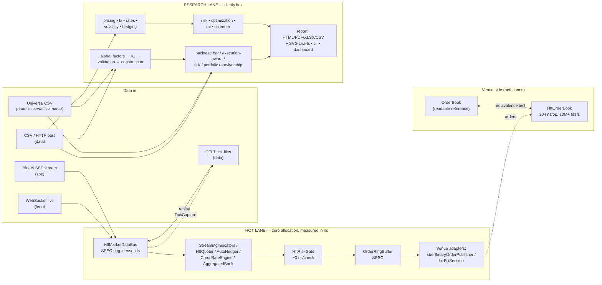

---

## 2. The hot path, end to end — with measured latencies

Every arrow is on the measured path; the numbers are medians from the
benchmark family (`HftLatencyBenchmark`, `HftOrderBenchmark`,
`HftQuoterBenchmark`, `HftBookBenchmark`) on a stock Windows desktop.


Key disciplines, in one line each:

| Discipline | Where | Proof |
|---|---|---|
| Zero allocation steady-state | rings, gate, quoter, hedger, book, codecs | per-thread allocation-counter tests |
| No locks/CAS on the hot path | SPSC rings, acquire/release only | FIFO stress tests |
| No String/boxing on the hot path | dense int symbol ids everywhere | design + tests |
| Tails attributed, not guessed | `HiccupMonitor` in every benchmark | printed with every run |
| Zero GC, literally | whole sessions under Epsilon GC | benchmark runs committed |

---

## 3. The alpha research pipeline

Scores flow as `double[]` aligned to a frozen symbol panel; `NaN` = "not in
the cross-section" at every stage. Attaching a `PointInTimeUniverse` makes
the *whole* pipeline survivorship-honest.

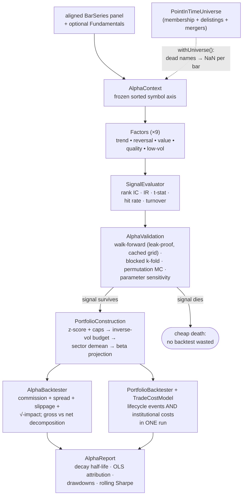

---

## 4. Survivorship-aware backtest — per-bar event ordering

The order of operations inside each bar is a correctness contract (a
dividend on a delisting's ex-date still pays the holder of record; a
merger's shares flow into a same-bar-dying acquirer at *its* terms):

```mermaid
sequenceDiagram
    participant Bar as bar i (timestamp t)
    participant Div as 1. Dividends
    participant Mrg as 2. Mergers
    participant Del as 3. Delistings
    participant Drop as 4. Index drops
    participant Reb as 5. Rebalance

    Bar->>Div: ex-dates ≤ t: position × amount<br/>(holder of record at prior close; shorts pay)
    Bar->>Mrg: target → cash + acquirer shares<br/>(before delistings, so conversions land first)
    Bar->>Del: position × lastClose × (1 + delistingReturn)<br/>(−100% = wiped out; Shumway −30% default)
    Bar->>Drop: still listed but out of the index →<br/>forced sale at this bar's close (fee charged)
    Bar->>Reb: strategy weights (non-members capped at 0,<br/>dead names untradeable) via TradeCostModel
    Note over Div,Reb: symbols processed in sorted order —<br/>same inputs, same result, any JVM
```

---

## 5. Inside the venue-grade matching engine (`HftOrderBook`)

Everything is a primitive array; the diagram shows what happens to a
crossing buy limit.


Measured: **204 ns/op p50** (70/20/10 add/cancel/aggress), **10M+
fills/sec**, zero allocation, full sessions under Epsilon GC.

---

## 6. FX instruments — how the pieces compose

Conventions flow downward; everything date-related delegates to ONE joint
calendar.

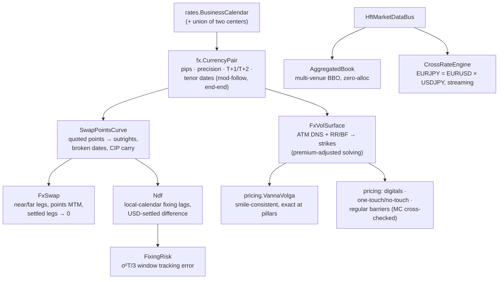

---

## 7. The equities participant stack — L3 feed in, routed orders out

The consumer's side of an exchange: rebuild the venue's book from its raw
event stream, know exactly where your own order queues, read the pressure,
route. Every stage is hot-lane (zero allocation, proven by test).

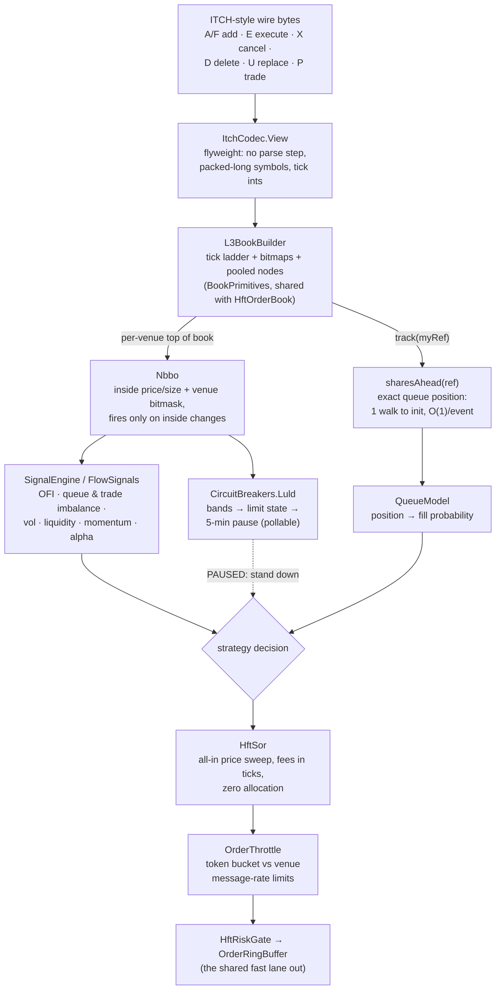

Own-order queue tracking rests on two price-time facts: executions always
consume the queue head, and a cancel is ahead of you iff it entered the
queue before you — which is what makes O(1) maintenance sound.

---

## 8. The FX participant stack — quotes, last look, and routing around it

FX is the mirror image: no tape, no central book. Liquidity is private
quotes subject to last look, so the stack measures LP *behavior* and routes
on expected all-in cost, not displayed price.

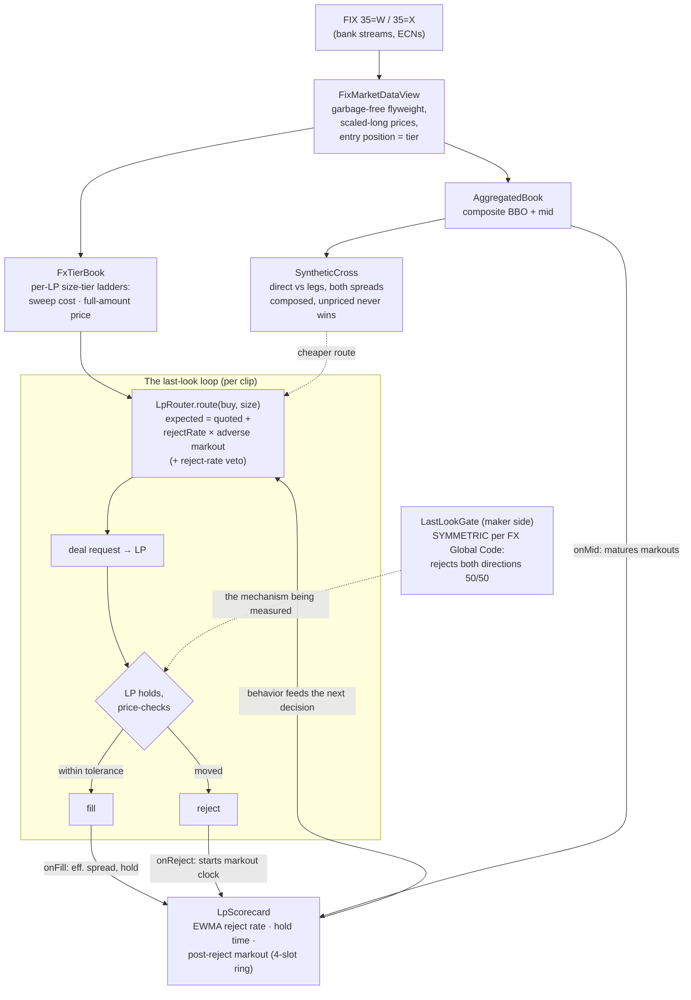

The feedback loop is the point: an LP's tight display means nothing if its
rejects cluster on the flow that was about to pay you — the scorecard
measures exactly that, and the router prices it in.

---

## 9. Scaling out — shared-nothing shards under one risk umbrella

Throughput scales by running independent engine stacks; safety stays global
through a slow observer that only ever asks the hot path to read one
boolean.


Measured on a 12-core desktop, 300 symbols quoted two-sided: 1 shard =
4.3M ticks/s → 2 shards = 6.2M (+46%) → 4 shards plateau at 6.7M (core
oversubscription + single producer, not contention). War story in
[ULTRA_LOW_LATENCY.md](ULTRA_LOW_LATENCY.md): one shared synchronized
counter across shards made sharding measure as a *slowdown*.

---

## 10. Choosing an execution algorithm — the decision map

The parent-order question is "what am I being measured against?" — the
benchmark picks the algorithm, and TCA closes the loop.


The two lanes coexist by design: **`BenchmarkExecutor`** when you re-decide
on live state (the usual case), the **static schedulers** when you want a
fixed slice list computed once up front.

---

## 11. Portfolio-level execution — one basket, one schedule

A two-sided transition run as N independent algos carries a risk none of
them can see: the filled legs drift apart and the basket holds an
unintended net market bet mid-flight. `PortfolioExecutor` layers the two
basket-level rules over untouched per-symbol executors — and both rules
only ever *reduce* a child's own due, so per-symbol benchmark integrity
holds by construction.


The fills edge is the one discipline to keep: report fills through
`PortfolioExecutor.onFill` only — going straight to a child advances its
schedule but blinds the net-exposure ledger the band reads.

---

## 12. Surviving the overnight — the checkpoint lifecycle

Everything the models learn lives in memory; `persist.Checkpoint` is how
it outlives the session. Two properties carry the design: the save is
atomic (a crash mid-save cannot corrupt yesterday's file), and the restore
is honest about time (learned state returns, intraday state deliberately
does not).

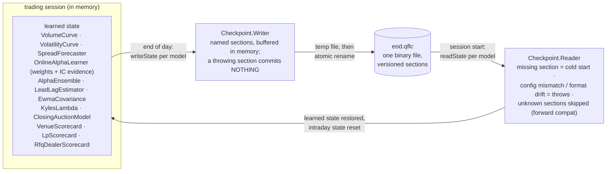

Deliberately NOT persisted: `HiddenLiquidityDetector` (its state is keyed
by price level, and overnight the ladder moves — restoring it would pin
yesterday's icebergs onto today's unrelated prices).

---

## 13. The central risk book — one netted view, four decisions

Every product decomposes into ONE factor space at booking (currency-level
FX legs, per-symbol equity deltas, gamma/vega per underlying), and every
downstream decision runs on the netted residual. The commercial loop:
capture spread by internalizing, spend as little of it as possible on
hedging, and answer one question at the close.

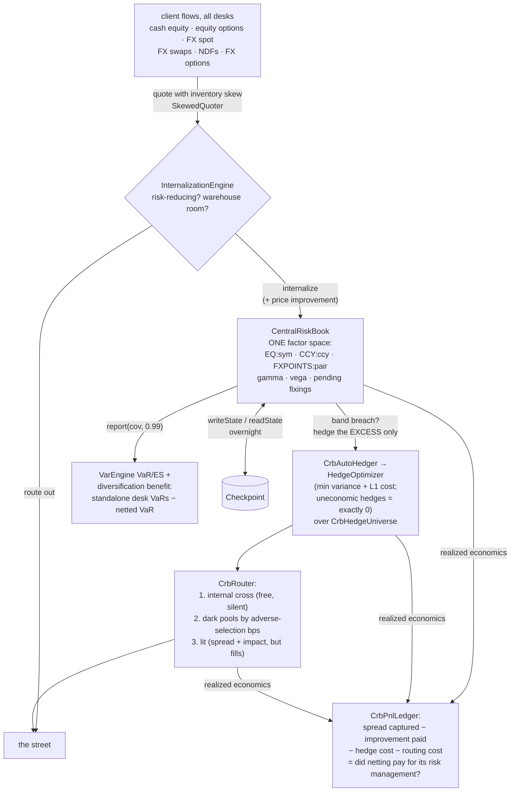

The whole loop at realistic sizes and costs is
`crb/CrbRealWorldScenarioTest` (quiet day, one-way institutional day,
COVID-template stress day, NDF fixing day); recipe 14 is the runnable
version and [CENTRAL_RISK_BOOK.md](CENTRAL_RISK_BOOK.md) the guided tour.

---

## 14. The market-risk workflow — data to Basel, fourteen steps

The map `docs/MARKET_RISK.md` maintains, as a pipeline. Every box is
implemented and tested; the regulatory boxes are styled after BCBS, not
certified — stated, not hidden.

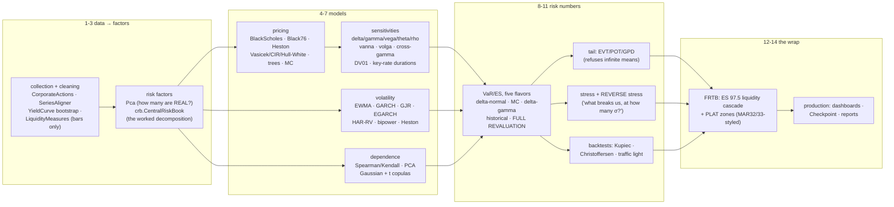

---

## 15. How an order reaches the exchange — and how the market comes back

Two lanes meet at the strategy: outbound, a decision survives the risk
gate, becomes a FIX message, and rides a sequenced session to the venue's
book; inbound, the venue's raw feed is rebuilt into signals that shape the
next decision. The `ExecutionReport` closes the loop through position and
P&L.

```mermaid
flowchart LR
    subgraph OUTLANE["outbound — the order's journey"]
        STRAT["strategy decision<br/>HftQuoter · BenchmarkExecutor ·<br/>your logic"]
        GATE15["HftRiskGate<br/>qty · notional · position ·<br/>collar · halt (~3 ns)"]
        ENC["FIX encode<br/>NewOrderSingle 35=D<br/>(FixSession.sendNewOrderSingle)"]
        SESS["FixSession<br/>seqnums · heartbeats · TestRequest ·<br/>ResendRequest recovery · session store"]
    end
    subgraph VENUE15["the venue"]
        VBOOK["venue book<br/>(HftOrderBook plays this<br/>role in the tests)"]
        ER["ExecutionReport 35=8<br/>ack · fill · cancel · reject"]
    end
    subgraph INLANE["inbound — the market's journey"]
        WIRE15["ITCH / SBE wire bytes<br/>(ItchCodec · sbe flyweights)"]
        L315["L3BookBuilder → Nbbo<br/>book rebuild + own-queue position"]
        SIGS15["SignalEngine / FlowSignals<br/>OFI · imbalance · vol · alpha"]
    end
    PNL["position & P&L update<br/>ledger · TCA markouts"]

    STRAT --> GATE15 --> ENC --> SESS
    SESS -->|"TCP, MsgSeqNum n"| VBOOK
    VBOOK --> ER
    ER -->|"onExecutionReport"| PNL
    ER -.->|"gap? ResendRequest(2),<br/>PossDup replay heals it"| SESS
    WIRE15 --> L315 --> SIGS15
    SIGS15 --> STRAT
    PNL -.->|"inventory feeds the<br/>next quote's skew"| STRAT
```

The sequenced session is the part people underestimate: the venue's book
only ever sees messages in order, so every gap is either healed by a
resend (application messages replayed with PossDup, admin runs coalesced
into GapFill) or the session refuses to continue. Recipe 21 is the
runnable version; diagram 2 shows the nanosecond budget of the left lane.

---

## 16. The rates stack — quotes to simulated curves

One curve object underneath everything: quotes bootstrap into zeros, the
zeros price cash flows, node bumps locate the risk, and the short-rate
models animate the same curve through time.

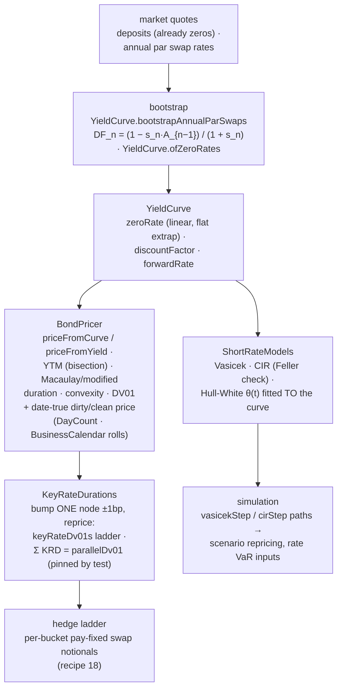

The stack splits statics from dynamics. Everything down the left column
is today's curve interrogated harder and harder — price, then slope
(DV01), then slope *per node* (the KRD ladder that recipe 18 turns into
hedge notionals). The right branch is the same curve given a stochastic
engine: Vasicek and CIR bring their own equilibrium, Hull-White is
calibrated so today's curve is reproduced exactly — which is why its
simulations are the ones you can use for curve-consistent scenario P&L.

---

## 17. Portfolio construction — one input set, three optimizers

All three consume the same expected returns and covariance; they disagree
about how much the return estimates deserve to be trusted, and the weight
vectors show it.

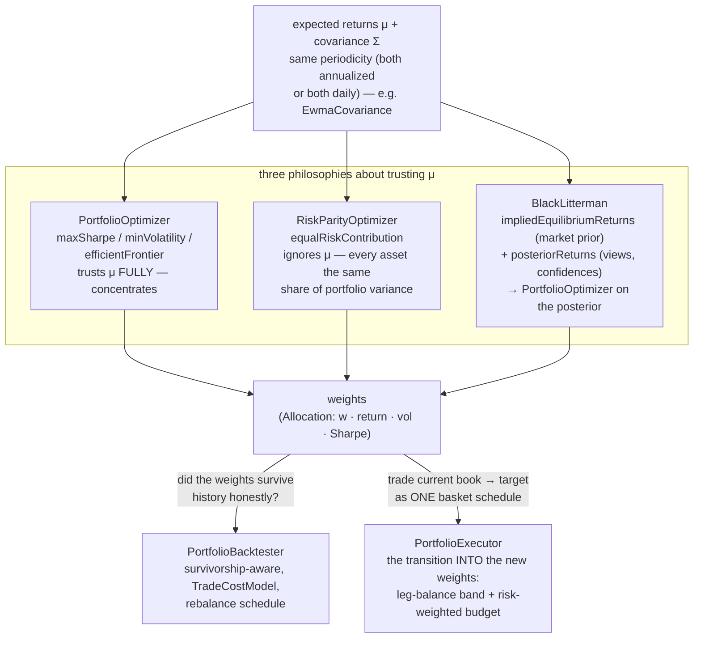

The fork at the bottom is the point of the diagram: a weight vector is a
research artifact until it survives a survivorship-honest backtest
(diagram 3's pipeline) *and* can be reached from the current book without
the transition itself destroying the alpha — which is what
`PortfolioExecutor` (diagram 11) exists to protect. Recipe 19 prints the
three weight vectors side by side.

---

## 18. The overfitting defense stack — from grid winner to deploy-or-reject

A parameter grid produces N backtests and reports the maximum — which is
a selection effect, not evidence. Four defenses interrogate the same
winner from different angles before any capital moves.


Each defense catches a different lie: walk-forward catches parameters
that only fit the past arrangement of regimes; the purged K-fold catches
label leakage that ordinary cross-validation invites; CSCV catches a
broken *selection process* (the winner keeps flipping under resampling);
the deflated Sharpe catches the multiple-testing haircut everyone forgets
to apply. Passing one is easy. Passing all four is what "not overfit"
means here — and PBO ≥ 0.5 is an unconditional stop.

---

## Where to go next

- [LEARN.md](LEARN.md) — the from-zero tutorial: every concept in these diagrams, explained for beginners
- [ARCHITECTURE.md](ARCHITECTURE.md) — the package → classes → tests map and design invariants
- [ULTRA_LOW_LATENCY.md](ULTRA_LOW_LATENCY.md) — the four-tier latency stack, honestly bounded
- [COOKBOOK.md](COOKBOOK.md) — twenty-two runnable recipes across these flows
- `README.md` — capability tour with runnable examples and all measured numbers
